Mitigating Bias in AI Algorithms: A Healthcare Guide to Threshold
Adjustment
================
2025-01-13


# Introduction

The annotated code presented here is meant to accompany our detailed
playbook which aims to address the gap in accessible, practical tools
for mitigating algorithmic bias in healthcare by illustrating a simple
method of subgroup threshold adjustment that can improve the fairness of
both commercial and in-house classification models in the EMR.

**\# in-line comments** are provided within code chunks where you need
to edit parameters specific to your data/use-case.

This resource is the fruit of collaboration across NYC Health +
Hospitals and New York University’s Center for Health Data Science and
Grossman School of Medicine’s Department of Population Health, with
funding from Schmidt Futures and Rockefeller Philanthropy Advisors.

[Step 1: Prepare](#step-1-prepare)  
[Step 2: Assess Bias](#step-2-assess-bias)  
[Step 3: Mitigate Bias](#step-3-mitigate-bias)  
[Step 4: Assess Mitigation Success](#step-4-assess-mitigation-success)  
\_\_\_\_\_\_\_\_\_\_\_\_\_\_\_\_\_\_\_\_\_\_\_\_\_\_\_\_\_\_\_\_\_\_\_\_\_\_\_\_\_\_\_\_\_\_\_\_\_\_\_\_\_\_\_\_\_\_\_\_\_\_\_\_\_\_\_\_\_\_\_\_\_\_\_\_\_\_\_\_

# Step 1: Prepare


## Setup Your Environment

``` r
# If the following libraries are not already installed, do so before loading them:
library(tidyverse) 
library(ROCR) 
library(janitor)
library(dplyr)
library(tidyr)
library(glue)
library(ggplot2)
library(ggpubr)
library(purrr)
library(DBI)
library(odbc)
library(patchwork)
library(knitr)
library(readr)
library(tidyverse) 
library(binom)
library(kableExtra)
library(yardstick)
library(ROCR)
library(pROC)
library(reader)
```

## Get Your Data

There are two ways to pull your dataset.

1)  Connect to your system’s database. We suggest using an ODBC
    connection and DBI interface with a SQL query. This is the preferred
    method, as it does not require saving any PHI locally, but since we
    are using a synthetic dataset for the purposes of this playbook, we
    are using Option 2:

2)  Connect to a csv flat file. We’re calling our dataset ‘BIA’ for Bias
    In Algorithms. You can call yours whatever you like, but if you do
    change it, be sure to replace all other occurrences of ‘BIA’ in the
    code with your new name.

``` r
BIA <- read_csv("BIA_Synthetic_Data.csv") # Replace with your file name
```

## Clean Your Data

Your data needs to contain the following columns:  
\* ‘id’ (unique ID)  
\* ‘proba’ (probability (risk score) between ‘0’ and ‘1’)  
\* ‘outcome’ (binary outcome, where ‘1’ is the outcome we are trying to
predict and ‘0’ is the absence of that outcome)  
\* and the sensitive variables you want to assess for bias. We’re using
‘race’,‘sex’, ‘age_cat’, ‘language’, and ‘insurance’

If you need to rename any variables, do so now.

``` r
# Clean your data so that your probability variable is 'proba' 
# Rename any of your sensitive variables how you'd like. For us, that's updating our insurance and age names: 
BIA = janitor::clean_names(BIA) %>% # We're making all variable names lowercase,
  rename(proba = score, # Renaming our score variable as 'proba',
         insurance = financial_class, # Renaming our financial_class variable as 'insurance',
         age = age_category) # Renaming our age_category variable as 'age'
```

Check to make sure your outcome variable is binary. If it’s not, combine
outcome categories so that it is.

``` r
categories <- unique(BIA$outcome) 
knitr::kable(categories, col.names = "Outcomes")
```

| Outcomes |
|---------:|
|        0 |
|        1 |

Great, we have two outcome values. We can proceed!

## Define Your 'Sensitive' (Sociodemographic) Variables

List categorical variables of interest here by their column names in the
above data frame.

``` r
sensitive = list('race', 'sex', 'age', 'language', 'insurance') # Replace variables as needed
```

Review ‘n’ counts to identify subgroups comprising less than 1% of the
population

``` r
knitr::kable(lapply(sensitive, function(s){
  BIA %>% count_(s) %>% mutate(fraction = n/sum(n)) %>% arrange(fraction)
}), caption = "Subgroup counts")
```

<table class="kable_wrapper">
<caption>
Subgroup counts
</caption>
<tbody>
<tr>
<td>

| race              |    n | fraction |
|:------------------|-----:|---------:|
| Something Else    | 2826 |  0.05652 |
| Asian             | 5619 |  0.11238 |
| Native American   | 5631 |  0.11262 |
| Unknown           | 5688 |  0.11376 |
| Two or more races | 5781 |  0.11562 |
| African American  | 5963 |  0.11926 |
| White             | 8739 |  0.17478 |
| Hispanic          | 9753 |  0.19506 |

</td>
<td>

| sex    |     n | fraction |
|:-------|------:|---------:|
| Male   | 24003 |  0.48006 |
| Female | 25997 |  0.51994 |

</td>
<td>

| age   |     n | fraction |
|:------|------:|---------:|
| \>45  | 16530 |  0.33060 |
| 25-45 | 16718 |  0.33436 |
| \<25  | 16752 |  0.33504 |

</td>
<td>

| language |     n | fraction |
|:---------|------:|---------:|
| Other    |  6886 |  0.13772 |
| Spanish  | 19273 |  0.38546 |
| English  | 23841 |  0.47682 |

</td>
<td>

| insurance        |     n | fraction |
|:-----------------|------:|---------:|
| No Fault         |  6454 |  0.12908 |
| Medicare         |  6524 |  0.13048 |
| Self-Pay         |  6538 |  0.13076 |
| Other Government |  6588 |  0.13176 |
| Medicaid         |  6619 |  0.13238 |
| Workers Comp     |  6659 |  0.13318 |
| Commercial       | 10618 |  0.21236 |

</td>
</tr>
</tbody>
</table>

All our subgroups comprise \>1% so we can proceed, but if they did not,
this would be the step where we logically combine groups or drop those
too small for independent analysis.

## Establish Thresholds

After a review of model documentation and interviews with clinicians,
set your probability score cutoffs (thresholds) indicating levels of risk. For us, the following thresholds were identified:

- Low risk: 0%-7.9%
- Med risk: 8%-14.9%
- High risk: 15%-100%

You only need one threshold, but if you are considering your options or
evaluating low, high, and medium risk thresholds, you can list multiple
cutoffs at this stage.

``` r
thresholds = c(0.08, 0.15) # Specify your threshold(s) as values between 0 and 1
```

------------------------------------------------------------------------

# Step 2: Assess Bias

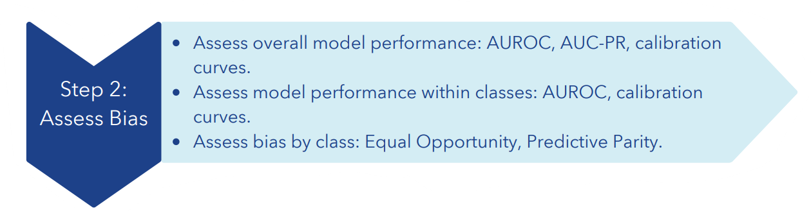

## Probability Distributions

To orient ourselves to the data, we first look at distributions of the
probability of the outcome for each subgroup within each class (sensitive variable/sociodemographic group). The
thresholds we set above are output as vertical lines, so we can get a
visual sense of how different thresholds flag different subgroups.

``` r
lapply(sensitive, function(s){
 p = BIA %>% ggplot(aes(x = proba, color = .data[[!!s]])) + 
    geom_vline(xintercept = thresholds) + 
    geom_density(bounds = c(0, 1), linewidth = 2) +
    ggtitle(paste("Probability distribution for",s))
})
```

    ## [[1]]

<!-- -->

    ## 
    ## [[2]]

<!-- -->

    ## 
    ## [[3]]

<!-- -->

    ## 
    ## [[4]]

<!-- -->

    ## 
    ## [[5]]

<!-- -->

## Assess Overall Performance

First, we define some helper functions to help us output: (1) Receiver
Operating Characteristic (ROC) with thresholds highlighted as dots, (2)
Precision-Recall Curve (PRC) with thresholds highlighted as dots, (3)
Calibration curve with thresholds highlighted as vertical lines.

``` r
# You don't need to edit the parameters in any of the below, just run this chunk to define the functions.

## Area under curve with trapezoid 
helper.trapezoid <- function(df) {
  if(!all(c("x", "y") %in% colnames(df))) {
    stop('df must have x and y columns')
  }
  df.trap <- df %>% 
    arrange(x) %>% 
    filter(!is.na(x), !is.na(y)) %>% 
    mutate(x.diff = x - lag(x, 1),
           y.mean = (y + lag(y, 1))/2,
           xy = x.diff * y.mean) 
  auc <- df.trap %>% 
    summarize(auc = sum(xy, na.rm = T)) %>% .$auc
  return(auc)
}

## ROC curve and area under 
analytic.calc_roc = function(predictions, labels, group_name = NA_character_){
  if(length(unique(labels)) == 1){
    ## shortcut to return nothing.
    return(tibble(group = group_name,
                  auroc = NA, 
                  roc = list(tibble(group = group_name)) ) )
  }
  pred = ROCR::prediction(predictions, labels)
  perf = ROCR::performance(pred, 'auc')
  res.auc = perf@y.values[[1]]
  
  perf = ROCR::performance(pred, 'tpr', 'fpr')
  plot.roc = tibble(cutoff = perf@alpha.values[[1]], 
                    tpr = perf@y.values[[1]],
                    fpr = perf@x.values[[1]] )
  if(!is.na(group_name)){
    plot.roc = plot.roc %>% mutate(group = group_name)
  }else{plot.roc = plot.roc %>% mutate(group = 'total')}
  return(tibble(group = group_name,
                auroc = res.auc, 
                roc = list(plot.roc)))
}

## Precision-recall curve and area under
analytic.calc_prc = function(predictions, labels, group_name = NA_character_){
  if(length(unique(labels)) == 1){
    ## shortcut to return nothing.
    return(tibble(group = group_name,
                  auprc = NA, 
                  prc = list(tibble(group = group_name)) ) )
  }
  pred = ROCR::prediction(predictions, labels)
  perf = ROCR::performance(pred, "prec", "rec")
  perf_npv = ROCR::performance(pred, "npv", 'rpp') 
  
  plot.prc = tibble(cutoff = perf@alpha.values[[1]],
                    preCIsion.raw = perf@y.values[[1]],
                    recall = perf@x.values[[1]],
                    npv = perf_npv@y.values[[1]],
                    alert_rpp = perf_npv@x.values[[1]]) %>% 
    arrange(cutoff) %>% 
    mutate(preCIsion = cummax(preCIsion.raw) ) %>% 
    select(cutoff, preCIsion, recall, preCIsion.raw, npv, alert_rpp) %>% 
    arrange(desc(cutoff))
  if(!is.na(group_name)){
    plot.prc = plot.prc %>% mutate(group = group_name)
  }else{plot.prc = plot.prc %>% mutate(group = 'total')}
  res.auprc <- helper.trapezoid(plot.prc %>% select(x = recall, y = preCIsion))
  return(tibble(group = group_name,
                auprc = res.auprc, 
                prc = list(plot.prc)) )
}

## Calibration curves 
analytic.form_ntiles = function(df, group_var = NA, groups = 10, z = 1.96, percentile_range = c(0, 1)){
  if(is.na(group_var)){
    df = df %>% mutate(group = 'total')
  }else{
    df = df %>% rename(group = !!group_var)
  }
  df %>% 
    group_by(group) %>% 
    mutate(chunk = ntile(proba, n = groups), center = (chunk * (100/groups) - ((100/groups)/2)) ) %>% 
    filter(center >= first(percentile_range)*100, chunk <= last(percentile_range)*100) %>% 
    group_by(group, center) %>% 
    summarize(label_mean = mean(outcome),
              model_prediction_mean = mean(proba),
              n = n()) %>% ungroup() %>% 
    mutate(se = sqrt((label_mean*(1-label_mean))/n),
           lower = label_mean - z*se, 
           upper = label_mean + z*se) %>%
    mutate(lower = pmax(lower, 0), upper = pmin(upper, 1))
}
```

Now, we use the above functions to get the AUC, PR-AUC, and Calibration
Curve for our data.

``` r
# Again, you don't need to edit the parameters in this chunk as long as you've maintained our nomenclature, just run it.
# Area under
total.roc = analytic.calc_roc(BIA$proba, BIA$outcome)
writeLines(glue::glue('Area under the ROC curve is: {round(100*first(total.roc$auroc), 2)}%'))
```

    ## Area under the ROC curve is: 86.14%

``` r
total.prc = analytic.calc_prc(BIA$proba, BIA$outcome)
writeLines(glue::glue('Area under the Precision-Recall curve for is: {round(100*first(total.prc$auprc), 2)}%'))
```

    ## Area under the Precision-Recall curve for is: 44.7%

``` r
# ROC
temp.a = total.roc %>% pull(roc) %>% bind_rows()
a = temp.a %>% 
  ggplot(aes(x = fpr, y = tpr, color = group)) + 
  geom_vline(xintercept = c(0, 1)) + geom_hline(yintercept = c(0, 1)) + 
  geom_abline(color = 'grey50', linetype = 'dashed') + 
  geom_line(size = 1.5) + 
  geom_point(data = lapply(thresholds, function(t){temp.a %>% arrange(desc(cutoff)) %>% filter(cutoff <= t) %>% slice(1)}) %>% bind_rows(), mapping = aes(fill = group), size = 3, stroke = 0.8, pch = 21, color = 'grey20') + theme_minimal() + coord_fixed() + ggtitle('AUROC') 

#PRC
temp.b = total.prc %>% pull(prc) %>% bind_rows() 
b = temp.b %>%
  ggplot(aes(x = recall, y = preCIsion, color = group)) + 
  geom_vline(xintercept = c(0, 1)) + 
  geom_hline(yintercept = c(0, 1)) + 
  geom_hline(data = temp.b %>% arrange(cutoff) %>% group_by(group) %>% slice(1) %>% ungroup(),
             mapping = aes(yintercept = preCIsion),
             color = 'grey50', linetype = 'dashed') + 
  geom_point(inherit.aes = T, mapping = aes(y = preCIsion.raw), size = 1, alpha = 0.1) + 
  geom_line(size = 1.5) + 
  geom_point(data = lapply(thresholds, function(t){temp.b %>% arrange(desc(cutoff)) %>% filter(cutoff <= t) %>% slice(1)}) %>% bind_rows(), 
             mapping = aes(fill = group), size = 3, stroke = 0.8, pch = 21, color = 'grey20') + 
  theme_minimal() + coord_fixed() + ggtitle('PR-AUC')

#Calibration
c = analytic.form_ntiles(BIA, groups =10) %>% 
  ggplot(aes(x = model_prediction_mean, y = label_mean, color = group)) + 
  #facet_grid(. ~ group) + 
  geom_vline(xintercept = c(0, 1)) + 
  geom_hline(yintercept = c(0, 1)) + # bounding box
  geom_abline(slope = 1, intercept = 0, color = 'grey50', linetype = 'dashed') + 
  geom_vline(xintercept = thresholds, color = 'grey20') + 
  geom_point() + 
  geom_errorbar(aes(ymin = lower, ymax = upper), width = 0.02) + 
  geom_smooth(method= 'lm', color = 'grey20', se = FALSE) + 
  theme_minimal() + 
  coord_fixed() + 
  ylim(0, 1) + 
  xlim(0, 1) + 
  xlab('Mean Estimated Risk') + ylab('Mean Observed Positives') + ggtitle('Calibration')
  plot = ggarrange(a, b, c, ncol = 3, common.legend = TRUE, legend = 'none')
  plot
```

<!-- -->

## Assess Overall Model Performance Within Each Class

Now, we look at AUC and calibration for each subgroup within each class.
Keep in mind, disparities in AUROC suggest the model functions
(“discriminates”, in the good sense) better or worse for some subgroups
(e.g., due to representation within the data, availability of data,
etc.). Because PR-AUC is swayed by outcome prevalence, and we thus
expect groups with higher outcome rates to have higher PR-AUCs, we
calculate them but don’t use them in our assessment of subgroup
performance here.

``` r
# Again, you don't need to edit the parameters in this chunk as long as you've maintained our nomenclature, just run it.
performances = lapply(sensitive, function(s){
  print(s)
    g = BIA %>% group_by_(s)
    df.list = g %>% group_split() 
    s.values = group_keys(g) %>% unlist() 
    if(length(df.list) == 1){
      warning(glue::glue("a group of size 1 found for variable={s}, possibly an error"))
    }
    # For each value within the sensitive variable, e.g. for male within sex, calculate ROC and PRC
    temp.roc = mapply(function(temp.df, value){
      analytic.calc_roc(temp.df$proba, temp.df$outcome, group_name = value ) %>% 
        mutate(n_group = nrow(temp.df)) # subgroup sample size for clarity
    }, df.list, s.values ) %>% t() %>% as.tibble()
    temp.prc = mapply(function(temp.df, value){
      analytic.calc_prc(temp.df$proba, temp.df$outcome, group_name = value)
    }, df.list, s.values ) %>% t() %>% as.tibble()
    # Combine globals into one output of AUROCs and PR-AUCs
    global = left_join(temp.roc %>% select(group, n_group, auroc) %>% tidyr::unnest(cols = c(group, n_group, auroc)), temp.prc %>% select(group, auprc) %>% tidyr::unnest(cols = c(group, auprc)), by = join_by(group)) %>% mutate(group = glue::glue('{s}={group}'))
    # For plotting, unpack long list of each point along ROC and PR curves
    temp.a = temp.roc %>% pull(roc) %>% bind_rows() 
    temp.b = temp.prc %>% pull(prc) %>% bind_rows() 
    local = left_join(lapply(thresholds, function(t){temp.a %>% group_by(group) %>% arrange(desc(cutoff)) %>% 
        mutate(threshold_desired = t) %>% filter(cutoff <= threshold_desired) %>% slice(1)}) %>% bind_rows() , 
        lapply(thresholds, function(t){temp.b %>% group_by(group) %>% arrange(desc(cutoff)) %>% 
            mutate(threshold_desired = t) %>% filter(cutoff <= threshold_desired) %>% slice(1)}) %>% bind_rows() , #%>% mutate(curve = 'prc')
        by = c('group', 'threshold_desired'), suffix = c(".roc",  ".prc") ) %>% 
      mutate(variable = s) %>% 
      select(variable, group, threshold_desired, everything())
    # Generate graphs of a=ROC, b = PRC, c = calibration as above
    a = temp.a %>% 
      ggplot(aes(x = fpr, y = tpr, color = group)) + 
      geom_vline(xintercept = c(0, 1)) + geom_hline(yintercept = c(0, 1)) + 
      geom_abline(color = 'grey50', linetype = 'dashed') + 
      geom_line(size = 1.5) + 
      geom_point(data = local, 
                 mapping = aes(fill = group), size = 2, stroke = 0.8, pch = 21, color = 'grey20') + 
      theme_minimal() + coord_fixed() + 
      labs(color = s) +
      ggtitle(glue::glue("ROC Curve")) 
    b = temp.b %>%
      ggplot(aes(x = recall, y = preCIsion, color = group)) + 
      geom_vline(xintercept = c(0, 1)) + geom_hline(yintercept = c(0, 1)) + 
      geom_hline(data = . %>% arrange(cutoff) %>% group_by(group) %>% slice(1) %>% ungroup(),
                 mapping = aes(yintercept = preCIsion, color = group), #color = 'grey50'
                 linetype = 'dashed') + 
      geom_point(inherit.aes = T, mapping = aes(y = preCIsion.raw), size = 1, alpha = 0.1) + 
      geom_line(size = 1.5) + 
      geom_point(data = local, 
                 mapping = aes(fill = group), size = 2, stroke = 0.8, pch = 21, color = 'grey20') + 
      theme_minimal() + coord_fixed() + 
      guides(color = "none") +
      ggtitle(glue::glue("PRC Curve"))
    # Combine ROC and PR curves into one side-by-side
    ab = ggpubr::ggarrange(a, b, legend = 'none')
    # Calibration curves
    c = analytic.form_ntiles(BIA, groups = 10, group_var = s) %>% 
      ggplot(aes(x = model_prediction_mean, y = label_mean, color = group)) + 
      facet_grid(. ~ group) + 
      geom_vline(xintercept = c(0, 1)) + geom_hline(yintercept = c(0, 1)) + 
      geom_abline(slope = 1, intercept = 0, color = 'grey50', linetype = 'dashed') + 
      geom_vline(xintercept = thresholds, color = 'grey20') + 
      geom_point() + geom_errorbar(aes(ymin = lower, ymax = upper), width = 0.02) + 
      geom_smooth(method= 'lm', color = 'grey20', se = FALSE) + 
      theme_minimal() + coord_fixed() + 
      ylim(0, 1) + xlim(0, 1) + 
      xlab('Mean Estimated Risk') + ylab('Mean Observed Positives') +
      ggtitle(glue::glue("Calibration Curve"))
    # Combine calibration below ROC+PR into one giant figure.
    fig = ggpubr::ggarrange(ab, c, ncol = 1, nrow = 2, common.legend = TRUE, legend = 'bottom', heights = c(1, 1.2) ) 
    print(fig)
    return(tibble(global=list(global), local=list(local)) ) 
  }) %>% bind_rows()
```

    ## [1] "race"

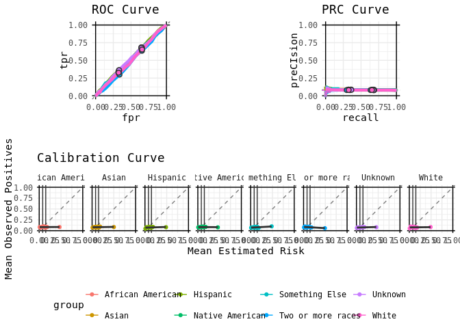<!-- -->

    ## [1] "sex"

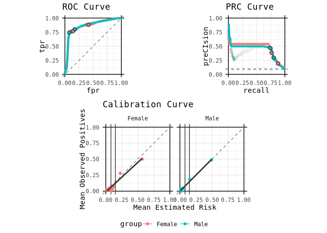<!-- -->

    ## [1] "age"

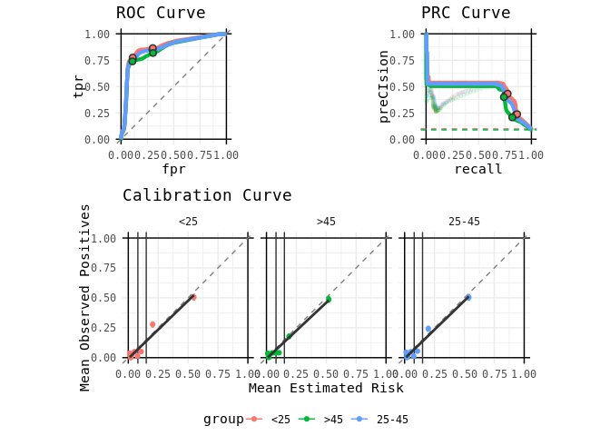<!-- -->

    ## [1] "language"

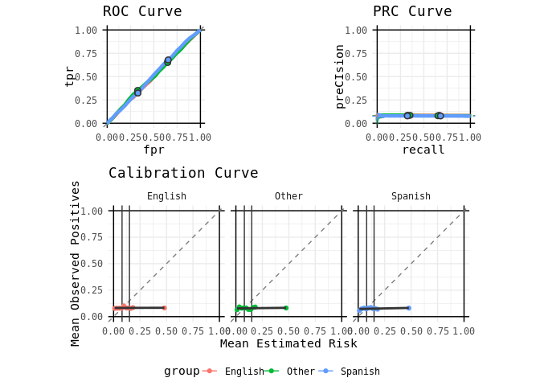<!-- -->

    ## [1] "insurance"

<!-- -->

``` r
# Unpack the listed outputs from above into dataframe
global_performances = performances %>% pull(global) %>% bind_rows() # output a table presenting the total AUROC and PR-AUC for each group within each sensitive variable. 
knitr::kable(global_performances)
```

| group                      | n_group |     auroc |     auprc |
|:---------------------------|--------:|----------:|----------:|
| race=African American      |    5963 | 0.7683917 | 0.4266475 |
| race=Asian                 |    5619 | 0.9401181 | 0.5486946 |
| race=Hispanic              |    9753 | 0.8290706 | 0.4097390 |
| race=Native American       |    5631 | 0.9178439 | 0.4846723 |
| race=Something Else        |    2826 | 0.8505488 | 0.3920923 |
| race=Two or more races     |    5781 | 0.9227523 | 0.4387840 |
| race=Unknown               |    5688 | 0.9259316 | 0.4638295 |
| race=White                 |    8739 | 0.9308959 | 0.5440543 |
| sex=Female                 |   25997 | 0.8576664 | 0.4612216 |
| sex=Male                   |   24003 | 0.8635712 | 0.4334274 |
| age=25-45                  |   16718 | 0.8615517 | 0.4521086 |
| age=\<25                   |   16752 | 0.8719933 | 0.4709538 |
| age=\>45                   |   16530 | 0.8494339 | 0.4195285 |
| language=English           |   23841 | 0.8648657 | 0.4672416 |
| language=Other             |    6886 | 0.8644197 | 0.4380724 |
| language=Spanish           |   19273 | 0.8547416 | 0.4234835 |
| insurance=Commercial       |   10618 | 0.8633560 | 0.4471157 |
| insurance=Medicaid         |    6619 | 0.8030681 | 0.3897112 |
| insurance=Medicare         |    6524 | 0.9063984 | 0.4815773 |
| insurance=No Fault         |    6454 | 0.7857614 | 0.4086432 |
| insurance=Other Government |    6588 | 0.9317875 | 0.5100215 |
| insurance=Self-Pay         |    6538 | 0.8781859 | 0.4648471 |
| insurance=Workers Comp     |    6659 | 0.9003593 | 0.4868387 |

## Assess Fairness Metrics by Class

Fairness metrics allow us to measure model bias at specific thresholds.
This quantifies the real-world impact of our model on our patients at
that threshold. Our fairness metric here is Equal Opportunity (subgroup
FNR - referent FNR). Equal Opportunity measures whether people who will
experience the outcome have a fair chance of being flagged as high risk
at our chosen threshold.

Create a dataframe of performance metrics and their confidence intervals
(CIs) using the Agresti-Coull method for use in our bias check below.

``` r
# Again, you don't need to edit the parameters in this chunk as long as you've maintained our nomenclature, just run it.
CIs = lapply(sensitive, function(s){
    lapply(thresholds, function(t){
      loc_ci = BIA %>% mutate(prediction = as.integer(proba >= t) ) %>% group_by_(s) %>% 
        summarize(threshold = t, total = n(), 
                  pos = sum(outcome), neg = total - pos, # actual positive and actual negative
                  pp = sum(prediction), pn = total - pp, # predicted P and N where total = P+N
                  tp = sum((prediction + outcome) == 2), fp = pp - tp, # Predicted P = True + False P
                  tn = sum((prediction + outcome) == 0), fn = pn - tn,
                  neg_check = fp + tn, pos_check = tp + fn
        ) %>% 
        mutate(prev_percent = (round((pos/total) * 100, digits=4)), 
               alert_rate = pp/total, 
               ppv_precision = tp/pp, ppv_ci = binom.confint(tp, pp, method = 'ac')[4:6], 
               npv = tn/pn, 
               tpr_recall_sensitivity = tp/(pos), tpr_ci = binom.confint(tp, pos, method = 'ac')[4:6],
               tnr_specificity = tn/(neg), 
               fpr_type1 = fp/(neg),
               fnr_type2 = fn/(pos), fnr_ci = binom.confint(fn, pos, method = 'ac')[4:6] 
  )
    }) %>% bind_rows()
  }) %>% bind_rows()
```

Create a function called ‘check’ to help us check for bias.

``` r
#  Again, you don't need to edit the parameters in this chunk as long as you've maintained our nomenclature, just run it.
bias_check = function(l_perfs, variable_colname, group_colname, reference_group, p_threshold = 0.05, fairness_metric="not FNR"){
  if(!(variable_colname %in% colnames(l_perfs)) ){warning(glue::glue("Could not find the supplied variable column named={variable_colname}")); return(FALSE)}
  if(!(group_colname %in% colnames(l_perfs)) ){warning(glue::glue("Could not find the supplied group column named={group_colname}")); return(FALSE)}
  if(!(reference_group %in% unlist(l_perfs[group_colname])) ){
    t_output = paste0(unlist(l_perfs[group_colname]), collapse = ", ")
    warning(glue::glue("Could not find the reference group={reference_group} specified in the set of values: [{t_output}]"))
    return(FALSE)}
  if(!('pos' %in% colnames(l_perfs))){warning("Could not find the # of positive cases in the expected column named=pos"); return(FALSE)}
  if(!('total' %in% colnames(l_perfs))){warning("Could not find the # of total cases in the expected column named=total"); return(FALSE)}
  
  ref = l_perfs[which(unlist(l_perfs[group_colname]) == reference_group), variable_colname][[1]] %>% 
    bind_cols(l_perfs[which(unlist(l_perfs[group_colname]) == reference_group), c('pos', 'total')] %>% 
                mutate(prev = pos/total)) # unpack pos and total and calculate prev
  output = l_perfs[variable_colname][[1]] %>% 
    bind_cols(l_perfs %>% select(pos, total) %>% mutate(prev = pos/total)) %>% # row order assumed, # unpack pos and total and calculate prev
    mutate(delta_sign = sign(mean - ref$mean),
           eod = abs(mean - ref$mean)) %>% 
    mutate(lower_outside = !between(lower, first(ref$lower), first(ref$upper)),
           upper_outside = !between(upper, first(ref$lower), first(ref$upper)),
           outside_ci = lower_outside & upper_outside) %>% 
    rowwise() %>% # perform following mutate() one row at a time, CRUCIAL to not vectorize the prop.test logic
    mutate(p_value = prop.test(x=c(pos, ref$pos[1]), n=c(total, ref$total[1]))$p.value,
           prev_delta_sign = sign(prev - ref$prev[1])) %>% 
    ungroup() %>% # the ungroup stops the rowwise
    mutate(difference_check = eod > 0.05) %>%

    mutate(five_pp_diff = if_else(eod > 0.05, "BIAS", "NO BIAS")) %>% 
     mutate(ci_check = if_else(eod > 0.05 & outside_ci, "BIAS", "NO BIAS")) %>% 
    mutate(
      prev_delta_sign = if_else(p_value > p_threshold, 0, prev_delta_sign), # if prevs similar, sign = 0, a fuzzy similar
      composite_check = case_when( 
             ci_check == "NO BIAS"| is.na(ci_check) ~ "NO BIAS", # if first two checks are not TRUE -> output FALSE (aka no evidence of bias).
             # if p > threshold, the prevalences are similar, all we need is a non-overlapping CI from the ci_check 
             ci_check == "BIAS" & p_value > p_threshold ~ "BIAS", # note the ci_check == TRUE is guaranteed from the above line
             # if p <= threshold, the prevalences are different, either a contrasting trend or equivalency 
             p_value <= p_threshold & abs(prev_delta_sign - delta_sign) == if_else(fairness_metric == 'FNR',0,2) ~ "BIAS", 
             p_value <= p_threshold ~ "NO BIAS", # catch where abs() == 0 or 1
             TRUE ~ NA # if the logic has a flaw, output NA
           ),
           directionality = case_when(
             p_value <= p_threshold & abs(prev_delta_sign - delta_sign) == if_else(fairness_metric == 'FNR',0,2) ~ TRUE, 
             p_value <= p_threshold ~ FALSE,
             TRUE ~ NA))
  output$group = unlist(l_perfs[group_colname])
  return(output %>% select(group, everything()) )
}
```

Using the dataframe and function from above, we’ll check the equal
opportunity differences of subgroups for each class. You do need to edit
this chunk; refer to the in-line comments to do so.

``` r
# Pay attention to the in-line comments in this chunk, as edits are required for your data/use-case: 

EOD_race = CIs %>% filter(!is.na(race), threshold == 0.15) %>% # If you defined multiple thresholds in Step 1, list the one you want to use for analysis here.
  bias_check('fnr_ci', 'race', 'Hispanic', fairness_metric='FNR') %>% # If you are using different sensitive variables than we are, change the second value to your first variable of interest; change the third value to its reference group. 
  mutate(
    five_pp_diff = if_else(group == 'Hispanic', "REF", five_pp_diff) # Replace the value of 'group' with your reference group
  ) %>%  
  select('group','mean','eod','five_pp_diff','total','pos','prev') %>%
  rename('fnr' = mean) 
knitr::kable(EOD_race, caption = "Equal Opportunity Differences, Race", digits=4) %>%
  kableExtra::kable_styling() %>%
  kableExtra::column_spec(2:4, background = "lightgray") %>%
  kableExtra::column_spec(5:7, background = "darkgray")
```

<table class="table" style="margin-left: auto; margin-right: auto;">
<caption>
Equal Opportunity Differences, Race
</caption>
<thead>
<tr>
<th style="text-align:left;">
group
</th>
<th style="text-align:right;">
fnr
</th>
<th style="text-align:right;">
eod
</th>
<th style="text-align:left;">
five_pp_diff
</th>
<th style="text-align:right;">
total
</th>
<th style="text-align:right;">
pos
</th>
<th style="text-align:right;">
prev
</th>
</tr>
</thead>
<tbody>
<tr>
<td style="text-align:left;">
African American
</td>
<td style="text-align:right;background-color: lightgray !important;">
0.5261
</td>
<td style="text-align:right;background-color: lightgray !important;">
0.2564
</td>
<td style="text-align:left;background-color: lightgray !important;">
BIAS
</td>
<td style="text-align:right;background-color: darkgray !important;">
5963
</td>
<td style="text-align:right;background-color: darkgray !important;">
937
</td>
<td style="text-align:right;background-color: darkgray !important;">
0.1571
</td>
</tr>
<tr>
<td style="text-align:left;">
Asian
</td>
<td style="text-align:right;background-color: lightgray !important;">
0.0719
</td>
<td style="text-align:right;background-color: lightgray !important;">
0.1979
</td>
<td style="text-align:left;background-color: lightgray !important;">
BIAS
</td>
<td style="text-align:right;background-color: darkgray !important;">
5619
</td>
<td style="text-align:right;background-color: darkgray !important;">
473
</td>
<td style="text-align:right;background-color: darkgray !important;">
0.0842
</td>
</tr>
<tr>
<td style="text-align:left;">
Hispanic
</td>
<td style="text-align:right;background-color: lightgray !important;">
0.2697
</td>
<td style="text-align:right;background-color: lightgray !important;">
0.0000
</td>
<td style="text-align:left;background-color: lightgray !important;">
REF
</td>
<td style="text-align:right;background-color: darkgray !important;">
9753
</td>
<td style="text-align:right;background-color: darkgray !important;">
975
</td>
<td style="text-align:right;background-color: darkgray !important;">
0.1000
</td>
</tr>
<tr>
<td style="text-align:left;">
Native American
</td>
<td style="text-align:right;background-color: lightgray !important;">
0.1217
</td>
<td style="text-align:right;background-color: lightgray !important;">
0.1480
</td>
<td style="text-align:left;background-color: lightgray !important;">
BIAS
</td>
<td style="text-align:right;background-color: darkgray !important;">
5631
</td>
<td style="text-align:right;background-color: darkgray !important;">
460
</td>
<td style="text-align:right;background-color: darkgray !important;">
0.0817
</td>
</tr>
<tr>
<td style="text-align:left;">
Something Else
</td>
<td style="text-align:right;background-color: lightgray !important;">
0.2876
</td>
<td style="text-align:right;background-color: lightgray !important;">
0.0179
</td>
<td style="text-align:left;background-color: lightgray !important;">
NO BIAS
</td>
<td style="text-align:right;background-color: darkgray !important;">
2826
</td>
<td style="text-align:right;background-color: darkgray !important;">
226
</td>
<td style="text-align:right;background-color: darkgray !important;">
0.0800
</td>
</tr>
<tr>
<td style="text-align:left;">
Two or more races
</td>
<td style="text-align:right;background-color: lightgray !important;">
0.1259
</td>
<td style="text-align:right;background-color: lightgray !important;">
0.1438
</td>
<td style="text-align:left;background-color: lightgray !important;">
BIAS
</td>
<td style="text-align:right;background-color: darkgray !important;">
5781
</td>
<td style="text-align:right;background-color: darkgray !important;">
413
</td>
<td style="text-align:right;background-color: darkgray !important;">
0.0714
</td>
</tr>
<tr>
<td style="text-align:left;">
Unknown
</td>
<td style="text-align:right;background-color: lightgray !important;">
0.1247
</td>
<td style="text-align:right;background-color: lightgray !important;">
0.1451
</td>
<td style="text-align:left;background-color: lightgray !important;">
BIAS
</td>
<td style="text-align:right;background-color: darkgray !important;">
5688
</td>
<td style="text-align:right;background-color: darkgray !important;">
393
</td>
<td style="text-align:right;background-color: darkgray !important;">
0.0691
</td>
</tr>
<tr>
<td style="text-align:left;">
White
</td>
<td style="text-align:right;background-color: lightgray !important;">
0.1640
</td>
<td style="text-align:right;background-color: lightgray !important;">
0.1057
</td>
<td style="text-align:left;background-color: lightgray !important;">
BIAS
</td>
<td style="text-align:right;background-color: darkgray !important;">
8739
</td>
<td style="text-align:right;background-color: darkgray !important;">
817
</td>
<td style="text-align:right;background-color: darkgray !important;">
0.0935
</td>
</tr>
</tbody>
</table>

``` r
CIs %>% filter(!is.na(race), threshold == 0.15) %>% # If you defined multiple thresholds in Step 1, list the one you want to use for analysis here.
  bias_check('fnr_ci', 'race', 'Hispanic', fairness_metric='FNR') %>% # If you are using different sensitive variables than we are, change the second value to your first variable of interest; change the third value to its reference group. 
  mutate(label = paste0(as.character(round(prev*100, 1)), '%')) %>%
  ggplot(aes(x=group, y = mean, ymin = lower, ymax = upper, color = group)) + 
  geom_linerange() + geom_point() + 
  theme(axis.line=element_blank(), axis.text.x=element_blank()) + 
  ggtitle("FNRs for race") +
  geom_text(aes(x=group, y=0, label=label), show.legend=FALSE)
```

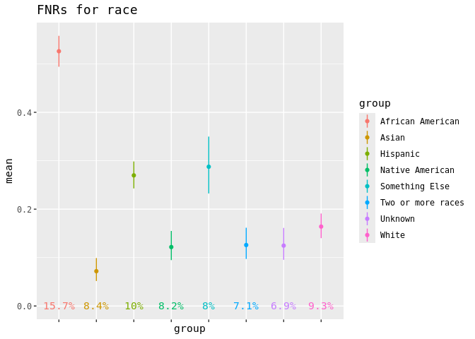<!-- -->

``` r
EOD_sex = CIs %>% filter(!is.na(sex), threshold == 0.15) %>% # If you defined multiple thresholds in Step 1, list the one you want to use for analysis here.
  bias_check('fnr_ci', 'sex', 'Female', fairness_metric='FNR') %>% # If you are using different sensitive variables than we are, change the second value to your first variable of interest; change the third value to its reference group. 
    mutate(
    five_pp_diff = if_else(group == 'Female', "REF", five_pp_diff)) %>%  # Replace the value of 'group' with your reference group
    select('group','mean','eod','five_pp_diff','total','pos','prev') %>%
    rename('fnr' = mean) 
knitr::kable(EOD_sex, caption = "Equal Opportunity Differences, Sex", digits=4) %>%
  kableExtra::kable_styling() %>%
  kableExtra::column_spec(2:4, background = "lightgray") %>%
  kableExtra::column_spec(5:7, background = "darkgray")
```

<table class="table" style="margin-left: auto; margin-right: auto;">
<caption>
Equal Opportunity Differences, Sex
</caption>
<thead>
<tr>
<th style="text-align:left;">
group
</th>
<th style="text-align:right;">
fnr
</th>
<th style="text-align:right;">
eod
</th>
<th style="text-align:left;">
five_pp_diff
</th>
<th style="text-align:right;">
total
</th>
<th style="text-align:right;">
pos
</th>
<th style="text-align:right;">
prev
</th>
</tr>
</thead>
<tbody>
<tr>
<td style="text-align:left;">
Female
</td>
<td style="text-align:right;background-color: lightgray !important;">
0.2346
</td>
<td style="text-align:right;background-color: lightgray !important;">
0.0000
</td>
<td style="text-align:left;background-color: lightgray !important;">
REF
</td>
<td style="text-align:right;background-color: darkgray !important;">
25997
</td>
<td style="text-align:right;background-color: darkgray !important;">
2647
</td>
<td style="text-align:right;background-color: darkgray !important;">
0.1018
</td>
</tr>
<tr>
<td style="text-align:left;">
Male
</td>
<td style="text-align:right;background-color: lightgray !important;">
0.2565
</td>
<td style="text-align:right;background-color: lightgray !important;">
0.0219
</td>
<td style="text-align:left;background-color: lightgray !important;">
NO BIAS
</td>
<td style="text-align:right;background-color: darkgray !important;">
24003
</td>
<td style="text-align:right;background-color: darkgray !important;">
2047
</td>
<td style="text-align:right;background-color: darkgray !important;">
0.0853
</td>
</tr>
</tbody>
</table>

``` r
CIs %>% filter(!is.na(sex), threshold == 0.15) %>% # If you defined multiple thresholds in Step 1, list the one you want to use for analysis here.
  bias_check('fnr_ci', 'sex', 'Female', fairness_metric='FNR') %>% # If you are using different sensitive variables than we are, change the second value to your first variable of interest; change the third value to its reference group. 
  mutate(label = paste0(as.character(round(prev*100, 1)), '%')) %>%
  ggplot(aes(x=group, y = mean, ymin = lower, ymax = upper, color = group)) + 
  geom_linerange() + geom_point() + 
  theme(axis.line=element_blank(), axis.text.x=element_blank()) + 
  ggtitle("FNRs for sex") +
  geom_text(aes(x=group, y=0, label=label), show.legend=FALSE)
```

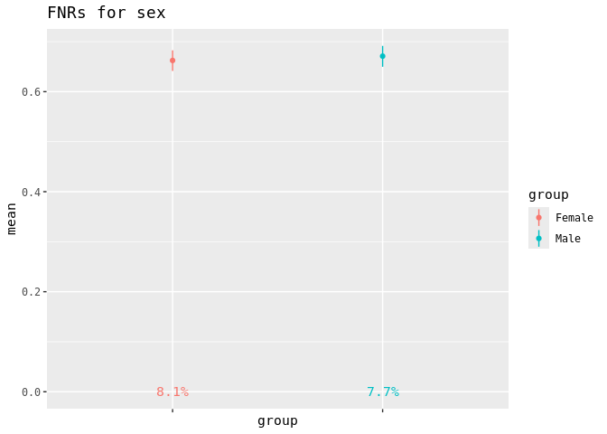<!-- -->

``` r
EOD_language = CIs %>% filter(!is.na(language), threshold == 0.15) %>% # If you defined multiple thresholds in Step 1, list the one you want to use for analysis here.
  bias_check('fnr_ci', 'language', 'English', fairness_metric='FNR') %>% # If you are using different sensitive variables than we are, change the second value to your first variable of interest; change the third value to its reference group. 
  mutate(
    five_pp_diff = if_else(group == 'English', "REF", five_pp_diff) # Replace the value of 'group' with your reference group
  ) %>%  
  select('group','mean','eod','five_pp_diff','total','pos','prev') 
knitr::kable(EOD_language, caption = "Equal Opportunity Differences, Language", digits=4) %>%
  kableExtra::kable_styling() %>%
  kableExtra::column_spec(2:4, background = "lightgray") %>%
  kableExtra::column_spec(5:7, background = "darkgray")
```

<table class="table" style="margin-left: auto; margin-right: auto;">
<caption>
Equal Opportunity Differences, Language
</caption>
<thead>
<tr>
<th style="text-align:left;">
group
</th>
<th style="text-align:right;">
mean
</th>
<th style="text-align:right;">
eod
</th>
<th style="text-align:left;">
five_pp_diff
</th>
<th style="text-align:right;">
total
</th>
<th style="text-align:right;">
pos
</th>
<th style="text-align:right;">
prev
</th>
</tr>
</thead>
<tbody>
<tr>
<td style="text-align:left;">
English
</td>
<td style="text-align:right;background-color: lightgray !important;">
0.2415
</td>
<td style="text-align:right;background-color: lightgray !important;">
0.0000
</td>
<td style="text-align:left;background-color: lightgray !important;">
REF
</td>
<td style="text-align:right;background-color: darkgray !important;">
23841
</td>
<td style="text-align:right;background-color: darkgray !important;">
2381
</td>
<td style="text-align:right;background-color: darkgray !important;">
0.0999
</td>
</tr>
<tr>
<td style="text-align:left;">
Other
</td>
<td style="text-align:right;background-color: lightgray !important;">
0.2264
</td>
<td style="text-align:right;background-color: lightgray !important;">
0.0151
</td>
<td style="text-align:left;background-color: lightgray !important;">
NO BIAS
</td>
<td style="text-align:right;background-color: darkgray !important;">
6886
</td>
<td style="text-align:right;background-color: darkgray !important;">
614
</td>
<td style="text-align:right;background-color: darkgray !important;">
0.0892
</td>
</tr>
<tr>
<td style="text-align:left;">
Spanish
</td>
<td style="text-align:right;background-color: lightgray !important;">
0.2543
</td>
<td style="text-align:right;background-color: lightgray !important;">
0.0128
</td>
<td style="text-align:left;background-color: lightgray !important;">
NO BIAS
</td>
<td style="text-align:right;background-color: darkgray !important;">
19273
</td>
<td style="text-align:right;background-color: darkgray !important;">
1699
</td>
<td style="text-align:right;background-color: darkgray !important;">
0.0882
</td>
</tr>
</tbody>
</table>

``` r
CIs %>% filter(!is.na(language), threshold == 0.15) %>% # If you defined multiple thresholds in Step 1, list the one you want to use for analysis here.
  bias_check('fnr_ci', 'language', 'English', fairness_metric='FNR') %>% # If you are using different sensitive variables than we are, change the second value to your first variable of interest; change the third value to its reference group. 
  mutate(label = paste0(as.character(round(prev*100, 1)), '%')) %>%
  ggplot(aes(x=group, y = mean, ymin = lower, ymax = upper, color = group)) + 
  geom_linerange() + geom_point() + 
  theme(axis.line=element_blank(), axis.text.x=element_blank()) + 
  ggtitle("FNRs for language") +
  geom_text(aes(x=group, y=0, label=label), show.legend=FALSE)
```

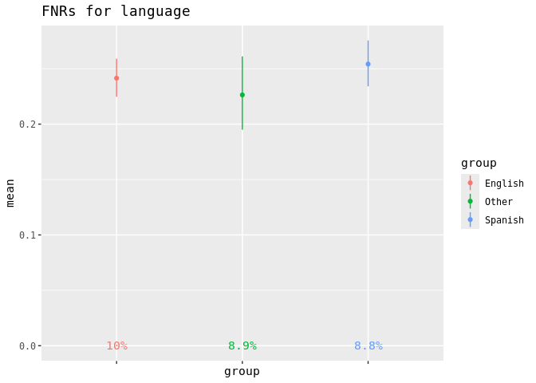<!-- -->

``` r
EOD_insurance = CIs %>% filter(!is.na(insurance), threshold == 0.15) %>% # If you defined multiple thresholds in Step 1, list the one you want to use for analysis here.
  bias_check('fnr_ci', 'insurance', 'Medicaid', fairness_metric='FNR') %>% # If you are using different sensitive variables than we are, change the second value to your first variable of interest; change the third value to its reference group. 
  mutate(
    five_pp_diff = if_else(group == 'Medicaid', "REF", five_pp_diff) # Replace the value of 'group' with your reference group
  ) %>%  
  select('group','mean','eod','five_pp_diff','total','pos','prev') 
knitr::kable(EOD_insurance, caption = "Equal Opportunity Differences, Insurance", digits=4) %>%
  kableExtra::kable_styling() %>%
  kableExtra::column_spec(2:4, background = "lightgray") %>%
  kableExtra::column_spec(5:7, background = "darkgray")
```

<table class="table" style="margin-left: auto; margin-right: auto;">
<caption>
Equal Opportunity Differences, Insurance
</caption>
<thead>
<tr>
<th style="text-align:left;">
group
</th>
<th style="text-align:right;">
mean
</th>
<th style="text-align:right;">
eod
</th>
<th style="text-align:left;">
five_pp_diff
</th>
<th style="text-align:right;">
total
</th>
<th style="text-align:right;">
pos
</th>
<th style="text-align:right;">
prev
</th>
</tr>
</thead>
<tbody>
<tr>
<td style="text-align:left;">
Commercial
</td>
<td style="text-align:right;background-color: lightgray !important;">
0.1969
</td>
<td style="text-align:right;background-color: lightgray !important;">
0.1606
</td>
<td style="text-align:left;background-color: lightgray !important;">
BIAS
</td>
<td style="text-align:right;background-color: darkgray !important;">
10618
</td>
<td style="text-align:right;background-color: darkgray !important;">
838
</td>
<td style="text-align:right;background-color: darkgray !important;">
0.0789
</td>
</tr>
<tr>
<td style="text-align:left;">
Medicaid
</td>
<td style="text-align:right;background-color: lightgray !important;">
0.3575
</td>
<td style="text-align:right;background-color: lightgray !important;">
0.0000
</td>
<td style="text-align:left;background-color: lightgray !important;">
REF
</td>
<td style="text-align:right;background-color: darkgray !important;">
6619
</td>
<td style="text-align:right;background-color: darkgray !important;">
716
</td>
<td style="text-align:right;background-color: darkgray !important;">
0.1082
</td>
</tr>
<tr>
<td style="text-align:left;">
Medicare
</td>
<td style="text-align:right;background-color: lightgray !important;">
0.1694
</td>
<td style="text-align:right;background-color: lightgray !important;">
0.1881
</td>
<td style="text-align:left;background-color: lightgray !important;">
BIAS
</td>
<td style="text-align:right;background-color: darkgray !important;">
6524
</td>
<td style="text-align:right;background-color: darkgray !important;">
549
</td>
<td style="text-align:right;background-color: darkgray !important;">
0.0842
</td>
</tr>
<tr>
<td style="text-align:left;">
No Fault
</td>
<td style="text-align:right;background-color: lightgray !important;">
0.3653
</td>
<td style="text-align:right;background-color: lightgray !important;">
0.0078
</td>
<td style="text-align:left;background-color: lightgray !important;">
NO BIAS
</td>
<td style="text-align:right;background-color: darkgray !important;">
6454
</td>
<td style="text-align:right;background-color: darkgray !important;">
761
</td>
<td style="text-align:right;background-color: darkgray !important;">
0.1179
</td>
</tr>
<tr>
<td style="text-align:left;">
Other Government
</td>
<td style="text-align:right;background-color: lightgray !important;">
0.1026
</td>
<td style="text-align:right;background-color: lightgray !important;">
0.2549
</td>
<td style="text-align:left;background-color: lightgray !important;">
BIAS
</td>
<td style="text-align:right;background-color: darkgray !important;">
6588
</td>
<td style="text-align:right;background-color: darkgray !important;">
575
</td>
<td style="text-align:right;background-color: darkgray !important;">
0.0873
</td>
</tr>
<tr>
<td style="text-align:left;">
Self-Pay
</td>
<td style="text-align:right;background-color: lightgray !important;">
0.3077
</td>
<td style="text-align:right;background-color: lightgray !important;">
0.0498
</td>
<td style="text-align:left;background-color: lightgray !important;">
NO BIAS
</td>
<td style="text-align:right;background-color: darkgray !important;">
6538
</td>
<td style="text-align:right;background-color: darkgray !important;">
676
</td>
<td style="text-align:right;background-color: darkgray !important;">
0.1034
</td>
</tr>
<tr>
<td style="text-align:left;">
Workers Comp
</td>
<td style="text-align:right;background-color: lightgray !important;">
0.1503
</td>
<td style="text-align:right;background-color: lightgray !important;">
0.2073
</td>
<td style="text-align:left;background-color: lightgray !important;">
BIAS
</td>
<td style="text-align:right;background-color: darkgray !important;">
6659
</td>
<td style="text-align:right;background-color: darkgray !important;">
579
</td>
<td style="text-align:right;background-color: darkgray !important;">
0.0869
</td>
</tr>
</tbody>
</table>

``` r
CIs %>% filter(!is.na(insurance), threshold == 0.15) %>% # If you defined multiple thresholds in Step 1, list the one you want to use for analysis here.
  bias_check('fnr_ci', 'insurance', 'Medicaid', fairness_metric='FNR') %>% # If you are using different sensitive variables than we are, change the second value to your first variable of interest; change the third value to its reference group. 
  mutate(label = paste0(as.character(round(prev*100, 1)), '%')) %>%
  ggplot(aes(x=group, y = mean, ymin = lower, ymax = upper, color = group)) + 
  geom_linerange() + geom_point() + 
  theme(axis.line=element_blank(), axis.text.x=element_blank()) + 
  ggtitle("FNRs for insurance") +
  geom_text(aes(x=group, y=0, label=label), show.legend=FALSE)
```

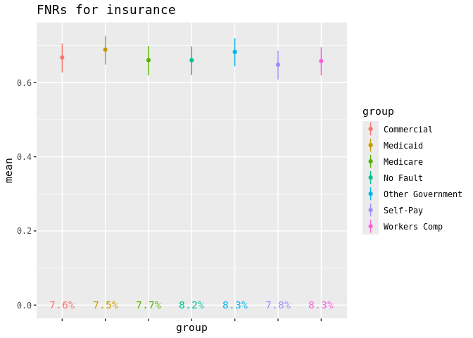<!-- -->

## Assess Fairness across Classes to Identify “Most Biased” Class

Often, models will show evidence of bias within multiple classes. To
start adjusting thresholds, we need to prioritize one class which
reports the “most” bias. Looking at a panel of summary measures can
highlight overarching patterns to help us decide how to make these
decisions. In the following table, we see measures quantifying equal
opportunity difference (“disparity”) between subgroups and their
associated reference group across our classes of interest. The worst
performing class is highlighted in red for each statistic, which are
defined as follows:

- ‘Biggest Abs EOD’ = absolute value of the biggest difference between a subgroup’s
  FNR and the reference group’s FNR
- “Abs Avg EOD” = absolute value of the average of the differences between every
  subgroup and the reference group’s FNR
- “Weighted Abs Avg EOD” = absolute value of the weighted average of the
  differences between every subgroup and the reference group’s FNR
- “Subgroups with >0.05 Abs EOD (%)” = percent of subgroups showing bias, or percent of subgroups
  with FNR’s >= 0.05 different from the referent’s FNR.

You need to edit the following code chunk per your variables and
referents, according to in-line comments:

``` r
# Pay attention to the in-line comments in this chunk, as edits are required for your data/use-case: 

disparity_table = tibble(
  class = c("race", "sex", "language", "insurance"), # Edit according to your classes
  big = c(
    (max(abs(EOD_race$eod))), # Edit according to your classes
    (max(abs(EOD_sex$eod))), # Edit according to your classes
    (max(abs(EOD_language$eod))), # Edit according to your classes
    (max(abs(EOD_insurance$eod))) # Edit according to your classes
    ),
  avg = c(
    sum(EOD_race$eod) / (n_distinct(EOD_race$group) - 1),  # Edit according to your classes
    sum(EOD_sex$eod) / (n_distinct(EOD_sex$group) - 1),      # Edit according to your classes
    sum(EOD_language$eod) / (n_distinct(EOD_language$group) - 1),  # Edit according to your classes
    sum(EOD_insurance$eod) / (n_distinct(EOD_insurance$group) - 1)), # Edit according to your classes
  avg_pop_adj = 
    c(
    (EOD_race %>% filter(group != 'Hispanic') %>% summarize(weighted_sum = sum(eod * total), total_sum = sum(total)) %>% mutate(final_result = weighted_sum / total_sum) %>% pull(final_result)), # Replace the value of group != to your reference group for this class
    (EOD_sex %>% filter(group != 'Female') %>% summarize(weighted_sum = sum(eod * total), total_sum = sum(total)) %>% mutate(final_result = weighted_sum / total_sum) %>% pull(final_result)), # Replace the value of group != to your reference group for this class
    (EOD_language %>% filter(group != 'English') %>% summarize(weighted_sum = sum(eod * total), total_sum = sum(total)) %>% mutate(final_result = weighted_sum / total_sum) %>% pull(final_result)), # Replace the value of group != to your reference group for this class
    (EOD_insurance %>% filter(group != 'Medicaid') %>% summarize(weighted_sum = sum(eod * total), total_sum = sum(total)) %>% mutate(final_result = weighted_sum / total_sum) %>% pull(final_result)) # Replace the value of group != to your reference group for this class
    ),
  five_pp = c(
    (nrow(EOD_race %>% filter(five_pp_diff == "BIAS")))/(nrow(EOD_race %>% filter(eod > 0)))*100, # Edit according to your classes
    (nrow(EOD_sex %>% filter(five_pp_diff == "BIAS")))/(nrow(EOD_sex%>% filter(eod > 0)))*100, # Edit according to your classes
    (nrow(EOD_language %>% filter(five_pp_diff == "BIAS")))/(nrow(EOD_language%>% filter(eod > 0)))*100, # Edit according to your classes
    (nrow(EOD_insurance %>% filter(five_pp_diff == "BIAS")))/(nrow(EOD_insurance%>% filter(eod > 0)))*100 # Edit according to your classes
    ) 
)

disparity_table = disparity_table %>% 
  mutate(across(where(is.numeric),~ round(.,3))) %>%
  mutate(across(where(is.numeric), ~ ifelse(. == max(.), paste0("<span style='color: red;'>", ., "</span>"), .)))

knitr::kable(disparity_table, caption = "Equal Opportunity Disparity Table", col.names = c(
 "Class",
 "Biggest Abs EOD",
 "Abs Avg EOD",
 "Weighted Abs Avg EOD",
 "Subgroups with >0.05 Abs EOD (%)"
)) 
```

| Class     | Biggest Abs EOD                        | Abs Avg EOD                            | Weighted Abs Avg EOD                   | Subgroups with \>0.05 Abs EOD (%)       |
|:----------|:---------------------------------------|:---------------------------------------|:---------------------------------------|:----------------------------------------|
| race      | <span style="color: red;">0.256</span> | <span style="color: red;">0.145</span> | <span style="color: red;">0.152</span> | <span style="color: red;">85.714</span> |
| sex       | 0.022                                  | 0.022                                  | 0.022                                  | 0                                       |
| language  | 0.015                                  | 0.014                                  | 0.013                                  | 0                                       |
| insurance | 0.255                                  | <span style="color: red;">0.145</span> | 0.147                                  | 66.667                                  |

Equal Opportunity Disparity Table

The class with the biggest burden of bias according to the table should
be prioritized for mitigation in Step 3. For us, that’s
*race/ethnicity*.
\_\_\_\_\_\_\_\_\_\_\_\_\_\_\_\_\_\_\_\_\_\_\_\_\_\_\_\_\_\_\_\_\_\_\_\_\_\_\_\_\_\_\_\_\_\_\_\_\_\_\_\_\_\_\_\_\_\_\_\_\_\_\_\_\_\_\_\_\_\_\_\_\_\_\_\_\_

# Step 3: Mitigate Bias

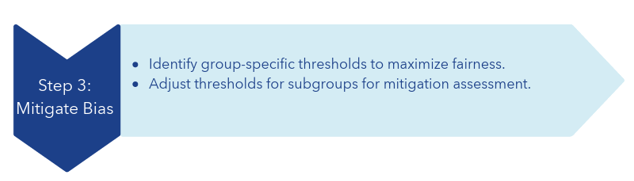

## Identify Group-Specific Thresholds That Improve Equal Opportunity

Threshold adjustment sets a custom risk score threshold for each group
within one class. Our goal is to select the group-specific thresholds
which maximize fairness without drastically changing our alert rate or
accuracy. To do this, we set the referent group’s FNR as the goal. The
code finds the threshold that yields an FNR closest to the referent’s
for each other subgroup, to minimize total equal opportunity difference.

You will need to set your class and reference group values where
indicated in-line:

``` r
# Pay attention to the in-line comments in this chunk, as edits are required for your data/use-case: 

# Function to calculate FNR
calculate_fnr <- function(predicted, actual, threshold) {
  predictions <- ifelse(predicted >= threshold, 1, 0)
  fn <- sum((predictions == 0) & (actual == 1))
  tp_fn <- sum(actual == 1)
  fnr <- fn / tp_fn
  return(fnr)
}

# Function to find the optimal threshold 
find_optimal_threshold <- function(data, reference_fnr, protected_class_value, protected_class_col,whichScore) {
  thresholds <- seq(0, 1, by = 0.01)
  fnr_diffs <- sapply(thresholds, function(threshold) {
    fnr <- calculate_fnr(data$proba[data[[protected_class_col]] == protected_class_value],
                         data$outcome[data[[protected_class_col]] == protected_class_value],
                         threshold)
    
    diff <- if (whichScore == 'closest') {
      abs(fnr - reference_fnr)
    } else if (whichScore == 'lowest' && fnr <= reference_fnr) {
      fnr - reference_fnr
    } else if (whichScore == 'highest' && fnr >= reference_fnr) {
      fnr - reference_fnr
    } else {
      NA_real_
    }
  })
  optimal_threshold <- if (whichScore == 'closest' || whichScore == 'highest') {
    thresholds[which.min(fnr_diffs)]
  } else if (whichScore == 'lowest') {
    thresholds[which.max(fnr_diffs)]
  } else {
    NA_real_
  } 
  return(optimal_threshold)
}

# Set your data
predictive_model_data <- BIA

# Set the protected class column name to the class identified as having the most bias in Step 2. 
protected_class_col <- 'race' 

# Set the baseline threshold value as the threshold for the reference class.
reference_threshold <- .15

# Set the reference group to calculate its FNR
reference_class <- 'Hispanic'

reference_fnr <- calculate_fnr(predictive_model_data$proba[predictive_model_data[[protected_class_col]] == reference_class],predictive_model_data$outcome[predictive_model_data[[protected_class_col]] == reference_class],reference_threshold)  

# Find optimal thresholds for each protected class value
protected_classes <- unique(predictive_model_data[[protected_class_col]])
optimal_thresholds <- sapply(protected_classes, function(class) {
  find_optimal_threshold(predictive_model_data, reference_fnr, class, protected_class_col,'closest')
})
# Print optimal thresholds
knitr::kable(optimal_thresholds, caption = "Subgroup Thresholds")
```

|                   |    x |
|:------------------|-----:|
| African American  | 0.04 |
| Asian             | 0.35 |
| Hispanic          | 0.15 |
| Native American   | 0.27 |
| Something Else    | 0.13 |
| Two or more races | 0.28 |
| Unknown           | 0.28 |
| White             | 0.35 |

Subgroup Thresholds

``` r
# Convert optimal_thresholds to a named vector
optimal_thresholds <- setNames(optimal_thresholds, protected_classes)
```

## Update Predictions Using Your Adjusted Threshold to Prepare for Mitigation Assessment

We create an updated binary prediction variable to reflect our updated
thresholds. We can think of this as “label flipping,” since some scores
previously categorized as low risk (0) are now categorized as high risk
(1).

``` r
#  Again, you don't need to edit the parameters in this chunk as long as you've maintained our nomenclature, just run it.

BIA <- BIA %>%
  mutate(
    new_label = case_when(
      TRUE ~ ifelse(proba >= optimal_thresholds[!!sym(protected_class_col)], 1, 0)
    )
  ) %>%
  mutate(
    old_label = ifelse(
      proba >= reference_threshold,1,0)
    )
```

We count our label flips to get a sense of the changes happening.

``` r
#  Again, you don't need to edit the parameters in this chunk as long as you've maintained our nomenclature, just run it.

flips <- BIA %>%
  group_by(race) %>%
  summarise(
    count_changes = sum(old_label != new_label),
    one_to_zero = sum(old_label > new_label),
    zero_to_one = sum(old_label < new_label)
  ) %>%
  add_row(
    race = "Total",  # Label for the total row
    count_changes = sum(BIA$old_label != BIA$new_label),
    one_to_zero = sum(BIA$old_label > BIA$new_label),
    zero_to_one = sum(BIA$old_label < BIA$new_label)
  )
knitr::kable(flips)
```

| race              | count_changes | one_to_zero | zero_to_one |
|:------------------|--------------:|------------:|------------:|
| African American  |          1169 |           0 |        1169 |
| Asian             |           222 |         222 |           0 |
| Hispanic          |             0 |           0 |           0 |
| Native American   |           301 |         301 |           0 |
| Something Else    |            97 |           0 |          97 |
| Two or more races |           302 |         302 |           0 |
| Unknown           |           283 |         283 |           0 |
| White             |           502 |         502 |           0 |
| Total             |          2876 |        1610 |        1266 |

------------------------------------------------------------------------

# Step 4: Assess Mitigation Success

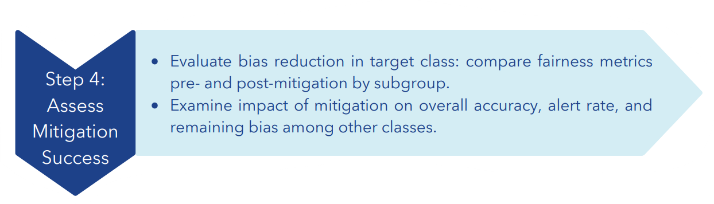

## Assess Model Accuracy and Alert Rate with Updated Thresholds

We want to know if our updated thresholds have impacted model accuracy
and alert rate. If we reduced bias but no longer offer valuable
predictions, we should not implement the adjusted model. Although there
are no hard rules, we are hoping to see that our threshold adjustment
has not markedly decreased our overall accuracy by more than 5% or
changed our alert rate by more than 20%. In some cases, more dramatic
changes in accuracy or alert rate may be tolerable to improve fairness.

First, we’ll calculate accuracy.

``` r
#  Again, you don't need to edit the parameters in this chunk as long as you've maintained our nomenclature, just run it.

# Function to calculate baseline accuracy score
accuracy_score <- function(outcome, old_label, normalize = TRUE, sample_weight = NULL) {
  # Check if outcome and old_label are the same length
  if (length(outcome) != length(old_label)) {
    stop("outcome and old_label must have the same length")
  }
  if (is.matrix(outcome) || is.matrix(old_label)) {
    differing_labels <- rowSums(outcome != old_label)
    score <- as.numeric(differing_labels == 0)
  } else {
    score <- outcome == old_label
  }
  if (!is.null(sample_weight)) {
    score <- score * sample_weight
    total_weight <- sum(sample_weight)
    return(if (normalize) sum(score) / total_weight else sum(score))
  } else {
    return(if (normalize) mean(score) else sum(score))
  }
}

# Function to calculate adjusted accuracy score
accuracy_score <- function(outcome, new_label, normalize = TRUE, sample_weight = NULL) {
  # Check if outcome and new_label are the same length
  if (length(outcome) != length(new_label)) {
    stop("outcome and new_label must have the same length")
  }
  if (is.matrix(outcome) || is.matrix(new_label)) {
    differing_labels <- rowSums(outcome != new_label)
    score <- as.numeric(differing_labels == 0)
  } else {
    score <- outcome == new_label
  }
  if (!is.null(sample_weight)) {
    score <- score * sample_weight
    total_weight <- sum(sample_weight)
    return(if (normalize) sum(score) / total_weight else sum(score))
  } else {
    return(if (normalize) mean(score) else sum(score))
  }
}

# Use the functions to get accuracy scores
baseline_accuracy = accuracy_score(BIA$outcome, BIA$old_label)
adjusted_accuracy = accuracy_score(BIA$outcome, BIA$new_label)

# Print the accuracy scores
print(paste("Baseline Accuracy Score:", baseline_accuracy))
```

    ## [1] "Baseline Accuracy Score: 0.87758"

``` r
print(paste("Adjusted Accuracy Score:", adjusted_accuracy))
```

    ## [1] "Adjusted Accuracy Score: 0.8791"

Second, we’ll put our accuracy scores in a table and also calculate
alert rate changes. You don’t need to edit the following code chunk if
your nomenclature has been the same as ours up to this point.

``` r
#  Again, you don't need to edit the parameters in this chunk as long as you've maintained our nomenclature, just run it.

alert_baseline = BIA %>% 
        summarize(total = n(), 
                  pp = sum(old_label)) %>% 
        mutate(alert_rate = pp/total)
               
alert_adjusted = BIA %>% 
        summarize(total = n(), 
                  pp = sum(new_label)) %>% 
        mutate(alert_rate = pp/total)

accuracy_alert = tibble(
  model = c("Baseline", "Adjusted", "Percent Change"),
  accuracy = c(baseline_accuracy, 
               adjusted_accuracy, 
               ((adjusted_accuracy - baseline_accuracy)/baseline_accuracy)*100),
  alert_rate = c(alert_baseline$alert_rate, 
                 alert_adjusted$alert_rate,
                (((alert_adjusted$alert_rate - alert_baseline$alert_rate)/alert_baseline$alert_rate))*100))

comparison = accuracy_alert %>%
  mutate(accuracy = round(accuracy,2),
         alert_rate = round(alert_rate, 2))

knitr::kable(comparison, caption = "Accuracy and Alert Rate Changes", col.names = c(
 "",
 "Accuracy",
 "Alert Rate"))  %>%
  kableExtra::kable_styling(bootstrap_options = c("striped", "hover"), full_width = TRUE)
```

<table class="table table-striped table-hover" style="margin-left: auto; margin-right: auto;">
<caption>
Accuracy and Alert Rate Changes
</caption>
<thead>
<tr>
<th style="text-align:left;">
</th>
<th style="text-align:right;">
Accuracy
</th>
<th style="text-align:right;">
Alert Rate
</th>
</tr>
</thead>
<tbody>
<tr>
<td style="text-align:left;">
Baseline
</td>
<td style="text-align:right;">
0.88
</td>
<td style="text-align:right;">
0.17
</td>
</tr>
<tr>
<td style="text-align:left;">
Adjusted
</td>
<td style="text-align:right;">
0.88
</td>
<td style="text-align:right;">
0.16
</td>
</tr>
<tr>
<td style="text-align:left;">
Percent Change
</td>
<td style="text-align:right;">
0.17
</td>
<td style="text-align:right;">
-4.04
</td>
</tr>
</tbody>
</table>

Check to see if both changes fall within our acceptable ranges (\<10%
change in accuracy and \<20% change in alert rate). If yes, we can
proceed to our second check.

## Assess Fairness Improvement within Chosen Class

We want to understand if our updated thresholds improved bias in the
class that we identified. We re-generate the equal opportunity
difference table we ran in Step 2 with our updated prediction labels.

``` r
# Again, you don't need to edit the parameters in this chunk as long as you've maintained our nomenclature, just run it.
adjusted_CIs = lapply(sensitive, function(s){
      loc_ci = BIA %>% 
      group_by_(s) %>% 
      summarize(
                  total = n(), 
                  pos = sum(outcome), neg = total - pos, # actual positive and actual negative
                  pp = sum(new_label), pn = total - pp, # predicted P and N where total = P+N
                  tp = sum((new_label + outcome) == 2), fp = pp - tp, # Predicted P = True + False P
                  tn = sum((new_label + outcome) == 0), fn = pn - tn,
                  neg_check = fp + tn, pos_check = tp + fn
        ) %>% 
        mutate(prev_percent = (round((pos/total) * 100, digits=4)), 
               alert_rate = pp/total, 
               ppv_precision = tp/pp, ppv_ci = binom.confint(tp, pp, method = 'ac')[4:6], 
               npv = tn/pn, 
               tpr_recall_sensitivity = tp/(pos), tpr_ci = binom.confint(tp, pos, method = 'ac')[4:6],
               tnr_specificity = tn/(neg), 
               fpr_type1 = fp/(neg),
               fnr_type2 = fn/(pos), fnr_ci = binom.confint(fn, pos, method = 'ac')[4:6] 
  )
    }) %>% bind_rows()
```

``` r
# Pay attention to the in-line comments in this chunk, as edits are required for your data/use-case: 
adj_EOD_race = adjusted_CIs %>% filter(!is.na(race)) %>%
  bias_check('fnr_ci', 'race', 'Hispanic', fairness_metric='FNR') %>% # If you are using different sensitive variables than we are, change the second value to your first variable of interest; change the third value to its reference group. 
  mutate(
    five_pp_diff = if_else(group == 'Hispanic', "REF", five_pp_diff) # Replace the value of 'group' with your reference group
  ) %>%  
  select('group','mean','eod','five_pp_diff','total','pos','prev') %>%
  rename('fnr' = mean) %>%
    rename('prevalence' = prev) 
knitr::kable(adj_EOD_race, caption = "Adjusted Equal Opportunity Differences, Race", digits=4) %>%
  kableExtra::kable_styling() %>%
  kableExtra::column_spec(2:4, background = "lightgray") %>%
  kableExtra::column_spec(5:7, background = "darkgray")
```

<table class="table" style="margin-left: auto; margin-right: auto;">
<caption>
Adjusted Equal Opportunity Differences, Race
</caption>
<thead>
<tr>
<th style="text-align:left;">
group
</th>
<th style="text-align:right;">
fnr
</th>
<th style="text-align:right;">
eod
</th>
<th style="text-align:left;">
five_pp_diff
</th>
<th style="text-align:right;">
total
</th>
<th style="text-align:right;">
pos
</th>
<th style="text-align:right;">
prev
</th>
</tr>
</thead>
<tbody>
<tr>
<td style="text-align:left;">
African American
</td>
<td style="text-align:right;background-color: lightgray !important;">
0.2882
</td>
<td style="text-align:right;background-color: lightgray !important;">
0.0184
</td>
<td style="text-align:left;background-color: lightgray !important;">
NO BIAS
</td>
<td style="text-align:right;background-color: darkgray !important;">
5963
</td>
<td style="text-align:right;background-color: darkgray !important;">
937
</td>
<td style="text-align:right;background-color: darkgray !important;">
0.1571
</td>
</tr>
<tr>
<td style="text-align:left;">
Asian
</td>
<td style="text-align:right;background-color: lightgray !important;">
0.2600
</td>
<td style="text-align:right;background-color: lightgray !important;">
0.0097
</td>
<td style="text-align:left;background-color: lightgray !important;">
NO BIAS
</td>
<td style="text-align:right;background-color: darkgray !important;">
5619
</td>
<td style="text-align:right;background-color: darkgray !important;">
473
</td>
<td style="text-align:right;background-color: darkgray !important;">
0.0842
</td>
</tr>
<tr>
<td style="text-align:left;">
Hispanic
</td>
<td style="text-align:right;background-color: lightgray !important;">
0.2697
</td>
<td style="text-align:right;background-color: lightgray !important;">
0.0000
</td>
<td style="text-align:left;background-color: lightgray !important;">
REF
</td>
<td style="text-align:right;background-color: darkgray !important;">
9753
</td>
<td style="text-align:right;background-color: darkgray !important;">
975
</td>
<td style="text-align:right;background-color: darkgray !important;">
0.1000
</td>
</tr>
<tr>
<td style="text-align:left;">
Native American
</td>
<td style="text-align:right;background-color: lightgray !important;">
0.2652
</td>
<td style="text-align:right;background-color: lightgray !important;">
0.0045
</td>
<td style="text-align:left;background-color: lightgray !important;">
NO BIAS
</td>
<td style="text-align:right;background-color: darkgray !important;">
5631
</td>
<td style="text-align:right;background-color: darkgray !important;">
460
</td>
<td style="text-align:right;background-color: darkgray !important;">
0.0817
</td>
</tr>
<tr>
<td style="text-align:left;">
Something Else
</td>
<td style="text-align:right;background-color: lightgray !important;">
0.2788
</td>
<td style="text-align:right;background-color: lightgray !important;">
0.0090
</td>
<td style="text-align:left;background-color: lightgray !important;">
NO BIAS
</td>
<td style="text-align:right;background-color: darkgray !important;">
2826
</td>
<td style="text-align:right;background-color: darkgray !important;">
226
</td>
<td style="text-align:right;background-color: darkgray !important;">
0.0800
</td>
</tr>
<tr>
<td style="text-align:left;">
Two or more races
</td>
<td style="text-align:right;background-color: lightgray !important;">
0.2663
</td>
<td style="text-align:right;background-color: lightgray !important;">
0.0034
</td>
<td style="text-align:left;background-color: lightgray !important;">
NO BIAS
</td>
<td style="text-align:right;background-color: darkgray !important;">
5781
</td>
<td style="text-align:right;background-color: darkgray !important;">
413
</td>
<td style="text-align:right;background-color: darkgray !important;">
0.0714
</td>
</tr>
<tr>
<td style="text-align:left;">
Unknown
</td>
<td style="text-align:right;background-color: lightgray !important;">
0.2646
</td>
<td style="text-align:right;background-color: lightgray !important;">
0.0051
</td>
<td style="text-align:left;background-color: lightgray !important;">
NO BIAS
</td>
<td style="text-align:right;background-color: darkgray !important;">
5688
</td>
<td style="text-align:right;background-color: darkgray !important;">
393
</td>
<td style="text-align:right;background-color: darkgray !important;">
0.0691
</td>
</tr>
<tr>
<td style="text-align:left;">
White
</td>
<td style="text-align:right;background-color: lightgray !important;">
0.2754
</td>
<td style="text-align:right;background-color: lightgray !important;">
0.0057
</td>
<td style="text-align:left;background-color: lightgray !important;">
NO BIAS
</td>
<td style="text-align:right;background-color: darkgray !important;">
8739
</td>
<td style="text-align:right;background-color: darkgray !important;">
817
</td>
<td style="text-align:right;background-color: darkgray !important;">
0.0935
</td>
</tr>
</tbody>
</table>

``` r
adjusted_CIs %>% filter(!is.na(race)) %>% 
  bias_check('fnr_ci', 'race', 'Hispanic', fairness_metric='FNR') %>% # If you are using different sensitive variables than we are, change the second value to your first variable of interest; change the third value to its reference group. 
  mutate(label = paste0(as.character(round(prev*100, 1)), '%')) %>%
  ggplot(aes(x=group, y = mean, ymin = lower, ymax = upper, color = group)) + 
  geom_linerange() + geom_point() + 
  theme(axis.line=element_blank(), axis.text.x=element_blank()) + 
  ggtitle("Adj FNRs for race") +
  geom_text(aes(x=group, y=0, label=label), show.legend=FALSE)
```

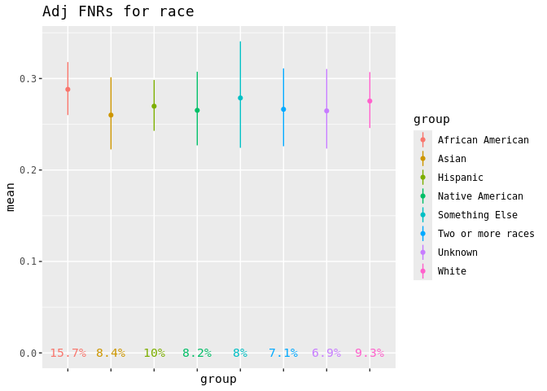<!-- -->

``` r
adj_EOD_sex = adjusted_CIs %>% filter(!is.na(sex)) %>% 
  bias_check('fnr_ci', 'sex', 'Female', fairness_metric='FNR') %>% # If you are using different sensitive variables than we are, change the second value to your first variable of interest; change the third value to its reference group. 
    mutate(
    five_pp_diff = if_else(group == 'Female', "REF", five_pp_diff)) %>%  # Replace the value of 'group' with your reference group
    select('group','mean','eod','five_pp_diff','total','pos','prev') %>%
    rename('fnr' = mean) 
knitr::kable(adj_EOD_sex, caption = "Adjusted Equal Opportunity Differences, Sex", digits=4) %>%
  kableExtra::kable_styling() %>%
  kableExtra::column_spec(2:4, background = "lightgray") %>%
  kableExtra::column_spec(5:7, background = "darkgray")
```

<table class="table" style="margin-left: auto; margin-right: auto;">
<caption>
Adjusted Equal Opportunity Differences, Sex
</caption>
<thead>
<tr>
<th style="text-align:left;">
group
</th>
<th style="text-align:right;">
fnr
</th>
<th style="text-align:right;">
eod
</th>
<th style="text-align:left;">
five_pp_diff
</th>
<th style="text-align:right;">
total
</th>
<th style="text-align:right;">
pos
</th>
<th style="text-align:right;">
prev
</th>
</tr>
</thead>
<tbody>
<tr>
<td style="text-align:left;">
Female
</td>
<td style="text-align:right;background-color: lightgray !important;">
0.2032
</td>
<td style="text-align:right;background-color: lightgray !important;">
0.0000
</td>
<td style="text-align:left;background-color: lightgray !important;">
REF
</td>
<td style="text-align:right;background-color: darkgray !important;">
25997
</td>
<td style="text-align:right;background-color: darkgray !important;">
2647
</td>
<td style="text-align:right;background-color: darkgray !important;">
0.1018
</td>
</tr>
<tr>
<td style="text-align:left;">
Male
</td>
<td style="text-align:right;background-color: lightgray !important;">
0.3625
</td>
<td style="text-align:right;background-color: lightgray !important;">
0.1592
</td>
<td style="text-align:left;background-color: lightgray !important;">
BIAS
</td>
<td style="text-align:right;background-color: darkgray !important;">
24003
</td>
<td style="text-align:right;background-color: darkgray !important;">
2047
</td>
<td style="text-align:right;background-color: darkgray !important;">
0.0853
</td>
</tr>
</tbody>
</table>

``` r
adjusted_CIs %>% filter(!is.na(sex)) %>% 
  bias_check('fnr_ci', 'sex', 'Female', fairness_metric='FNR') %>% # If you are using different sensitive variables than we are, change the second value to your first variable of interest; change the third value to its reference group. 
  mutate(label = paste0(as.character(round(prev*100, 1)), '%')) %>%
  ggplot(aes(x=group, y = mean, ymin = lower, ymax = upper, color = group)) + 
  geom_linerange() + geom_point() + 
  theme(axis.line=element_blank(), axis.text.x=element_blank()) + 
  ggtitle("Adj FNRs for sex") +
  geom_text(aes(x=group, y=0, label=label), show.legend=FALSE)
```

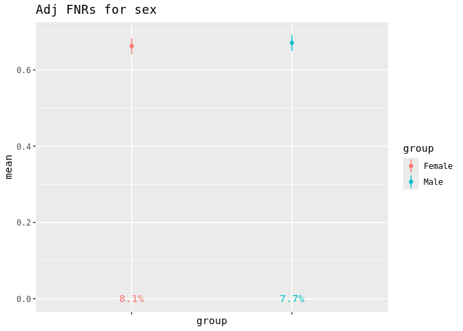<!-- -->

``` r
adj_EOD_language = adjusted_CIs %>% filter(!is.na(language)) %>% 
  bias_check('fnr_ci', 'language', 'English', fairness_metric='FNR') %>% # If you are using different sensitive variables than we are, change the second value to your first variable of interest; change the third value to its reference group. 
  mutate(
    five_pp_diff = if_else(group == 'English', "REF", five_pp_diff) # Replace the value of 'group' with your reference group
  ) %>%  
  select('group','mean','eod','five_pp_diff','total','pos','prev') 
knitr::kable(adj_EOD_language, caption = "Adjusted Equal Opportunity Differences, Language", digits=4) %>%
  kableExtra::kable_styling() %>%
  kableExtra::column_spec(2:4, background = "lightgray") %>%
  kableExtra::column_spec(5:7, background = "darkgray")
```

<table class="table" style="margin-left: auto; margin-right: auto;">
<caption>
Adjusted Equal Opportunity Differences, Language
</caption>
<thead>
<tr>
<th style="text-align:left;">
group
</th>
<th style="text-align:right;">
mean
</th>
<th style="text-align:right;">
eod
</th>
<th style="text-align:left;">
five_pp_diff
</th>
<th style="text-align:right;">
total
</th>
<th style="text-align:right;">
pos
</th>
<th style="text-align:right;">
prev
</th>
</tr>
</thead>
<tbody>
<tr>
<td style="text-align:left;">
English
</td>
<td style="text-align:right;background-color: lightgray !important;">
0.2549
</td>
<td style="text-align:right;background-color: lightgray !important;">
0.0000
</td>
<td style="text-align:left;background-color: lightgray !important;">
REF
</td>
<td style="text-align:right;background-color: darkgray !important;">
23841
</td>
<td style="text-align:right;background-color: darkgray !important;">
2381
</td>
<td style="text-align:right;background-color: darkgray !important;">
0.0999
</td>
</tr>
<tr>
<td style="text-align:left;">
Other
</td>
<td style="text-align:right;background-color: lightgray !important;">
0.2752
</td>
<td style="text-align:right;background-color: lightgray !important;">
0.0203
</td>
<td style="text-align:left;background-color: lightgray !important;">
NO BIAS
</td>
<td style="text-align:right;background-color: darkgray !important;">
6886
</td>
<td style="text-align:right;background-color: darkgray !important;">
614
</td>
<td style="text-align:right;background-color: darkgray !important;">
0.0892
</td>
</tr>
<tr>
<td style="text-align:left;">
Spanish
</td>
<td style="text-align:right;background-color: lightgray !important;">
0.2966
</td>
<td style="text-align:right;background-color: lightgray !important;">
0.0417
</td>
<td style="text-align:left;background-color: lightgray !important;">
NO BIAS
</td>
<td style="text-align:right;background-color: darkgray !important;">
19273
</td>
<td style="text-align:right;background-color: darkgray !important;">
1699
</td>
<td style="text-align:right;background-color: darkgray !important;">
0.0882
</td>
</tr>
</tbody>
</table>

``` r
adjusted_CIs %>% filter(!is.na(language)) %>% 
  bias_check('fnr_ci', 'language', 'English', fairness_metric='FNR') %>% # If you are using different sensitive variables than we are, change the second value to your first variable of interest; change the third value to its reference group. 
  mutate(label = paste0(as.character(round(prev*100, 1)), '%')) %>%
  ggplot(aes(x=group, y = mean, ymin = lower, ymax = upper, color = group)) + 
  geom_linerange() + geom_point() + 
  theme(axis.line=element_blank(), axis.text.x=element_blank()) + 
  ggtitle("Adj FNRs for language") +
  geom_text(aes(x=group, y=0, label=label), show.legend=FALSE)
```

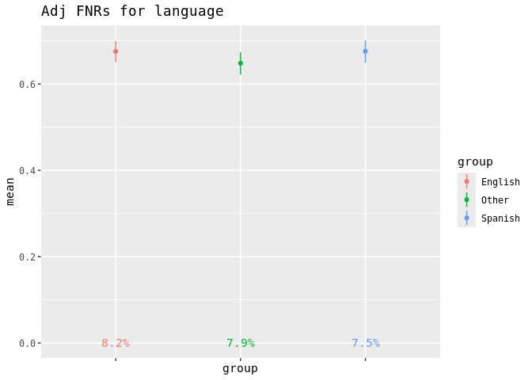<!-- -->

``` r
adj_EOD_insurance = adjusted_CIs %>% filter(!is.na(insurance)) %>% 
  bias_check('fnr_ci', 'insurance', 'Medicaid', fairness_metric='FNR') %>% # If you are using different sensitive variables than we are, change the second value to your first variable of interest; change the third value to its reference group. 
  mutate(
    five_pp_diff = if_else(group == 'Medicaid', "REF", five_pp_diff) # Replace the value of 'group' with your reference group
  ) %>%  
  select('group','mean','eod','five_pp_diff','total','pos','prev') 
knitr::kable(adj_EOD_insurance, caption = "Adjusted Equal Opportunity Differences, Insurance", digits=4) %>%
  kableExtra::kable_styling() %>%
  kableExtra::column_spec(2:4, background = "lightgray") %>%
  kableExtra::column_spec(5:7, background = "darkgray")
```

<table class="table" style="margin-left: auto; margin-right: auto;">
<caption>
Adjusted Equal Opportunity Differences, Insurance
</caption>
<thead>
<tr>
<th style="text-align:left;">
group
</th>
<th style="text-align:right;">
mean
</th>
<th style="text-align:right;">
eod
</th>
<th style="text-align:left;">
five_pp_diff
</th>
<th style="text-align:right;">
total
</th>
<th style="text-align:right;">
pos
</th>
<th style="text-align:right;">
prev
</th>
</tr>
</thead>
<tbody>
<tr>
<td style="text-align:left;">
Commercial
</td>
<td style="text-align:right;background-color: lightgray !important;">
0.2768
</td>
<td style="text-align:right;background-color: lightgray !important;">
0.0500
</td>
<td style="text-align:left;background-color: lightgray !important;">
NO BIAS
</td>
<td style="text-align:right;background-color: darkgray !important;">
10618
</td>
<td style="text-align:right;background-color: darkgray !important;">
838
</td>
<td style="text-align:right;background-color: darkgray !important;">
0.0789
</td>
</tr>
<tr>
<td style="text-align:left;">
Medicaid
</td>
<td style="text-align:right;background-color: lightgray !important;">
0.3268
</td>
<td style="text-align:right;background-color: lightgray !important;">
0.0000
</td>
<td style="text-align:left;background-color: lightgray !important;">
REF
</td>
<td style="text-align:right;background-color: darkgray !important;">
6619
</td>
<td style="text-align:right;background-color: darkgray !important;">
716
</td>
<td style="text-align:right;background-color: darkgray !important;">
0.1082
</td>
</tr>
<tr>
<td style="text-align:left;">
Medicare
</td>
<td style="text-align:right;background-color: lightgray !important;">
0.2441
</td>
<td style="text-align:right;background-color: lightgray !important;">
0.0827
</td>
<td style="text-align:left;background-color: lightgray !important;">
BIAS
</td>
<td style="text-align:right;background-color: darkgray !important;">
6524
</td>
<td style="text-align:right;background-color: darkgray !important;">
549
</td>
<td style="text-align:right;background-color: darkgray !important;">
0.0842
</td>
</tr>
<tr>
<td style="text-align:left;">
No Fault
</td>
<td style="text-align:right;background-color: lightgray !important;">
0.3968
</td>
<td style="text-align:right;background-color: lightgray !important;">
0.0700
</td>
<td style="text-align:left;background-color: lightgray !important;">
BIAS
</td>
<td style="text-align:right;background-color: darkgray !important;">
6454
</td>
<td style="text-align:right;background-color: darkgray !important;">
761
</td>
<td style="text-align:right;background-color: darkgray !important;">
0.1179
</td>
</tr>
<tr>
<td style="text-align:left;">
Other Government
</td>
<td style="text-align:right;background-color: lightgray !important;">
0.2052
</td>
<td style="text-align:right;background-color: lightgray !important;">
0.1216
</td>
<td style="text-align:left;background-color: lightgray !important;">
BIAS
</td>
<td style="text-align:right;background-color: darkgray !important;">
6588
</td>
<td style="text-align:right;background-color: darkgray !important;">
575
</td>
<td style="text-align:right;background-color: darkgray !important;">
0.0873
</td>
</tr>
<tr>
<td style="text-align:left;">
Self-Pay
</td>
<td style="text-align:right;background-color: lightgray !important;">
0.1967
</td>
<td style="text-align:right;background-color: lightgray !important;">
0.1301
</td>
<td style="text-align:left;background-color: lightgray !important;">
BIAS
</td>
<td style="text-align:right;background-color: darkgray !important;">
6538
</td>
<td style="text-align:right;background-color: darkgray !important;">
676
</td>
<td style="text-align:right;background-color: darkgray !important;">
0.1034
</td>
</tr>
<tr>
<td style="text-align:left;">
Workers Comp
</td>
<td style="text-align:right;background-color: lightgray !important;">
0.2193
</td>
<td style="text-align:right;background-color: lightgray !important;">
0.1075
</td>
<td style="text-align:left;background-color: lightgray !important;">
BIAS
</td>
<td style="text-align:right;background-color: darkgray !important;">
6659
</td>
<td style="text-align:right;background-color: darkgray !important;">
579
</td>
<td style="text-align:right;background-color: darkgray !important;">
0.0869
</td>
</tr>
</tbody>
</table>

``` r
adjusted_CIs %>% filter(!is.na(insurance)) %>% 
  bias_check('fnr_ci', 'insurance', 'Medicaid', fairness_metric='FNR') %>% # If you are using different sensitive variables than we are, change the second value to your first variable of interest; change the third value to its reference group. 
  mutate(label = paste0(as.character(round(prev*100, 1)), '%')) %>%
  ggplot(aes(x=group, y = mean, ymin = lower, ymax = upper, color = group)) + 
  geom_linerange() + geom_point() + 
  theme(axis.line=element_blank(), axis.text.x=element_blank()) + 
  ggtitle("Adj FNRs for insurance") +
  geom_text(aes(x=group, y=0, label=label), show.legend=FALSE)
```

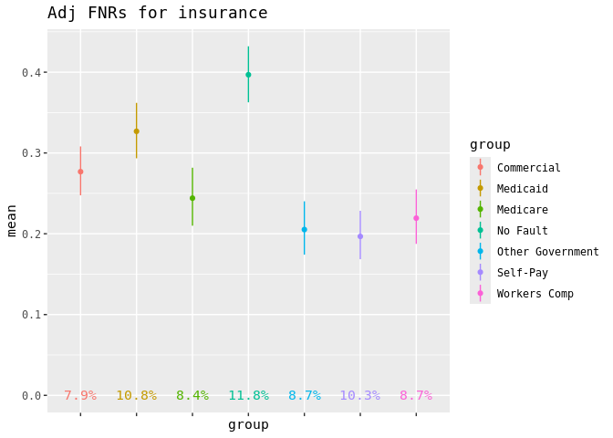<!-- -->

## Assess Impact of Threshold Adjustment on Fairness Across Classes

Comparing original and updated Disparity Tables shows how threshold
adjustment impacted fairness for other classes. Every organization
should define success contextually. To catalyze those conversations, we
offer one possible set of guidelines in Step 4.3 of the Playbook.

``` r
# Pay attention to the in-line comments in this chunk, as edits are required for your data/use-case: 

adj_disparity_table = tibble(
  class = c("race", "sex", "language", "insurance"), # Edit according to your classes
  big = c(
    (max(abs(adj_EOD_race$eod))), # Edit according to your classes
    (max(abs(adj_EOD_sex$eod))), # Edit according to your classes
    (max(abs(adj_EOD_language$eod))), # Edit according to your classes
    (max(abs(adj_EOD_insurance$eod))) # Edit according to your classes
    ),
  avg = c(
    sum(adj_EOD_race$eod) / (n_distinct(adj_EOD_race$group) - 1),  # Edit according to your classes
    sum(adj_EOD_sex$eod) / (n_distinct(adj_EOD_sex$group) - 1),      # Edit according to your classes
    sum(adj_EOD_language$eod) / (n_distinct(adj_EOD_language$group) - 1),  # Edit according to your classes
    sum(adj_EOD_insurance$eod) / (n_distinct(adj_EOD_insurance$group) - 1)), # Edit according to your classes
  avg_pop_adj = 
    c(
    (adj_EOD_race %>% filter(group != 'Hispanic') %>% summarize(weighted_sum = sum(eod * total), total_sum = sum(total)) %>% mutate(final_result = weighted_sum / total_sum) %>% pull(final_result)), # Replace the value of group != to your reference group for this class
    (adj_EOD_sex %>% filter(group != 'Female') %>% summarize(weighted_sum = sum(eod * total), total_sum = sum(total)) %>% mutate(final_result = weighted_sum / total_sum) %>% pull(final_result)), # Replace the value of group != to your reference group for this class
    (adj_EOD_language %>% filter(group != 'English') %>% summarize(weighted_sum = sum(eod * total), total_sum = sum(total)) %>% mutate(final_result = weighted_sum / total_sum) %>% pull(final_result)), # Replace the value of group != to your reference group for this class
    (adj_EOD_insurance %>% filter(group != 'Medicaid') %>% summarize(weighted_sum = sum(eod * total), total_sum = sum(total)) %>% mutate(final_result = weighted_sum / total_sum) %>% pull(final_result)) # Replace the value of group != to your reference group for this class
    ),
  five_pp = c(
    (nrow(adj_EOD_race %>% filter(five_pp_diff == "BIAS")))/(nrow(adj_EOD_race %>% filter(eod > 0)))*100, # Edit according to your classes
    (nrow(adj_EOD_sex %>% filter(five_pp_diff == "BIAS")))/(nrow(adj_EOD_sex%>% filter(eod > 0)))*100, # Edit according to your classes
    (nrow(adj_EOD_language %>% filter(five_pp_diff == "BIAS")))/(nrow(adj_EOD_language%>% filter(eod > 0)))*100, # Edit according to your classes
    (nrow(adj_EOD_insurance %>% filter(five_pp_diff == "BIAS")))/(nrow(adj_EOD_insurance%>% filter(eod > 0)))*100 # Edit according to your classes
    ) 
)

adj_disparity_table = adj_disparity_table %>% 
  mutate(across(where(is.numeric),~ round(.,3))) %>%
  mutate(across(where(is.numeric), ~ ifelse(. == max(.), paste0("<span style='color: red;'>", ., "</span>"), .)))

knitr::kable(adj_disparity_table, caption = "Adjusted Equal Opportunity Disparity Table", col.names = c(
 "Class",
 "Biggest Abs EOD",
 "Abs Avg EOD",
 "Weighted Abs Avg EOD",
 "Subgroups with >0.05 Abs EOD (%)"
)) 
```

| Class     | Biggest Abs EOD                        | Abs Avg EOD                            | Weighted Abs Avg EOD                   | Subgroups with \>0.05 Abs EOD (%)    |
|:----------|:---------------------------------------|:---------------------------------------|:---------------------------------------|:-------------------------------------|
| race      | 0.018                                  | 0.008                                  | 0.008                                  | 0                                    |
| sex       | <span style="color: red;">0.159</span> | <span style="color: red;">0.159</span> | <span style="color: red;">0.159</span> | <span style="color: red;">100</span> |
| language  | 0.042                                  | 0.031                                  | 0.036                                  | 0                                    |
| insurance | 0.13                                   | 0.094                                  | 0.09                                   | 83.333                               |

Adjusted Equal Opportunity Disparity Table

While we reduced bias in every column for our target class, we see some
increases across other classes.

To interpret these differences and determine the success of mitigation
using this table, refer to Section 4.3 of the Playbook.

To implement your new subgroup thresholds in your EMR, refer to Section
5 of the Playbook.
\_\_\_\_\_\_\_\_\_\_\_\_\_\_\_\_\_\_\_\_\_\_\_\_\_\_\_\_\_\_\_\_\_\_\_\_\_\_\_\_\_\_\_\_\_\_\_\_\_\_\_\_\_\_\_\_\_\_\_\_\_\_\_\_\_\_\_\_\_\_\_\_\_\_\_\_\_

*Suggested Citation:* Mackin S, Major VJ, Chunara R, Dickenson A, Lee S,
Bocour A, Eisenstein L, Davis N, Newton-Dame R. Mitigating bias in AI
algorithms: A healthcare guide to threshold adjustment. New York City:
Office of Population Health, NYC Health + Hospitals; 2024.
