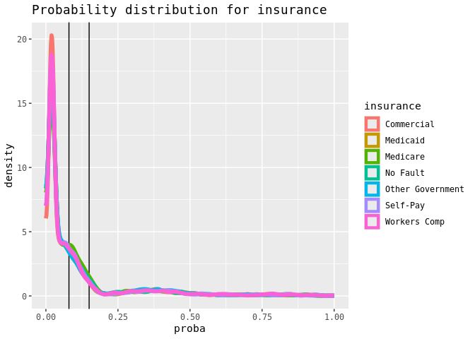

Mitigating Bias in AI Algorithms: A Healthcare Guide to Threshold
Adjustment
================
2025-01-02


# Introduction

The annotated code presented here is meant to accompany our detailed
playbook, which aims to address the gap in accessible, practical tools
for mitigating algorithmic bias by illustrating a simple method of
threshold adjustment that can improve the fairness of both commercial
and in-house algorithms. The playbook pairs concrete, real-world
examples with an annotated code repository. This resource is the fruit
of collaboration across NYC Health + Hospitals (H+H), a safety net
healthcare system serving \>1 million low-income patients; New York
University’s Center for Health Data Science; and Grossman School of
Medicine’s Department of Population Health. With funding from Schmidt
Futures and Rockefeller Philanthropy Advisors, we assessed and mitigated
bias in predictive algorithms live in our EMR. We hope that the
step-by-step process in this playbook will empower other low-resource
systems to tackle algorithmic bias as an ongoing and essential piece of
high-quality care.

[Step 1: Prepare](#step-1-prepare)  
[Step 2: Assess Bias](#step-2-assess-bias)  
[Step 3: Mitigate Bias](#step-3-mitigate-bias)  
[Step 4: Assess Mitigation Success](#step-4-assess-mitigation-success)  
\_\_\_\_\_\_\_\_\_\_\_\_\_\_\_\_\_\_\_\_\_\_\_\_\_\_\_\_\_\_\_\_\_\_\_\_\_\_\_\_\_\_\_\_\_\_\_\_\_\_\_\_\_\_\_\_\_\_\_\_\_\_\_\_\_\_\_\_\_\_\_\_\_\_\_\_\_\_\_\_

# Step 1: Prepare


``` r
# Setup your environment by loading the following libraries. 
# They may need to be installed first if they are not already: 
library(tidyverse) 
library(ROCR) 
library(janitor)
library(dplyr)
library(tidyr)
library(glue)
library(ggplot2)
library(ggpubr)
library(purrr)
library(DBI)
library(odbc)
library(patchwork)
library(knitr)
library(readr)
library(tidyverse) 
library(binom)
library(kableExtra)
library(yardstick)
library(ROCR)
library(pROC)
library(reader)
```

## Get Your Data

There are two ways to pull your dataset.

1)  Connect to your system’s database. We suggest using an ODBC
    connection and DBI interface with a SQL query. This is our preferred
    method, as it does not require saving any PHI locally, but for the
    purposes of this playbook, we are using option 2:

2)  Connect to a csv flat file, as follows:

``` r
# We're calling our dataset 'BIA' for Bias In Algorithms. You can call yours 
# whatever you like, but if you do change it, be sure to replace all other 
# occurrences of 'BIA' in the code with your new name
BIA <- read_csv("Synthetic Data for Bias Mitigation.xlsb.csv") # Replace with your file name
```

## Clean Your Data

Your data needs to contain the following columns:  
\* ‘id’ (unique ID)  
\* ‘proba’ (probability (risk score) between ‘0’ and ‘1’)  
\* ‘outcome’ (binary outcome, where ‘1’ is the outcome we are trying to
predict and ‘0’ is the absence of that outcome)  
\* and the sensitive variables you want to assess for bias. We’re using
‘race’,‘sex’, ‘age_cat’, ‘language’, and ‘insurance’

If you need to rename any variables, do so now.

``` r
# Clean up your data so that your probability variable is 'proba' and your outcome variable is 'label_value'
# Rename any of your sensitive variables how you'd like. For us, that's updating our insurance and age names: 
BIA = janitor::clean_names(BIA) %>% #we're making all variable names lowercase
  rename(proba = score, #and renaming our score variable as 'proba',
         insurance = financial_class, #our financial_class variable as 'insurance',
         label_value = outcome, #our outcome variable as 'label_value', and
         age = age_category) #our age_category variable as 'age'
```

Check to make sure your outcome variable is binary. If it’s not, combine
outcome categories so that it is.

``` r
categories <- unique(BIA$label_value) 
print(categories)
```

    ## [1] 0 1

Great, we have two outcome values. We can proceed!

## Define Your Sensitive Variables

``` r
# List categorical variables of interest here by their column names in the above data frame.
sensitive = list('race', 'sex', 'age', 'language', 'insurance') # replace variables of interest as needed
```

Review ‘n’ counts to identify subgroups comprising less than 1% of the
population

``` r
knitr::kable(lapply(sensitive, function(s){
  BIA %>% count_(s) %>% mutate(fraction = n/sum(n)) %>% arrange(fraction)
}), caption = "Subgroup counts")
```

<table class="kable_wrapper">
<caption>
Subgroup counts
</caption>
<tbody>
<tr>
<td>

| race              |    n | fraction |
|:------------------|-----:|---------:|
| Native American   | 6118 |  0.12236 |
| Something Else    | 6198 |  0.12396 |
| Asian             | 6199 |  0.12398 |
| Hispanic          | 6241 |  0.12482 |
| Unknown           | 6253 |  0.12506 |
| Two or more races | 6272 |  0.12544 |
| White             | 6284 |  0.12568 |
| African American  | 6435 |  0.12870 |

</td>
<td>

| sex    |     n | fraction |
|:-------|------:|---------:|
| Female | 24922 |  0.49844 |
| Male   | 25078 |  0.50156 |

</td>
<td>

| age   |     n | fraction |
|:------|------:|---------:|
| \>45  | 16623 |  0.33246 |
| 25-45 | 16666 |  0.33332 |
| \<25  | 16711 |  0.33422 |

</td>
<td>

| language |     n | fraction |
|:---------|------:|---------:|
| Spanish  | 16468 |  0.32936 |
| Other    | 16569 |  0.33138 |
| English  | 16963 |  0.33926 |

</td>
<td>

| insurance        |    n | fraction |
|:-----------------|-----:|---------:|
| Other Government | 6976 |  0.13952 |
| No Fault         | 7082 |  0.14164 |
| Medicare         | 7104 |  0.14208 |
| Medicaid         | 7160 |  0.14320 |
| Workers Comp     | 7207 |  0.14414 |
| Commercial       | 7208 |  0.14416 |
| Self-Pay         | 7263 |  0.14526 |

</td>
</tr>
</tbody>
</table>

All subgroups comprise \>1% so we can proceed, but if they did not, this
would be the step where we logically combine groups or drop those too
small for independent analysis.

## Establish Thresholds

After a review of model documentation and interviews with clinicians,
set your thresholds. For us, the following thresholds were identified:

- Low risk: 0%-7.9%
- Med risk: 8%-14.9%
- High risk: 15%-100%

``` r
# Specify threshold(s) as values between 0 and 1:
thresholds = c(0.08, 0.15) #you only need one threshold, but if you are considering your options or evaluating low, high, and medium risk thresholds, you can list multiple cutoffs at this stage
```

------------------------------------------------------------------------

# Step 2: Assess Bias


## Probability distributions:

Distributions of the probability of the outcome with thresholds output
as vertical lines.

``` r
lapply(sensitive, function(s){
  BIA %>% ggplot(aes(x = proba, color = .data[[!!s]])) + 
    geom_vline(xintercept = thresholds) + 
    geom_density(bounds = c(0, 1), linewidth = 2) +
    ggtitle(paste("Probability distribution for",s))
})
```

    ## [[1]]

<!-- -->

    ## 
    ## [[2]]

<!-- -->

    ## 
    ## [[3]]

<!-- -->

    ## 
    ## [[4]]

<!-- -->

    ## 
    ## [[5]]

<!-- -->

## Overall Model Performance: AUROC, PR-AUC, Calibration Curves

``` r
# First, define some helper functions. The below will help us output: (1) ROC with thresholds highlighted as dots, (2) PreCIsion-recall curve with thresholds highlighted as dots, (3) Calibration curve with thresholds highlighted as vertical lines.

#### Area under curve with trapezoid 
helper.trapezoid <- function(df) {
  if(!all(c("x", "y") %in% colnames(df))) {
    stop('df must have x and y columns')
  }
  df.trap <- df %>% 
    arrange(x) %>% 
    filter(!is.na(x), !is.na(y)) %>% 
    mutate(x.diff = x - lag(x, 1),
           y.mean = (y + lag(y, 1))/2,
           xy = x.diff * y.mean) 
  auc <- df.trap %>% 
    summarize(auc = sum(xy, na.rm = T)) %>% .$auc
  return(auc)
}

#### ROC curve and area under 
analytic.calc_roc = function(predictions, labels, group_name = NA_character_){
  if(length(unique(labels)) == 1){
    ## shortcut to return nothing.
    return(tibble(group = group_name,
                  auroc = NA, 
                  roc = list(tibble(group = group_name)) ) )
  }
  pred = ROCR::prediction(predictions, labels)
  perf = ROCR::performance(pred, 'auc')
  res.auc = perf@y.values[[1]]
  
  perf = ROCR::performance(pred, 'tpr', 'fpr')
  plot.roc = tibble(cutoff = perf@alpha.values[[1]], 
                    tpr = perf@y.values[[1]],
                    fpr = perf@x.values[[1]] )
  if(!is.na(group_name)){
    plot.roc = plot.roc %>% mutate(group = group_name)
  }else{plot.roc = plot.roc %>% mutate(group = 'total')}
  return(tibble(group = group_name,
                auroc = res.auc, 
                roc = list(plot.roc)))
}

#### PreCIsion-recall curve and area under
analytic.calc_prc = function(predictions, labels, group_name = NA_character_){
  if(length(unique(labels)) == 1){
    ## shortcut to return nothing.
    return(tibble(group = group_name,
                  auprc = NA, 
                  prc = list(tibble(group = group_name)) ) )
  }
  pred = ROCR::prediction(predictions, labels)
  perf = ROCR::performance(pred, "prec", "rec")
  perf_npv = ROCR::performance(pred, "npv", 'rpp') 
  
  plot.prc = tibble(cutoff = perf@alpha.values[[1]],
                    preCIsion.raw = perf@y.values[[1]],
                    recall = perf@x.values[[1]],
                    npv = perf_npv@y.values[[1]],
                    alert_rpp = perf_npv@x.values[[1]]) %>% 
    arrange(cutoff) %>% 
    mutate(preCIsion = cummax(preCIsion.raw) ) %>% 
    select(cutoff, preCIsion, recall, preCIsion.raw, npv, alert_rpp) %>% 
    arrange(desc(cutoff))
  if(!is.na(group_name)){
    plot.prc = plot.prc %>% mutate(group = group_name)
  }else{plot.prc = plot.prc %>% mutate(group = 'total')}
  res.auprc <- helper.trapezoid(plot.prc %>% select(x = recall, y = preCIsion))
  return(tibble(group = group_name,
                auprc = res.auprc, 
                prc = list(plot.prc)) )
}

#### Calibration curves 
analytic.form_ntiles = function(df, group_var = NA, groups = 10, z = 1.96, percentile_range = c(0, 1)){
  if(is.na(group_var)){
    df = df %>% mutate(group = 'total')
  }else{
    df = df %>% rename(group = !!group_var)
  }
  df %>% 
    group_by(group) %>% 
    mutate(chunk = ntile(proba, n = groups), center = (chunk * (100/groups) - ((100/groups)/2)) ) %>% 
    filter(center >= first(percentile_range)*100, chunk <= last(percentile_range)*100) %>% 
    group_by(group, center) %>% 
    summarize(label_mean = mean(label_value),
              model_prediction_mean = mean(proba),
              n = n()) %>% ungroup() %>% 
    mutate(se = sqrt((label_mean*(1-label_mean))/n),
           lower = label_mean - z*se, 
           upper = label_mean + z*se) %>%
    mutate(lower = pmax(lower, 0), upper = pmin(upper, 1))
}
```

``` r
  total.roc = analytic.calc_roc(BIA$proba, BIA$label_value)
  writeLines(glue::glue('Area under the ROC curve is: {round(100*first(total.roc$auroc), 2)}%'))
```

    ## Area under the ROC curve is: 50.79%

``` r
  total.prc = analytic.calc_prc(BIA$proba, BIA$label_value)
  writeLines(glue::glue('Area under the PreCIsion-Recall curve for is: {round(100*first(total.prc$auprc), 2)}%'))
```

    ## Area under the PreCIsion-Recall curve for is: 8.13%

``` r
  temp.a = total.roc %>% pull(roc) %>% bind_rows()
  a = temp.a %>% 
    ggplot(aes(x = fpr, y = tpr, color = group)) + 
    geom_vline(xintercept = c(0, 1)) + geom_hline(yintercept = c(0, 1)) + 
    geom_abline(color = 'grey50', linetype = 'dashed') + 
    geom_line(size = 1.5) + 
    geom_point(data = lapply(thresholds, function(t){temp.a %>% arrange(desc(cutoff)) %>% filter(cutoff <= t) %>% slice(1)}) %>% bind_rows(), 
             mapping = aes(fill = group), size = 3, stroke = 0.8, pch = 21, color = 'grey20') + 
    theme_minimal() + coord_fixed() + ggtitle('AUROC') 
  
temp.b = total.prc %>% pull(prc) %>% bind_rows() 
b = temp.b %>%
  ggplot(aes(x = recall, y = preCIsion, color = group)) + 
  geom_vline(xintercept = c(0, 1)) + 
  geom_hline(yintercept = c(0, 1)) + 
  geom_hline(data = temp.b %>% arrange(cutoff) %>% group_by(group) %>% slice(1) %>% ungroup(),
             mapping = aes(yintercept = preCIsion),
             color = 'grey50', linetype = 'dashed') + 
  geom_point(inherit.aes = T, mapping = aes(y = preCIsion.raw), size = 1, alpha = 0.1) + 
  geom_line(size = 1.5) + 
  geom_point(data = lapply(thresholds, function(t){temp.b %>% arrange(desc(cutoff)) %>% filter(cutoff <= t) %>% slice(1)}) %>% bind_rows(), 
             mapping = aes(fill = group), size = 3, stroke = 0.8, pch = 21, color = 'grey20') + 
  theme_minimal() + coord_fixed() + ggtitle('PR-AUC')
c = analytic.form_ntiles(BIA, groups =10) %>% 
  ggplot(aes(x = model_prediction_mean, y = label_mean, color = group)) + 
  #facet_grid(. ~ group) + 
  geom_vline(xintercept = c(0, 1)) + 
  geom_hline(yintercept = c(0, 1)) + # bounding box
  geom_abline(slope = 1, intercept = 0, color = 'grey50', linetype = 'dashed') + # diagonal line of perfect
  geom_vline(xintercept = thresholds, color = 'grey20') + # thresholds
  geom_point() + 
  geom_errorbar(aes(ymin = lower, ymax = upper), width = 0.02) + 
  geom_smooth(method= 'lm', color = 'grey20', se = FALSE) + 
  theme_minimal() + 
  coord_fixed() + 
  ylim(0, 1) + 
  xlim(0, 1) + 
  xlab('Mean Estimated Risk') + ylab('Mean Observed Positives') + ggtitle('Calibration')
  plot = ggarrange(a, b, c, ncol = 3, common.legend = TRUE, legend = 'none')
  plot
```

<!-- -->
\## Assess Model Performance Within Classes: AUROC, Calibration Curves

- Keep in mind, disparities in AUROC suggest the model functions
  (“discriminates”, in the good sense) better or worse for some
  subgroups (e.g., due to representation within the data, availability
  of data, etc.) and PR-AUC is swayed by outcome prevalence, so expect
  groups with higher outcome rates to have higher PR-AUCs.

``` r
performances = lapply(sensitive, function(s){
  print(s)
    g = BIA %>% group_by_(s)
    df.list = g %>% group_split() 
    s.values = group_keys(g) %>% unlist() 
    if(length(df.list) == 1){
      warning(glue::glue("a group of size 1 found for variable={s}, possibly an error"))
    }
    
    # For each value within the sensitive variable, e.g. for male within sex, calculate ROC and PRC
    temp.roc = mapply(function(temp.df, value){
      analytic.calc_roc(temp.df$proba, temp.df$label_value, group_name = value ) %>% 
        mutate(n_group = nrow(temp.df)) # subgroup sample size for clarity
    }, df.list, s.values ) %>% t() %>% as.tibble()
    
    temp.prc = mapply(function(temp.df, value){
      analytic.calc_prc(temp.df$proba, temp.df$label_value, group_name = value)
    }, df.list, s.values ) %>% t() %>% as.tibble()
    
    # Combine globals into one output of AUROCs and PR-AUCs
    global = left_join(temp.roc %>% select(group, n_group, auroc) %>% tidyr::unnest(cols = c(group, n_group, auroc)), temp.prc %>% select(group, auprc) %>% tidyr::unnest(cols = c(group, auprc)), by = join_by(group)) %>% mutate(group = glue::glue('{s}={group}'))
    
    # For plotting, unpack long list of each point along ROC and PR curves
    temp.a = temp.roc %>% pull(roc) %>% bind_rows() 
    temp.b = temp.prc %>% pull(prc) %>% bind_rows() 
    local = left_join(lapply(thresholds, function(t){temp.a %>% group_by(group) %>% arrange(desc(cutoff)) %>% 
        mutate(threshold_desired = t) %>% filter(cutoff <= threshold_desired) %>% slice(1)}) %>% bind_rows() , 
        lapply(thresholds, function(t){temp.b %>% group_by(group) %>% arrange(desc(cutoff)) %>% 
            mutate(threshold_desired = t) %>% filter(cutoff <= threshold_desired) %>% slice(1)}) %>% bind_rows() , #%>% mutate(curve = 'prc')
        by = c('group', 'threshold_desired'), suffix = c(".roc",  ".prc") ) %>% 
      mutate(variable = s) %>% 
      select(variable, group, threshold_desired, everything())
    
    # Generate graphs of a=ROC, b = PRC, c = calibration as above
    a = temp.a %>% 
      ggplot(aes(x = fpr, y = tpr, color = group)) + 
      geom_vline(xintercept = c(0, 1)) + geom_hline(yintercept = c(0, 1)) + 
      geom_abline(color = 'grey50', linetype = 'dashed') + 
      geom_line(size = 1.5) + 
      geom_point(data = local, 
                 mapping = aes(fill = group), size = 2, stroke = 0.8, pch = 21, color = 'grey20') + 
      theme_minimal() + coord_fixed() + 
      labs(color = s) +
      ggtitle(glue::glue("ROC Curve")) 
    
    b = temp.b %>%
      ggplot(aes(x = recall, y = preCIsion, color = group)) + 
      geom_vline(xintercept = c(0, 1)) + geom_hline(yintercept = c(0, 1)) + 
      geom_hline(data = . %>% arrange(cutoff) %>% group_by(group) %>% slice(1) %>% ungroup(),
                 mapping = aes(yintercept = preCIsion, color = group), #color = 'grey50'
                 linetype = 'dashed') + 
      geom_point(inherit.aes = T, mapping = aes(y = preCIsion.raw), size = 1, alpha = 0.1) + 
      geom_line(size = 1.5) + 
      geom_point(data = local, 
                 mapping = aes(fill = group), size = 2, stroke = 0.8, pch = 21, color = 'grey20') + 
      theme_minimal() + coord_fixed() + 
      guides(color = "none") +
      ggtitle(glue::glue("PRC Curve"))
    
    # Combine ROC and PR curves into one side-by-side
    ab = ggpubr::ggarrange(a, b, legend = 'none')
    
    # Calibration curves, default is 10 groups = deciles and no zooming.
    c = analytic.form_ntiles(BIA, groups = 10, group_var = s) %>% # passes entire input df in, stratifies internally.
      ggplot(aes(x = model_prediction_mean, y = label_mean, color = group)) + 
      facet_grid(. ~ group) + 
      geom_vline(xintercept = c(0, 1)) + geom_hline(yintercept = c(0, 1)) + # bounding box
      geom_abline(slope = 1, intercept = 0, color = 'grey50', linetype = 'dashed') + # diagonal line of perfect
      geom_vline(xintercept = thresholds, color = 'grey20') + # thresholds
      geom_point() + geom_errorbar(aes(ymin = lower, ymax = upper), width = 0.02) + 
      geom_smooth(method= 'lm', color = 'grey20', se = FALSE) + 
      theme_minimal() + coord_fixed() + 
      ylim(0, 1) + xlim(0, 1) + 
      xlab('Mean Estimated Risk') + ylab('Mean Observed Positives') +
      ggtitle(glue::glue("Calibration Curve"))
    
    # Combine calibration below ROC+PR into one giant figure.
    fig = ggpubr::ggarrange(ab, c, ncol = 1, nrow = 2, common.legend = TRUE, legend = 'bottom', heights = c(1, 1.2) ) 
    print(fig)
    
    return(tibble(global=list(global), local=list(local)) ) 
  }) %>% bind_rows()
```

    ## [1] "race"

<!-- -->

    ## [1] "sex"

<!-- -->

    ## [1] "age"

<!-- -->

    ## [1] "language"

<!-- -->

    ## [1] "insurance"

<!-- -->

``` r
# Unpack the listed outputs from above into dataframe
global_performances = performances %>% pull(global) %>% bind_rows() # 'global_performances' will output a table presenting the total AUROC and PR-AUC for each group within each sensitive variable. 
knitr::kable(global_performances)
```

| group                      | n_group |     auroc |     auprc |
|:---------------------------|--------:|----------:|----------:|
| race=African American      |    6435 | 0.5049994 | 0.0866900 |
| race=Asian                 |    6199 | 0.5127251 | 0.0858149 |
| race=Hispanic              |    6241 | 0.5262047 | 0.0828071 |
| race=Native American       |    6118 | 0.5056685 | 0.0862835 |
| race=Something Else        |    6198 | 0.5168311 | 0.0853229 |
| race=Two or more races     |    6272 | 0.4774217 | 0.0799771 |
| race=Unknown               |    6253 | 0.5214838 | 0.0820199 |
| race=White                 |    6284 | 0.4994842 | 0.0805740 |
| sex=Female                 |   24922 | 0.5090485 | 0.0839665 |
| sex=Male                   |   25078 | 0.5067609 | 0.0792212 |
| age=25-45                  |   16666 | 0.5095931 | 0.0841742 |
| age=\<25                   |   16711 | 0.5080443 | 0.0819541 |
| age=\>45                   |   16623 | 0.5061438 | 0.0801843 |
| language=English           |   16963 | 0.5038689 | 0.0846722 |
| language=Other             |   16569 | 0.5069614 | 0.0830072 |
| language=Spanish           |   16468 | 0.5135490 | 0.0787984 |
| insurance=Commercial       |    7208 | 0.5068758 | 0.0777737 |
| insurance=Medicaid         |    7160 | 0.5001590 | 0.0776156 |
| insurance=Medicare         |    7104 | 0.5133159 | 0.0813699 |
| insurance=No Fault         |    7082 | 0.4947024 | 0.0831798 |
| insurance=Other Government |    6976 | 0.4965449 | 0.0856945 |
| insurance=Self-Pay         |    7263 | 0.5233214 | 0.0833936 |
| insurance=Workers Comp     |    7207 | 0.5201778 | 0.0909183 |

``` r
local_performances = performances %>% pull(local) %>% bind_rows() %>% 
  mutate(fnr = 1-tpr, .after = 'fpr') # 'local_performances' will output a wider dataframe of the specific performance characteristics around each provided threshold/cutoff. Note that this is not an exhaustive list. The values are pulled from the curves used to make the graphs, a very high or very low threshold may output odd values such as 0, 1, Inf, or NA. 
print(local_performances)
```

    ## # A tibble: 46 × 13
    ## # Groups:   group [23]
    ##    variable group      threshold_desired cutoff.roc   tpr   fpr   fnr cutoff.prc
    ##    <chr>    <chr>                  <dbl>      <dbl> <dbl> <dbl> <dbl>      <dbl>
    ##  1 race     African A…              0.08       0.08 0.657 0.651 0.343       0.08
    ##  2 race     Asian                   0.08       0.08 0.657 0.650 0.343       0.08
    ##  3 race     Hispanic                0.08       0.08 0.683 0.652 0.317       0.08
    ##  4 race     Native Am…              0.08       0.08 0.677 0.652 0.323       0.08
    ##  5 race     Something…              0.08       0.08 0.685 0.646 0.315       0.08
    ##  6 race     Two or mo…              0.08       0.08 0.635 0.654 0.365       0.08
    ##  7 race     Unknown                 0.08       0.08 0.678 0.647 0.322       0.08
    ##  8 race     White                   0.08       0.08 0.654 0.656 0.346       0.08
    ##  9 race     African A…              0.15       0.15 0.325 0.326 0.675       0.15
    ## 10 race     Asian                   0.15       0.15 0.359 0.332 0.641       0.15
    ## # ℹ 36 more rows
    ## # ℹ 5 more variables: preCIsion <dbl>, recall <dbl>, preCIsion.raw <dbl>,
    ## #   npv <dbl>, alert_rpp <dbl>

## Assess Bias by Class: Equal Opportunity, Predictive Parity

``` r
#### Calculate confidence intervals (CIs) using the Agresti-Coull method:
CIs = lapply(sensitive, function(s){
    lapply(thresholds, function(t){
      loc_ci = BIA %>% mutate(new_label = as.integer(proba >= t) ) %>% group_by_(s) %>% 
        summarize(threshold = t, total = n(), 
                  pos = sum(label_value), neg = total - pos, # actual positive and actual negative
                  pp = sum(new_label), pn = total - pp, # predicted P and N where total = P+N
                  tp = sum((new_label + label_value) == 2), fp = pp - tp, # Predicted P = True + False P
                  tn = sum((new_label + label_value) == 0), fn = pn - tn,
                  neg_check = fp + tn, pos_check = tp + fn
        ) %>% 
        mutate(prev_percent = (round((pos/total) * 100, digits=4)), 
               alert_rate = pp/total, 
               ppv_preCIsion = tp/pp, ppv_ci = binom.confint(tp, pp, method = 'ac')[4:6], # adds a mean, lower, and upper dataframe inside the dataframe.
               npv = tn/pn, 
               tpr_recall_sensitivity = tp/(pos), tpr_ci = binom.confint(tp, pos, method = 'ac')[4:6],
               tnr_specificity = tn/(neg), 
               fpr_type1 = fp/(neg),
               fnr_type2 = fn/(pos), fnr_ci = binom.confint(fn, pos, method = 'ac')[4:6] 
  )
    }) %>% bind_rows()
  }) %>% bind_rows()
```

``` r
#### Then we create function to help with our bias check
bias_check = function(l_perfs, variable_colname, group_colname, reference_group, p_threshold = 0.05, fairness_metric="not FNR"){
  if(!(variable_colname %in% colnames(l_perfs)) ){warning(glue::glue("Could not find the supplied variable column named={variable_colname}")); return(FALSE)}
  if(!(group_colname %in% colnames(l_perfs)) ){warning(glue::glue("Could not find the supplied group column named={group_colname}")); return(FALSE)}
  if(!(reference_group %in% unlist(l_perfs[group_colname])) ){
    t_output = paste0(unlist(l_perfs[group_colname]), collapse = ", ")
    warning(glue::glue("Could not find the reference group={reference_group} specified in the set of values: [{t_output}]"))
    return(FALSE)}
  if(!('pos' %in% colnames(l_perfs))){warning("Could not find the # of positive cases in the expected column named=pos"); return(FALSE)}
  if(!('total' %in% colnames(l_perfs))){warning("Could not find the # of total cases in the expected column named=total"); return(FALSE)}
  ref = l_perfs[which(unlist(l_perfs[group_colname]) == reference_group), variable_colname][[1]] %>% 
    bind_cols(l_perfs[which(unlist(l_perfs[group_colname]) == reference_group), c('pos', 'total')] %>% 
                mutate(prev = pos/total)) # unpack pos and total and calculate prev
  output = l_perfs[variable_colname][[1]] %>% 
    bind_cols(l_perfs %>% select(pos, total) %>% mutate(prev = pos/total)) %>% # row order assumed, # unpack pos and total and calculate prev
    mutate(delta_sign = sign(mean - ref$mean),
           eod = abs(mean - ref$mean)) %>% 
    mutate(lower_outside = !between(lower, first(ref$lower), first(ref$upper)),
           upper_outside = !between(upper, first(ref$lower), first(ref$upper)),
           outside_ci = lower_outside & upper_outside) %>% 
    rowwise() %>% # perform following mutate() one row at a time, CRUCIAL to not vectorize the prop.test logic
    mutate(p_value = prop.test(x=c(pos, ref$pos[1]), n=c(total, ref$total[1]))$p.value,
           prev_delta_sign = sign(prev - ref$prev[1])) %>% 
    ungroup() %>% # the ungroup stops the rowwise
    mutate(difference_check = eod > 0.05) %>%
    mutate(five_pp_diff = if_else(eod > 0.05, "BIAS", "NO BIAS")) %>% 
    mutate(ci_check = if_else(eod > 0.05 & outside_ci, "BIAS", "NO BIAS")) %>% 
    mutate(
      prev_delta_sign = if_else(p_value > p_threshold, 0, prev_delta_sign), # if prevs similar, sign = 0, a fuzzy similar
      composite_check = case_when( 
             ci_check == "NO BIAS"| is.na(ci_check) ~ "NO BIAS", # if first two checks are not TRUE -> output FALSE (aka no evidence of bias).
             # if p > threshold, the prevalences are similar, all we need is a non-overlapping CI from the ci_check 
             ci_check == "BIAS" & p_value > p_threshold ~ "BIAS", # note the ci_check == TRUE is guaranteed from the above line
             # if p <= threshold, the prevalences are different, either a contrasting trend or equivalency 
             p_value <= p_threshold & abs(prev_delta_sign - delta_sign) == if_else(fairness_metric == 'FNR',0,2) ~ "BIAS", 
             p_value <= p_threshold ~ "NO BIAS", # catch where abs() == 0 or 1
             TRUE ~ NA # if the logic has a flaw, output NA
           ),
           directionality = case_when(
             p_value <= p_threshold & abs(prev_delta_sign - delta_sign) == if_else(fairness_metric == 'FNR',0,2) ~ TRUE, 
             p_value <= p_threshold ~ FALSE,
             TRUE ~ NA))
  output$group = unlist(l_perfs[group_colname])
  return(output %>% select(group, everything()) )
}
```

``` r
FNR_race = CIs %>% filter(!is.na(race), threshold == 0.15) %>% 
  bias_check('fnr_ci', 'race', 'Hispanic', fairness_metric='FNR') %>% 
  select('group','difference_check','outside_ci','directionality','five_pp_diff','ci_check','composite_check', 'mean','lower','upper','pos','total','prev','delta_sign','eod','lower_outside','upper_outside','p_value','prev_delta_sign') 
knitr::kable(FNR_race, caption = "FNR metrics by race", digits=4) %>%
  kableExtra::kable_styling() %>%
  kableExtra::column_spec(2:4, background = "lightgray") %>%
  kableExtra::column_spec(5:7, background = "darkgray")
```

<table class="table" style="margin-left: auto; margin-right: auto;">
<caption>
FNR metrics by race
</caption>
<thead>
<tr>
<th style="text-align:left;">
group
</th>
<th style="text-align:left;">
difference_check
</th>
<th style="text-align:left;">
outside_ci
</th>
<th style="text-align:left;">
directionality
</th>
<th style="text-align:left;">
five_pp_diff
</th>
<th style="text-align:left;">
ci_check
</th>
<th style="text-align:left;">
composite_check
</th>
<th style="text-align:right;">
mean
</th>
<th style="text-align:right;">
lower
</th>
<th style="text-align:right;">
upper
</th>
<th style="text-align:right;">
pos
</th>
<th style="text-align:right;">
total
</th>
<th style="text-align:right;">
prev
</th>
<th style="text-align:right;">
delta_sign
</th>
<th style="text-align:right;">
eod
</th>
<th style="text-align:left;">
lower_outside
</th>
<th style="text-align:left;">
upper_outside
</th>
<th style="text-align:right;">
p_value
</th>
<th style="text-align:right;">
prev_delta_sign
</th>
</tr>
</thead>
<tbody>
<tr>
<td style="text-align:left;">
African American
</td>
<td style="text-align:left;background-color: lightgray !important;">
FALSE
</td>
<td style="text-align:left;background-color: lightgray !important;">
FALSE
</td>
<td style="text-align:left;background-color: lightgray !important;">
NA
</td>
<td style="text-align:left;background-color: darkgray !important;">
NO BIAS
</td>
<td style="text-align:left;background-color: darkgray !important;">
NO BIAS
</td>
<td style="text-align:left;background-color: darkgray !important;">
NO BIAS
</td>
<td style="text-align:right;">
0.6754
</td>
<td style="text-align:right;">
0.6346
</td>
<td style="text-align:right;">
0.7137
</td>
<td style="text-align:right;">
536
</td>
<td style="text-align:right;">
6435
</td>
<td style="text-align:right;">
0.0833
</td>
<td style="text-align:right;">
1
</td>
<td style="text-align:right;">
0.0180
</td>
<td style="text-align:left;">
FALSE
</td>
<td style="text-align:left;">
TRUE
</td>
<td style="text-align:right;">
0.0832
</td>
<td style="text-align:right;">
0
</td>
</tr>
<tr>
<td style="text-align:left;">
Asian
</td>
<td style="text-align:left;background-color: lightgray !important;">
FALSE
</td>
<td style="text-align:left;background-color: lightgray !important;">
FALSE
</td>
<td style="text-align:left;background-color: lightgray !important;">
NA
</td>
<td style="text-align:left;background-color: darkgray !important;">
NO BIAS
</td>
<td style="text-align:left;background-color: darkgray !important;">
NO BIAS
</td>
<td style="text-align:left;background-color: darkgray !important;">
NO BIAS
</td>
<td style="text-align:right;">
0.6409
</td>
<td style="text-align:right;">
0.5981
</td>
<td style="text-align:right;">
0.6816
</td>
<td style="text-align:right;">
504
</td>
<td style="text-align:right;">
6199
</td>
<td style="text-align:right;">
0.0813
</td>
<td style="text-align:right;">
-1
</td>
<td style="text-align:right;">
0.0165
</td>
<td style="text-align:left;">
TRUE
</td>
<td style="text-align:left;">
FALSE
</td>
<td style="text-align:right;">
0.1893
</td>
<td style="text-align:right;">
0
</td>
</tr>
<tr>
<td style="text-align:left;">
Hispanic
</td>
<td style="text-align:left;background-color: lightgray !important;">
FALSE
</td>
<td style="text-align:left;background-color: lightgray !important;">
FALSE
</td>
<td style="text-align:left;background-color: lightgray !important;">
NA
</td>
<td style="text-align:left;background-color: darkgray !important;">
NO BIAS
</td>
<td style="text-align:left;background-color: darkgray !important;">
NO BIAS
</td>
<td style="text-align:left;background-color: darkgray !important;">
NO BIAS
</td>
<td style="text-align:right;">
0.6574
</td>
<td style="text-align:right;">
0.6132
</td>
<td style="text-align:right;">
0.6990
</td>
<td style="text-align:right;">
467
</td>
<td style="text-align:right;">
6241
</td>
<td style="text-align:right;">
0.0748
</td>
<td style="text-align:right;">
0
</td>
<td style="text-align:right;">
0.0000
</td>
<td style="text-align:left;">
FALSE
</td>
<td style="text-align:left;">
FALSE
</td>
<td style="text-align:right;">
1.0000
</td>
<td style="text-align:right;">
0
</td>
</tr>
<tr>
<td style="text-align:left;">
Native American
</td>
<td style="text-align:left;background-color: lightgray !important;">
FALSE
</td>
<td style="text-align:left;background-color: lightgray !important;">
FALSE
</td>
<td style="text-align:left;background-color: lightgray !important;">
NA
</td>
<td style="text-align:left;background-color: darkgray !important;">
NO BIAS
</td>
<td style="text-align:left;background-color: darkgray !important;">
NO BIAS
</td>
<td style="text-align:left;background-color: darkgray !important;">
NO BIAS
</td>
<td style="text-align:right;">
0.6772
</td>
<td style="text-align:right;">
0.6353
</td>
<td style="text-align:right;">
0.7164
</td>
<td style="text-align:right;">
508
</td>
<td style="text-align:right;">
6118
</td>
<td style="text-align:right;">
0.0830
</td>
<td style="text-align:right;">
1
</td>
<td style="text-align:right;">
0.0198
</td>
<td style="text-align:left;">
FALSE
</td>
<td style="text-align:left;">
TRUE
</td>
<td style="text-align:right;">
0.0972
</td>
<td style="text-align:right;">
0
</td>
</tr>
<tr>
<td style="text-align:left;">
Something Else
</td>
<td style="text-align:left;background-color: lightgray !important;">
FALSE
</td>
<td style="text-align:left;background-color: lightgray !important;">
FALSE
</td>
<td style="text-align:left;background-color: lightgray !important;">
NA
</td>
<td style="text-align:left;background-color: darkgray !important;">
NO BIAS
</td>
<td style="text-align:left;background-color: darkgray !important;">
NO BIAS
</td>
<td style="text-align:left;background-color: darkgray !important;">
NO BIAS
</td>
<td style="text-align:right;">
0.6660
</td>
<td style="text-align:right;">
0.6227
</td>
<td style="text-align:right;">
0.7066
</td>
<td style="text-align:right;">
482
</td>
<td style="text-align:right;">
6198
</td>
<td style="text-align:right;">
0.0778
</td>
<td style="text-align:right;">
1
</td>
<td style="text-align:right;">
0.0086
</td>
<td style="text-align:left;">
FALSE
</td>
<td style="text-align:left;">
TRUE
</td>
<td style="text-align:right;">
0.5594
</td>
<td style="text-align:right;">
0
</td>
</tr>
<tr>
<td style="text-align:left;">
Two or more races
</td>
<td style="text-align:left;background-color: lightgray !important;">
FALSE
</td>
<td style="text-align:left;background-color: lightgray !important;">
FALSE
</td>
<td style="text-align:left;background-color: lightgray !important;">
NA
</td>
<td style="text-align:left;background-color: darkgray !important;">
NO BIAS
</td>
<td style="text-align:left;background-color: darkgray !important;">
NO BIAS
</td>
<td style="text-align:left;background-color: darkgray !important;">
NO BIAS
</td>
<td style="text-align:right;">
0.7014
</td>
<td style="text-align:right;">
0.6598
</td>
<td style="text-align:right;">
0.7399
</td>
<td style="text-align:right;">
499
</td>
<td style="text-align:right;">
6272
</td>
<td style="text-align:right;">
0.0796
</td>
<td style="text-align:right;">
1
</td>
<td style="text-align:right;">
0.0440
</td>
<td style="text-align:left;">
FALSE
</td>
<td style="text-align:left;">
TRUE
</td>
<td style="text-align:right;">
0.3380
</td>
<td style="text-align:right;">
0
</td>
</tr>
<tr>
<td style="text-align:left;">
Unknown
</td>
<td style="text-align:left;background-color: lightgray !important;">
FALSE
</td>
<td style="text-align:left;background-color: lightgray !important;">
FALSE
</td>
<td style="text-align:left;background-color: lightgray !important;">
NA
</td>
<td style="text-align:left;background-color: darkgray !important;">
NO BIAS
</td>
<td style="text-align:left;background-color: darkgray !important;">
NO BIAS
</td>
<td style="text-align:left;background-color: darkgray !important;">
NO BIAS
</td>
<td style="text-align:right;">
0.6377
</td>
<td style="text-align:right;">
0.5934
</td>
<td style="text-align:right;">
0.6798
</td>
<td style="text-align:right;">
472
</td>
<td style="text-align:right;">
6253
</td>
<td style="text-align:right;">
0.0755
</td>
<td style="text-align:right;">
-1
</td>
<td style="text-align:right;">
0.0197
</td>
<td style="text-align:left;">
TRUE
</td>
<td style="text-align:left;">
FALSE
</td>
<td style="text-align:right;">
0.9163
</td>
<td style="text-align:right;">
0
</td>
</tr>
<tr>
<td style="text-align:left;">
White
</td>
<td style="text-align:left;background-color: lightgray !important;">
FALSE
</td>
<td style="text-align:left;background-color: lightgray !important;">
FALSE
</td>
<td style="text-align:left;background-color: lightgray !important;">
NA
</td>
<td style="text-align:left;background-color: darkgray !important;">
NO BIAS
</td>
<td style="text-align:left;background-color: darkgray !important;">
NO BIAS
</td>
<td style="text-align:left;background-color: darkgray !important;">
NO BIAS
</td>
<td style="text-align:right;">
0.6742
</td>
<td style="text-align:right;">
0.6314
</td>
<td style="text-align:right;">
0.7143
</td>
<td style="text-align:right;">
488
</td>
<td style="text-align:right;">
6284
</td>
<td style="text-align:right;">
0.0777
</td>
<td style="text-align:right;">
1
</td>
<td style="text-align:right;">
0.0168
</td>
<td style="text-align:left;">
FALSE
</td>
<td style="text-align:left;">
TRUE
</td>
<td style="text-align:right;">
0.5734
</td>
<td style="text-align:right;">
0
</td>
</tr>
</tbody>
</table>

``` r
CIs %>% filter(!is.na(race), threshold == 0.15) %>% 
  bias_check('fnr_ci', 'race', 'Hispanic', fairness_metric='FNR') %>% 
  mutate(label = paste0(as.character(round(prev*100, 1)), '%')) %>%
  ggplot(aes(x=group, y = mean, ymin = lower, ymax = upper, color = group)) + 
  geom_linerange() + geom_point() + 
  theme(axis.line=element_blank(), axis.text.x=element_blank()) + 
  ggtitle("FNR by race") +
  geom_text(aes(x=group, y=0, label=label), show.legend=FALSE)
```

<!-- -->

``` r
FNR_sex = CIs %>% filter(!is.na(sex), threshold == 0.15) %>% 
  bias_check('fnr_ci', 'sex', 'Female', fairness_metric='FNR') %>% select('group','difference_check','outside_ci','directionality','five_pp_diff','ci_check','composite_check', 'mean','lower','upper','pos','total','prev','delta_sign','eod','lower_outside','upper_outside','p_value','prev_delta_sign') 
knitr::kable(FNR_sex, caption = "FNR metrics by sex", digits=4) %>%
  kableExtra::kable_styling() %>%
  kableExtra::column_spec(2:4, background = "lightgray") %>%
  kableExtra::column_spec(5:7, background = "darkgray")
```

<table class="table" style="margin-left: auto; margin-right: auto;">
<caption>
FNR metrics by sex
</caption>
<thead>
<tr>
<th style="text-align:left;">
group
</th>
<th style="text-align:left;">
difference_check
</th>
<th style="text-align:left;">
outside_ci
</th>
<th style="text-align:left;">
directionality
</th>
<th style="text-align:left;">
five_pp_diff
</th>
<th style="text-align:left;">
ci_check
</th>
<th style="text-align:left;">
composite_check
</th>
<th style="text-align:right;">
mean
</th>
<th style="text-align:right;">
lower
</th>
<th style="text-align:right;">
upper
</th>
<th style="text-align:right;">
pos
</th>
<th style="text-align:right;">
total
</th>
<th style="text-align:right;">
prev
</th>
<th style="text-align:right;">
delta_sign
</th>
<th style="text-align:right;">
eod
</th>
<th style="text-align:left;">
lower_outside
</th>
<th style="text-align:left;">
upper_outside
</th>
<th style="text-align:right;">
p_value
</th>
<th style="text-align:right;">
prev_delta_sign
</th>
</tr>
</thead>
<tbody>
<tr>
<td style="text-align:left;">
Female
</td>
<td style="text-align:left;background-color: lightgray !important;">
FALSE
</td>
<td style="text-align:left;background-color: lightgray !important;">
FALSE
</td>
<td style="text-align:left;background-color: lightgray !important;">
NA
</td>
<td style="text-align:left;background-color: darkgray !important;">
NO BIAS
</td>
<td style="text-align:left;background-color: darkgray !important;">
NO BIAS
</td>
<td style="text-align:left;background-color: darkgray !important;">
NO BIAS
</td>
<td style="text-align:right;">
0.6624
</td>
<td style="text-align:right;">
0.6415
</td>
<td style="text-align:right;">
0.6827
</td>
<td style="text-align:right;">
2020
</td>
<td style="text-align:right;">
24922
</td>
<td style="text-align:right;">
0.0811
</td>
<td style="text-align:right;">
0
</td>
<td style="text-align:right;">
0.0000
</td>
<td style="text-align:left;">
FALSE
</td>
<td style="text-align:left;">
FALSE
</td>
<td style="text-align:right;">
1.0000
</td>
<td style="text-align:right;">
0
</td>
</tr>
<tr>
<td style="text-align:left;">
Male
</td>
<td style="text-align:left;background-color: lightgray !important;">
FALSE
</td>
<td style="text-align:left;background-color: lightgray !important;">
FALSE
</td>
<td style="text-align:left;background-color: lightgray !important;">
NA
</td>
<td style="text-align:left;background-color: darkgray !important;">
NO BIAS
</td>
<td style="text-align:left;background-color: darkgray !important;">
NO BIAS
</td>
<td style="text-align:left;background-color: darkgray !important;">
NO BIAS
</td>
<td style="text-align:right;">
0.6710
</td>
<td style="text-align:right;">
0.6497
</td>
<td style="text-align:right;">
0.6915
</td>
<td style="text-align:right;">
1936
</td>
<td style="text-align:right;">
25078
</td>
<td style="text-align:right;">
0.0772
</td>
<td style="text-align:right;">
1
</td>
<td style="text-align:right;">
0.0086
</td>
<td style="text-align:left;">
FALSE
</td>
<td style="text-align:left;">
TRUE
</td>
<td style="text-align:right;">
0.1142
</td>
<td style="text-align:right;">
0
</td>
</tr>
</tbody>
</table>

``` r
CIs %>% filter(!is.na(sex), threshold == 0.15) %>% 
  bias_check('fnr_ci', 'sex', 'Female', fairness_metric='FNR') %>% 
  mutate(label = paste0(as.character(round(prev*100, 1)), '%')) %>%
  ggplot(aes(x=group, y = mean, ymin = lower, ymax = upper, color = group)) + 
  geom_linerange() + geom_point() + 
  theme(axis.line=element_blank(), axis.text.x=element_blank()) + 
  ggtitle("FNR by sex") +
  geom_text(aes(x=group, y=0, label=label), show.legend=FALSE)
```

<!-- -->

``` r
FNR_language = CIs %>% filter(!is.na(language), threshold == 0.15) %>% 
  bias_check('fnr_ci', 'language', 'English', fairness_metric='FNR') %>% select('group','difference_check','outside_ci','directionality','five_pp_diff','ci_check','composite_check', 'mean','lower','upper','pos','total','prev','delta_sign','eod','lower_outside','upper_outside','p_value','prev_delta_sign') 
knitr::kable(FNR_language, caption = "FNR metrics by language", digits=4) %>%
  kableExtra::kable_styling() %>%
  kableExtra::column_spec(2:4, background = "lightgray") %>%
  kableExtra::column_spec(5:7, background = "darkgray")
```

<table class="table" style="margin-left: auto; margin-right: auto;">
<caption>
FNR metrics by language
</caption>
<thead>
<tr>
<th style="text-align:left;">
group
</th>
<th style="text-align:left;">
difference_check
</th>
<th style="text-align:left;">
outside_ci
</th>
<th style="text-align:left;">
directionality
</th>
<th style="text-align:left;">
five_pp_diff
</th>
<th style="text-align:left;">
ci_check
</th>
<th style="text-align:left;">
composite_check
</th>
<th style="text-align:right;">
mean
</th>
<th style="text-align:right;">
lower
</th>
<th style="text-align:right;">
upper
</th>
<th style="text-align:right;">
pos
</th>
<th style="text-align:right;">
total
</th>
<th style="text-align:right;">
prev
</th>
<th style="text-align:right;">
delta_sign
</th>
<th style="text-align:right;">
eod
</th>
<th style="text-align:left;">
lower_outside
</th>
<th style="text-align:left;">
upper_outside
</th>
<th style="text-align:right;">
p_value
</th>
<th style="text-align:right;">
prev_delta_sign
</th>
</tr>
</thead>
<tbody>
<tr>
<td style="text-align:left;">
English
</td>
<td style="text-align:left;background-color: lightgray !important;">
FALSE
</td>
<td style="text-align:left;background-color: lightgray !important;">
FALSE
</td>
<td style="text-align:left;background-color: lightgray !important;">
NA
</td>
<td style="text-align:left;background-color: darkgray !important;">
NO BIAS
</td>
<td style="text-align:left;background-color: darkgray !important;">
NO BIAS
</td>
<td style="text-align:left;background-color: darkgray !important;">
NO BIAS
</td>
<td style="text-align:right;">
0.6755
</td>
<td style="text-align:right;">
0.6505
</td>
<td style="text-align:right;">
0.6995
</td>
<td style="text-align:right;">
1399
</td>
<td style="text-align:right;">
16963
</td>
<td style="text-align:right;">
0.0825
</td>
<td style="text-align:right;">
0
</td>
<td style="text-align:right;">
0.0000
</td>
<td style="text-align:left;">
FALSE
</td>
<td style="text-align:left;">
FALSE
</td>
<td style="text-align:right;">
1.0000
</td>
<td style="text-align:right;">
0
</td>
</tr>
<tr>
<td style="text-align:left;">
Other
</td>
<td style="text-align:left;background-color: lightgray !important;">
FALSE
</td>
<td style="text-align:left;background-color: lightgray !important;">
FALSE
</td>
<td style="text-align:left;background-color: lightgray !important;">
NA
</td>
<td style="text-align:left;background-color: darkgray !important;">
NO BIAS
</td>
<td style="text-align:left;background-color: darkgray !important;">
NO BIAS
</td>
<td style="text-align:left;background-color: darkgray !important;">
NO BIAS
</td>
<td style="text-align:right;">
0.6482
</td>
<td style="text-align:right;">
0.6220
</td>
<td style="text-align:right;">
0.6735
</td>
<td style="text-align:right;">
1316
</td>
<td style="text-align:right;">
16569
</td>
<td style="text-align:right;">
0.0794
</td>
<td style="text-align:right;">
-1
</td>
<td style="text-align:right;">
0.0273
</td>
<td style="text-align:left;">
TRUE
</td>
<td style="text-align:left;">
FALSE
</td>
<td style="text-align:right;">
0.3159
</td>
<td style="text-align:right;">
0
</td>
</tr>
<tr>
<td style="text-align:left;">
Spanish
</td>
<td style="text-align:left;background-color: lightgray !important;">
FALSE
</td>
<td style="text-align:left;background-color: lightgray !important;">
TRUE
</td>
<td style="text-align:left;background-color: lightgray !important;">
FALSE
</td>
<td style="text-align:left;background-color: darkgray !important;">
NO BIAS
</td>
<td style="text-align:left;background-color: darkgray !important;">
NO BIAS
</td>
<td style="text-align:left;background-color: darkgray !important;">
NO BIAS
</td>
<td style="text-align:right;">
0.6761
</td>
<td style="text-align:right;">
0.6495
</td>
<td style="text-align:right;">
0.7015
</td>
<td style="text-align:right;">
1241
</td>
<td style="text-align:right;">
16468
</td>
<td style="text-align:right;">
0.0754
</td>
<td style="text-align:right;">
1
</td>
<td style="text-align:right;">
0.0006
</td>
<td style="text-align:left;">
TRUE
</td>
<td style="text-align:left;">
TRUE
</td>
<td style="text-align:right;">
0.0168
</td>
<td style="text-align:right;">
-1
</td>
</tr>
</tbody>
</table>

``` r
CIs %>% filter(!is.na(language), threshold == 0.15) %>% 
  bias_check('fnr_ci', 'language', 'English', fairness_metric='FNR') %>% 
  mutate(label = paste0(as.character(round(prev*100, 1)), '%')) %>%
  ggplot(aes(x=group, y = mean, ymin = lower, ymax = upper, color = group)) + 
  geom_linerange() + geom_point() + 
  theme(axis.line=element_blank(), axis.text.x=element_blank()) + 
  ggtitle("FNR by language") +
  geom_text(aes(x=group, y=0, label=label), show.legend=FALSE)
```

<!-- -->

``` r
FNR_insurance = CIs %>% filter(!is.na(insurance), threshold == 0.15) %>% 
  bias_check('fnr_ci', 'insurance', 'Medicaid', fairness_metric='FNR') %>% select('group','difference_check','outside_ci','directionality','five_pp_diff','ci_check','composite_check', 'mean','lower','upper','pos','total','prev','delta_sign','eod','lower_outside','upper_outside','p_value','prev_delta_sign') 
knitr::kable(FNR_insurance, caption = "FNR metrics by insurance", digits=4) %>%
  kableExtra::kable_styling() %>%
  kableExtra::column_spec(2:4, background = "lightgray") %>%
  kableExtra::column_spec(5:7, background = "darkgray")
```

<table class="table" style="margin-left: auto; margin-right: auto;">
<caption>
FNR metrics by insurance
</caption>
<thead>
<tr>
<th style="text-align:left;">
group
</th>
<th style="text-align:left;">
difference_check
</th>
<th style="text-align:left;">
outside_ci
</th>
<th style="text-align:left;">
directionality
</th>
<th style="text-align:left;">
five_pp_diff
</th>
<th style="text-align:left;">
ci_check
</th>
<th style="text-align:left;">
composite_check
</th>
<th style="text-align:right;">
mean
</th>
<th style="text-align:right;">
lower
</th>
<th style="text-align:right;">
upper
</th>
<th style="text-align:right;">
pos
</th>
<th style="text-align:right;">
total
</th>
<th style="text-align:right;">
prev
</th>
<th style="text-align:right;">
delta_sign
</th>
<th style="text-align:right;">
eod
</th>
<th style="text-align:left;">
lower_outside
</th>
<th style="text-align:left;">
upper_outside
</th>
<th style="text-align:right;">
p_value
</th>
<th style="text-align:right;">
prev_delta_sign
</th>
</tr>
</thead>
<tbody>
<tr>
<td style="text-align:left;">
Commercial
</td>
<td style="text-align:left;background-color: lightgray !important;">
FALSE
</td>
<td style="text-align:left;background-color: lightgray !important;">
FALSE
</td>
<td style="text-align:left;background-color: lightgray !important;">
NA
</td>
<td style="text-align:left;background-color: darkgray !important;">
NO BIAS
</td>
<td style="text-align:left;background-color: darkgray !important;">
NO BIAS
</td>
<td style="text-align:left;background-color: darkgray !important;">
NO BIAS
</td>
<td style="text-align:right;">
0.6679
</td>
<td style="text-align:right;">
0.6274
</td>
<td style="text-align:right;">
0.7060
</td>
<td style="text-align:right;">
548
</td>
<td style="text-align:right;">
7208
</td>
<td style="text-align:right;">
0.0760
</td>
<td style="text-align:right;">
-1
</td>
<td style="text-align:right;">
0.0210
</td>
<td style="text-align:left;">
TRUE
</td>
<td style="text-align:left;">
FALSE
</td>
<td style="text-align:right;">
0.9155
</td>
<td style="text-align:right;">
0
</td>
</tr>
<tr>
<td style="text-align:left;">
Medicaid
</td>
<td style="text-align:left;background-color: lightgray !important;">
FALSE
</td>
<td style="text-align:left;background-color: lightgray !important;">
FALSE
</td>
<td style="text-align:left;background-color: lightgray !important;">
NA
</td>
<td style="text-align:left;background-color: darkgray !important;">
NO BIAS
</td>
<td style="text-align:left;background-color: darkgray !important;">
NO BIAS
</td>
<td style="text-align:left;background-color: darkgray !important;">
NO BIAS
</td>
<td style="text-align:right;">
0.6889
</td>
<td style="text-align:right;">
0.6486
</td>
<td style="text-align:right;">
0.7265
</td>
<td style="text-align:right;">
540
</td>
<td style="text-align:right;">
7160
</td>
<td style="text-align:right;">
0.0754
</td>
<td style="text-align:right;">
0
</td>
<td style="text-align:right;">
0.0000
</td>
<td style="text-align:left;">
FALSE
</td>
<td style="text-align:left;">
FALSE
</td>
<td style="text-align:right;">
1.0000
</td>
<td style="text-align:right;">
0
</td>
</tr>
<tr>
<td style="text-align:left;">
Medicare
</td>
<td style="text-align:left;background-color: lightgray !important;">
FALSE
</td>
<td style="text-align:left;background-color: lightgray !important;">
FALSE
</td>
<td style="text-align:left;background-color: lightgray !important;">
NA
</td>
<td style="text-align:left;background-color: darkgray !important;">
NO BIAS
</td>
<td style="text-align:left;background-color: darkgray !important;">
NO BIAS
</td>
<td style="text-align:left;background-color: darkgray !important;">
NO BIAS
</td>
<td style="text-align:right;">
0.6606
</td>
<td style="text-align:right;">
0.6199
</td>
<td style="text-align:right;">
0.6990
</td>
<td style="text-align:right;">
548
</td>
<td style="text-align:right;">
7104
</td>
<td style="text-align:right;">
0.0771
</td>
<td style="text-align:right;">
-1
</td>
<td style="text-align:right;">
0.0283
</td>
<td style="text-align:left;">
TRUE
</td>
<td style="text-align:left;">
FALSE
</td>
<td style="text-align:right;">
0.7222
</td>
<td style="text-align:right;">
0
</td>
</tr>
<tr>
<td style="text-align:left;">
No Fault
</td>
<td style="text-align:left;background-color: lightgray !important;">
FALSE
</td>
<td style="text-align:left;background-color: lightgray !important;">
FALSE
</td>
<td style="text-align:left;background-color: lightgray !important;">
NA
</td>
<td style="text-align:left;background-color: darkgray !important;">
NO BIAS
</td>
<td style="text-align:left;background-color: darkgray !important;">
NO BIAS
</td>
<td style="text-align:left;background-color: darkgray !important;">
NO BIAS
</td>
<td style="text-align:right;">
0.6603
</td>
<td style="text-align:right;">
0.6208
</td>
<td style="text-align:right;">
0.6977
</td>
<td style="text-align:right;">
580
</td>
<td style="text-align:right;">
7082
</td>
<td style="text-align:right;">
0.0819
</td>
<td style="text-align:right;">
-1
</td>
<td style="text-align:right;">
0.0285
</td>
<td style="text-align:left;">
TRUE
</td>
<td style="text-align:left;">
FALSE
</td>
<td style="text-align:right;">
0.1600
</td>
<td style="text-align:right;">
0
</td>
</tr>
<tr>
<td style="text-align:left;">
Other Government
</td>
<td style="text-align:left;background-color: lightgray !important;">
FALSE
</td>
<td style="text-align:left;background-color: lightgray !important;">
FALSE
</td>
<td style="text-align:left;background-color: lightgray !important;">
NA
</td>
<td style="text-align:left;background-color: darkgray !important;">
NO BIAS
</td>
<td style="text-align:left;background-color: darkgray !important;">
NO BIAS
</td>
<td style="text-align:left;background-color: darkgray !important;">
NO BIAS
</td>
<td style="text-align:right;">
0.6828
</td>
<td style="text-align:right;">
0.6437
</td>
<td style="text-align:right;">
0.7195
</td>
<td style="text-align:right;">
577
</td>
<td style="text-align:right;">
6976
</td>
<td style="text-align:right;">
0.0827
</td>
<td style="text-align:right;">
-1
</td>
<td style="text-align:right;">
0.0060
</td>
<td style="text-align:left;">
TRUE
</td>
<td style="text-align:left;">
FALSE
</td>
<td style="text-align:right;">
0.1151
</td>
<td style="text-align:right;">
0
</td>
</tr>
<tr>
<td style="text-align:left;">
Self-Pay
</td>
<td style="text-align:left;background-color: lightgray !important;">
FALSE
</td>
<td style="text-align:left;background-color: lightgray !important;">
FALSE
</td>
<td style="text-align:left;background-color: lightgray !important;">
NA
</td>
<td style="text-align:left;background-color: darkgray !important;">
NO BIAS
</td>
<td style="text-align:left;background-color: darkgray !important;">
NO BIAS
</td>
<td style="text-align:left;background-color: darkgray !important;">
NO BIAS
</td>
<td style="text-align:right;">
0.6484
</td>
<td style="text-align:right;">
0.6082
</td>
<td style="text-align:right;">
0.6866
</td>
<td style="text-align:right;">
566
</td>
<td style="text-align:right;">
7263
</td>
<td style="text-align:right;">
0.0779
</td>
<td style="text-align:right;">
-1
</td>
<td style="text-align:right;">
0.0405
</td>
<td style="text-align:left;">
TRUE
</td>
<td style="text-align:left;">
FALSE
</td>
<td style="text-align:right;">
0.5925
</td>
<td style="text-align:right;">
0
</td>
</tr>
<tr>
<td style="text-align:left;">
Workers Comp
</td>
<td style="text-align:left;background-color: lightgray !important;">
FALSE
</td>
<td style="text-align:left;background-color: lightgray !important;">
FALSE
</td>
<td style="text-align:left;background-color: lightgray !important;">
NA
</td>
<td style="text-align:left;background-color: darkgray !important;">
NO BIAS
</td>
<td style="text-align:left;background-color: darkgray !important;">
NO BIAS
</td>
<td style="text-align:left;background-color: darkgray !important;">
NO BIAS
</td>
<td style="text-align:right;">
0.6583
</td>
<td style="text-align:right;">
0.6193
</td>
<td style="text-align:right;">
0.6952
</td>
<td style="text-align:right;">
597
</td>
<td style="text-align:right;">
7207
</td>
<td style="text-align:right;">
0.0828
</td>
<td style="text-align:right;">
-1
</td>
<td style="text-align:right;">
0.0306
</td>
<td style="text-align:left;">
TRUE
</td>
<td style="text-align:left;">
FALSE
</td>
<td style="text-align:right;">
0.1062
</td>
<td style="text-align:right;">
0
</td>
</tr>
</tbody>
</table>

``` r
CIs %>% filter(!is.na(insurance), threshold == 0.15) %>% 
  bias_check('fnr_ci', 'insurance', 'Medicaid', fairness_metric='FNR') %>% 
  mutate(label = paste0(as.character(round(prev*100, 1)), '%')) %>%
  ggplot(aes(x=group, y = mean, ymin = lower, ymax = upper, color = group)) + 
  geom_linerange() + geom_point() + 
  theme(axis.line=element_blank(), axis.text.x=element_blank()) + 
  ggtitle("FNR by insurance") +
  geom_text(aes(x=group, y=0, label=label), show.legend=FALSE)
```

<!-- -->

#### Here are a few measures of disparity to help us think through which biases we will prioritize for mitigation

- “big” = absolute value of the biggest difference between a subgroup
  and the reference group’s fairness metric in a given class
- “avg” = absolute value of the average of the differences between every
  subgroup and the reference group’s fairness metric in a given class
- “avg_pop_adj” = absolute value of the average of the differences
  between every subgroup and the reference group’s fairness metric in a
  given class, adjusted for population size by multiplying each
  subgroup’s absolute value of the difference from the reference group’s
  fairness metric by that subgroup’s size, adding them together, and
  dividing by the size of the total population (including referent
  group)
- “five_pp” = percent of sub-groups with an absolute difference from
  reference group’s fairness metric greater than 5% (5 percentage
  points)

``` r
bias_output = tibble(
  class = c("race", "sex", "language", "insurance"),
  big = c(
    (max(abs(FNR_race$eod))), 
    (max(abs(FNR_sex$eod))), 
    (max(abs(FNR_language$eod))), 
    (max(abs(FNR_insurance$eod)))
    ),
  avg = c(
    (sum(FNR_race$eod)/7), #AUTOMATE
    (sum(FNR_sex$eod)/1), #AUTOMATE
    (sum(FNR_language$eod)/2), #AUTOMATE
    (sum(FNR_insurance$eod)/6) #AUTOMATE
  ),
  avg_pop_adj = 
    c(
    (FNR_race %>% filter(group != 'Hispanic') %>% summarize(weighted_sum = sum(eod * total), total_sum = sum(total)) %>% mutate(final_result = weighted_sum / total_sum) %>% pull(final_result)), 
    (FNR_sex %>% filter(group != 'Female') %>% summarize(weighted_sum = sum(eod * total), total_sum = sum(total)) %>% mutate(final_result = weighted_sum / total_sum) %>% pull(final_result)),
    (FNR_language %>% filter(group != 'English') %>% summarize(weighted_sum = sum(eod * total), total_sum = sum(total)) %>% mutate(final_result = weighted_sum / total_sum) %>% pull(final_result)),
    (FNR_insurance %>% filter(group != 'Medicaid') %>% summarize(weighted_sum = sum(eod * total), total_sum = sum(total)) %>% mutate(final_result = weighted_sum / total_sum) %>% pull(final_result))
    ),
  five_pp = c(
    (nrow(FNR_race %>% filter(five_pp_diff == "BIAS")))/(nrow(FNR_race %>% filter(eod > 0)))*100,
    (nrow(FNR_sex %>% filter(five_pp_diff == "BIAS")))/(nrow(FNR_sex%>% filter(eod > 0)))*100,
    (nrow(FNR_language %>% filter(five_pp_diff == "BIAS")))/(nrow(FNR_language%>% filter(eod > 0)))*100,
    (nrow(FNR_insurance %>% filter(five_pp_diff == "BIAS")))/(nrow(FNR_insurance%>% filter(eod > 0)))*100
    ) 
)


bias_output = bias_output %>% 
  mutate(across(where(is.numeric),~ round(.,3))) %>%
  mutate(across(where(is.numeric), ~ ifelse(. == max(.), paste0("<span style='color: red;'>", ., "</span>"), .)))

knitr::kable(bias_output, caption = "Measures of Disparity using Equal Opportunity (FNR)", col.names = c(
 "Class",
 "Biggest Abs EOD",
 "Abs Avg EOD",
 "Weighted Abs Avg EOD",
 "Subgroups with >0.05 Abs EOD (%)"
)) 
```

| Class     | Biggest Abs EOD                        | Abs Avg EOD                            | Weighted Abs Avg EOD                   | Subgroups with \>0.05 Abs EOD (%)  |
|:----------|:---------------------------------------|:---------------------------------------|:---------------------------------------|:-----------------------------------|
| race      | <span style="color: red;">0.044</span> | 0.02                                   | 0.02                                   | <span style="color: red;">0</span> |
| sex       | 0.009                                  | 0.009                                  | 0.009                                  | <span style="color: red;">0</span> |
| language  | 0.027                                  | 0.014                                  | 0.014                                  | <span style="color: red;">0</span> |
| insurance | 0.04                                   | <span style="color: red;">0.026</span> | <span style="color: red;">0.026</span> | <span style="color: red;">0</span> |

Measures of Disparity using Equal Opportunity (FNR)

------------------------------------------------------------------------

# Step 3: Mitigate Bias


#### Let’s find subgroup-specific thresholds that move their FNR’s as close as possible to the FNR of our reference group:

``` r
# Function to calculate FNR
calculate_fnr <- function(predicted, actual, threshold) {
  predictions <- ifelse(predicted >= threshold, 1, 0)
  fn <- sum((predictions == 0) & (actual == 1))
  tp_fn <- sum(actual == 1)
  fnr <- fn / tp_fn
  return(fnr)
}

# Function to find the optimal threshold for Race
find_optimal_threshold <- function(data, reference_fnr, protected_class_value, protected_class_col,whichScore) {
  thresholds <- seq(0, 1, by = 0.01)
  fnr_diffs <- sapply(thresholds, function(threshold) {
    fnr <- calculate_fnr(data$proba[data[[protected_class_col]] == protected_class_value],
                         data$label_value[data[[protected_class_col]] == protected_class_value],
                         threshold)
    
    diff <- if (whichScore == 'closest') {
      abs(fnr - reference_fnr)
    } else if (whichScore == 'lowest' && fnr <= reference_fnr) {
      fnr - reference_fnr
    } else if (whichScore == 'highest' && fnr >= reference_fnr) {
      fnr - reference_fnr
    } else {
      NA_real_
    }
  })
  optimal_threshold <- if (whichScore == 'closest' || whichScore == 'highest') {
    thresholds[which.min(fnr_diffs)]
  } else if (whichScore == 'lowest') {
    thresholds[which.max(fnr_diffs)]
  } else {
    NA_real_
  } 
  return(optimal_threshold)
}

# Set your data
predictive_model_data <- BIA

# Set the protected class column name to the class identified as having the most bias in Step 2. 
protected_class_col <- 'race'

# Set the baseline threshold value as the threshold for the reference class.
reference_threshold <- .15

# Set the reference group to calculate its FNR
reference_class <- 'Hispanic'


reference_fnr <- calculate_fnr(predictive_model_data$proba[predictive_model_data[[protected_class_col]] == reference_class],
                               predictive_model_data$label_value[predictive_model_data[[protected_class_col]] == reference_class],
                               reference_threshold)  

# Find optimal thresholds for each protected class value
protected_classes <- unique(predictive_model_data[[protected_class_col]])
optimal_thresholds <- sapply(protected_classes, function(class) {
  find_optimal_threshold(predictive_model_data, reference_fnr, class, protected_class_col,'closest')
})
# Print optimal thresholds
knitr::kable(optimal_thresholds, caption = "Subgroup Thresholds")
```

|                   |    x |
|:------------------|-----:|
| Native American   | 0.15 |
| Two or more races | 0.14 |
| Hispanic          | 0.15 |
| Asian             | 0.15 |
| African American  | 0.14 |
| Something Else    | 0.15 |
| White             | 0.14 |
| Unknown           | 0.15 |

Subgroup Thresholds

``` r
# Convert optimal_thresholds to a named vector
optimal_thresholds <- setNames(optimal_thresholds, protected_classes)

# Add a new column with the predicted outcome based on the new optimal thresholds
BIA <- BIA %>%
  mutate(
    new_label = case_when(
      TRUE ~ ifelse(proba >= optimal_thresholds[!!sym(protected_class_col)], 1, 0)
    )
  ) %>%
  mutate(
    old_label = ifelse(
      proba >= reference_threshold,1,0)
    )
```

``` r
#### Count how many labels were flipped.
flips <- BIA %>%
  group_by(race) %>%
  summarise(
    count_changes = sum(old_label != new_label),
    one_to_zero = sum(old_label > new_label),
    zero_to_one = sum(old_label < new_label)
  ) %>%
  # Add a row for the total
  add_row(
    race = "Total",  # Label for the total row
    count_changes = sum(BIA$old_label != BIA$new_label),
    one_to_zero = sum(BIA$old_label > BIA$new_label),
    zero_to_one = sum(BIA$old_label < BIA$new_label)
  )
flips
```

    ## # A tibble: 9 × 4
    ##   race              count_changes one_to_zero zero_to_one
    ##   <chr>                     <int>       <int>       <int>
    ## 1 African American            266           0         266
    ## 2 Asian                         0           0           0
    ## 3 Hispanic                      0           0           0
    ## 4 Native American               0           0           0
    ## 5 Something Else                0           0           0
    ## 6 Two or more races           304           0         304
    ## 7 Unknown                       0           0           0
    ## 8 White                       298           0         298
    ## 9 Total                       868           0         868

# Step 4: Assess Mitigation Success


``` r
#### Let's look at confusion matrix values for every subgroup of all our classes. 
calculate_metrics <- function(data) {
  tp <- sum(data$label_value == 1 & data$new_label == 1)
  tn <- sum(data$label_value == 0 & data$new_label == 0)
  fp <- sum(data$label_value == 0 & data$new_label == 1)
  fn <- sum(data$label_value == 1 & data$new_label == 0)
  
  tpr <- tp / (tp + fn)    # True Positive Rate
  tnr <- tn / (tn + fp)    # True Negative Rate
  fpr <- fp / (fp + tn)    # False Positive Rate
  fnr <- fn / (fn + tp)    # False Negative Rate
  ppv <- tp / (tp + fp)    # Positive Predictive Value
  
  return(c(FNR = fnr, FPR = fpr, TPR = tpr, TNR = tnr, PPV = ppv))
}

# Calculate metrics for each subgroup
metrics_by_race <- BIA %>%
  group_by(race) %>%
  summarise(metrics = list(calculate_metrics(cur_data()))) %>%
  unnest_wider(metrics)
metrics_by_sex <- BIA %>%
  group_by(sex) %>%
  summarise(metrics = list(calculate_metrics(cur_data()))) %>%
  unnest_wider(metrics)
metrics_by_language <- BIA %>%
  group_by(language) %>%
  summarise(metrics = list(calculate_metrics(cur_data()))) %>%
  unnest_wider(metrics)
metrics_by_insurance <- BIA %>%
  group_by(insurance) %>%
  summarise(metrics = list(calculate_metrics(cur_data()))) %>%
  unnest_wider(metrics)

#### We also want to be able to compare them to baseline
calculate_baseline <- function(data) {
  tp <- sum(data$label_value == 1 & data$old_label == 1)
  tn <- sum(data$label_value == 0 & data$old_label == 0)
  fp <- sum(data$label_value == 0 & data$old_label == 1)
  fn <- sum(data$label_value == 1 & data$old_label == 0)
  
  tpr <- tp / (tp + fn)    # True Positive Rate
  tnr <- tn / (tn + fp)    # True Negative Rate
  fpr <- fp / (fp + tn)    # False Positive Rate
  fnr <- fn / (fn + tp)    # False Negative Rate
  ppv <- tp / (tp + fp)    # Positive Predictive Value
  
  return(c(FNR = fnr, FPR = fpr, TPR = tpr, TNR = tnr, PPV = ppv))
}

# Calculate metrics for each subgroup
metrics_by_race_baseline <- BIA %>%
  group_by(race) %>%
  summarise(metrics = list(calculate_baseline(cur_data()))) %>%
  unnest_wider(metrics)
metrics_by_sex_baseline <- BIA %>%
  group_by(sex) %>%
  summarise(metrics = list(calculate_baseline(cur_data()))) %>%
  unnest_wider(metrics)
metrics_by_language_baseline <- BIA %>%
  group_by(language) %>%
  summarise(metrics = list(calculate_baseline(cur_data()))) %>%
  unnest_wider(metrics)
metrics_by_insurance_baseline <- BIA %>%
  group_by(insurance) %>%
  summarise(metrics = list(calculate_baseline(cur_data()))) %>%
  unnest_wider(metrics)
```

``` r
# Print the results
knitr::kable(metrics_by_race, caption = "Race adjusted")
```

| race              |       FNR |       FPR |       TPR |       TNR |       PPV |
|:------------------|----------:|----------:|----------:|----------:|----------:|
| African American  | 0.6417910 | 0.3681980 | 0.3582090 | 0.6318020 | 0.0812183 |
| Asian             | 0.6408730 | 0.3318701 | 0.3591270 | 0.6681299 | 0.0873974 |
| Hispanic          | 0.6573876 | 0.3247316 | 0.3426124 | 0.6752684 | 0.0786241 |
| Native American   | 0.6771654 | 0.3269162 | 0.3228346 | 0.6730838 | 0.0820821 |
| Something Else    | 0.6659751 | 0.3201540 | 0.3340249 | 0.6798460 | 0.0808639 |
| Two or more races | 0.6593186 | 0.3861077 | 0.3406814 | 0.6138923 | 0.0708629 |
| Unknown           | 0.6377119 | 0.3307386 | 0.3622881 | 0.6692614 | 0.0820931 |
| White             | 0.6454918 | 0.3740511 | 0.3545082 | 0.6259489 | 0.0739000 |

Race adjusted

``` r
knitr::kable(metrics_by_race_baseline, caption = "Race baseline")
```

| race              |       FNR |       FPR |       TPR |       TNR |       PPV |
|:------------------|----------:|----------:|----------:|----------:|----------:|
| African American  | 0.6753731 | 0.3261570 | 0.3246269 | 0.6738430 | 0.0829361 |
| Asian             | 0.6408730 | 0.3318701 | 0.3591270 | 0.6681299 | 0.0873974 |
| Hispanic          | 0.6573876 | 0.3247316 | 0.3426124 | 0.6752684 | 0.0786241 |
| Native American   | 0.6771654 | 0.3269162 | 0.3228346 | 0.6730838 | 0.0820821 |
| Something Else    | 0.6659751 | 0.3201540 | 0.3340249 | 0.6798460 | 0.0808639 |
| Two or more races | 0.7014028 | 0.3370864 | 0.2985972 | 0.6629136 | 0.0711217 |
| Unknown           | 0.6377119 | 0.3307386 | 0.3622881 | 0.6692614 | 0.0820931 |
| White             | 0.6741803 | 0.3250518 | 0.3258197 | 0.6749482 | 0.0778267 |

Race baseline

``` r
knitr::kable(metrics_by_sex, caption = "Sex adjusted")
```

| sex    |       FNR |       FPR |       TPR |       TNR |       PPV |
|:-------|----------:|----------:|----------:|----------:|----------:|
| Female | 0.6480198 | 0.3441621 | 0.3519802 | 0.6558379 | 0.0827418 |
| Male   | 0.6585744 | 0.3469017 | 0.3414256 | 0.6530983 | 0.0760732 |

Sex adjusted

``` r
knitr::kable(metrics_by_sex_baseline, caption = "Sex baseline")
```

| sex    |       FNR |       FPR |       TPR |       TNR |       PPV |
|:-------|----------:|----------:|----------:|----------:|----------:|
| Female | 0.6623762 | 0.3278753 | 0.3376238 | 0.6721247 | 0.0832621 |
| Male   | 0.6709711 | 0.3278023 | 0.3290289 | 0.6721977 | 0.0774656 |

Sex baseline

``` r
knitr::kable(metrics_by_language, caption = "Language adjusted")
```

| language |       FNR |       FPR |       TPR |       TNR |       PPV |
|:---------|----------:|----------:|----------:|----------:|----------:|
| English  | 0.6611866 | 0.3441917 | 0.3388134 | 0.6558083 | 0.0812897 |
| Other    | 0.6375380 | 0.3436045 | 0.3624620 | 0.6563955 | 0.0834208 |
| Spanish  | 0.6607575 | 0.3488540 | 0.3392425 | 0.6511460 | 0.0734345 |

Language adjusted

``` r
knitr::kable(metrics_by_language_baseline, caption = "Language baseline")
```

| language |       FNR |       FPR |       TPR |       TNR |       PPV |
|:---------|----------:|----------:|----------:|----------:|----------:|
| English  | 0.6754825 | 0.3273580 | 0.3245175 | 0.6726420 | 0.0818165 |
| Other    | 0.6481763 | 0.3267554 | 0.3518237 | 0.6732446 | 0.0850009 |
| Spanish  | 0.6760677 | 0.3294149 | 0.3239323 | 0.6705851 | 0.0741971 |

Language baseline

``` r
knitr::kable(metrics_by_insurance, caption = "Insurance adjusted")
```

| insurance        |       FNR |       FPR |       TPR |       TNR |       PPV |
|:-----------------|----------:|----------:|----------:|----------:|----------:|
| Commercial       | 0.6587591 | 0.3403904 | 0.3412409 | 0.6596096 | 0.0762021 |
| Medicaid         | 0.6685185 | 0.3422961 | 0.3314815 | 0.6577039 | 0.0732106 |
| Medicare         | 0.6496350 | 0.3518914 | 0.3503650 | 0.6481086 | 0.0768307 |
| No Fault         | 0.6465517 | 0.3491233 | 0.3534483 | 0.6508767 | 0.0828283 |
| Other Government | 0.6724437 | 0.3433349 | 0.3275563 | 0.6566651 | 0.0792121 |
| Self-Pay         | 0.6272085 | 0.3408989 | 0.3727915 | 0.6591011 | 0.0846030 |
| Workers Comp     | 0.6499162 | 0.3509834 | 0.3500838 | 0.6490166 | 0.0826414 |

Insurance adjusted

``` r
knitr::kable(metrics_by_insurance_baseline, caption = "Insurance baseline")
```

| insurance        |       FNR |       FPR |       TPR |       TNR |       PPV |
|:-----------------|----------:|----------:|----------:|----------:|----------:|
| Commercial       | 0.6678832 | 0.3231231 | 0.3321168 | 0.6768769 | 0.0779777 |
| Medicaid         | 0.6888889 | 0.3274924 | 0.3111111 | 0.6725076 | 0.0719178 |
| Medicare         | 0.6605839 | 0.3331300 | 0.3394161 | 0.6668700 | 0.0784810 |
| No Fault         | 0.6603448 | 0.3311289 | 0.3396552 | 0.6688711 | 0.0838298 |
| Other Government | 0.6828423 | 0.3234880 | 0.3171577 | 0.6765120 | 0.0812250 |
| Self-Pay         | 0.6484099 | 0.3240257 | 0.3515901 | 0.6759743 | 0.0840017 |
| Workers Comp     | 0.6582915 | 0.3325265 | 0.3417085 | 0.6674735 | 0.0849292 |

Insurance baseline

``` r
# We also want to compare baseline and adjusted overall metrics, at the model level
BIA_baseline = BIA %>% 
        summarize(total = n(), 
                  pos = sum(label_value), neg = total - pos, # actual positive and actual negative
                  pp = sum(old_label), pn = total - pp, # predicted P and N where total = P+N
                  tp = sum((old_label + label_value) == 2), fp = pp - tp, # Predicted P = True + False P
                  tn = sum((old_label + label_value) == 0), fn = pn - tn,
                  neg_check = fp + tn, pos_check = tp + fn
        ) %>% 
        mutate(prev_percent = (round((pos/total) * 100, digits=4)),
               alert_rate = pp/total, 
               ppv_preCIsion = tp/pp,
               npv = tn/pn, 
               tpr_recall_sensitivity = tp/(pos),
               tnr_specificity = tn/(neg), 
               fpr_type1 = fp/(neg),
               fnr_type2 = fn/(pos))

BIA_adjusted = BIA %>% 
        summarize(total = n(), 
                  pos = sum(label_value), neg = total - pos, # actual positive and actual negative
                  pp = sum(new_label), pn = total - pp, # predicted P and N where total = P+N
                  tp = sum((new_label + label_value) == 2), fp = pp - tp, # Predicted P = True + False P
                  tn = sum((new_label + label_value) == 0), fn = pn - tn,
                  neg_check = fp + tn, pos_check = tp + fn
        ) %>% 
        mutate(prev_percent = (round((pos/total) * 100, digits=4)), 
               alert_rate = pp/total, 
               ppv_preCIsion = tp/pp,
               npv = tn/pn, 
               tpr_recall_sensitivity = tp/(pos),
               tnr_specificity = tn/(neg), 
               fpr_type1 = fp/(neg),
               fnr_type2 = fn/(pos))
```

``` r
FNR_race = CIs %>% filter(!is.na(race)) %>% 
  bias_check('fnr_ci', 'race', 'Hispanic', fairness_metric='FNR') %>% 
  select('group','difference_check','outside_ci','directionality','five_pp_diff','ci_check','composite_check', 'mean','lower','upper','pos','total','prev','delta_sign','eod','lower_outside','upper_outside','p_value','prev_delta_sign') 
knitr::kable(FNR_race, caption = "BIA FNR metrics by race, thresholds adjusted", digits=4) %>%
  kableExtra::kable_styling() %>%
  kableExtra::column_spec(2:4, background = "lightgray") %>%
  kableExtra::column_spec(5:7, background = "darkgray")
```

<table class="table" style="margin-left: auto; margin-right: auto;">
<caption>
BIA FNR metrics by race, thresholds adjusted
</caption>
<thead>
<tr>
<th style="text-align:left;">
group
</th>
<th style="text-align:left;">
difference_check
</th>
<th style="text-align:left;">
outside_ci
</th>
<th style="text-align:left;">
directionality
</th>
<th style="text-align:left;">
five_pp_diff
</th>
<th style="text-align:left;">
ci_check
</th>
<th style="text-align:left;">
composite_check
</th>
<th style="text-align:right;">
mean
</th>
<th style="text-align:right;">
lower
</th>
<th style="text-align:right;">
upper
</th>
<th style="text-align:right;">
pos
</th>
<th style="text-align:right;">
total
</th>
<th style="text-align:right;">
prev
</th>
<th style="text-align:right;">
delta_sign
</th>
<th style="text-align:right;">
eod
</th>
<th style="text-align:left;">
lower_outside
</th>
<th style="text-align:left;">
upper_outside
</th>
<th style="text-align:right;">
p_value
</th>
<th style="text-align:right;">
prev_delta_sign
</th>
</tr>
</thead>
<tbody>
<tr>
<td style="text-align:left;">
African American
</td>
<td style="text-align:left;background-color: lightgray !important;">
FALSE
</td>
<td style="text-align:left;background-color: lightgray !important;">
FALSE
</td>
<td style="text-align:left;background-color: lightgray !important;">
NA
</td>
<td style="text-align:left;background-color: darkgray !important;">
NO BIAS
</td>
<td style="text-align:left;background-color: darkgray !important;">
NO BIAS
</td>
<td style="text-align:left;background-color: darkgray !important;">
NO BIAS
</td>
<td style="text-align:right;">
0.3433
</td>
<td style="text-align:right;">
0.3043
</td>
<td style="text-align:right;">
0.3845
</td>
<td style="text-align:right;">
536
</td>
<td style="text-align:right;">
6435
</td>
<td style="text-align:right;">
0.0833
</td>
<td style="text-align:right;">
1
</td>
<td style="text-align:right;">
0.0264
</td>
<td style="text-align:left;">
FALSE
</td>
<td style="text-align:left;">
TRUE
</td>
<td style="text-align:right;">
0.0832
</td>
<td style="text-align:right;">
0
</td>
</tr>
<tr>
<td style="text-align:left;">
Asian
</td>
<td style="text-align:left;background-color: lightgray !important;">
TRUE
</td>
<td style="text-align:left;background-color: lightgray !important;">
FALSE
</td>
<td style="text-align:left;background-color: lightgray !important;">
NA
</td>
<td style="text-align:left;background-color: darkgray !important;">
BIAS
</td>
<td style="text-align:left;background-color: darkgray !important;">
NO BIAS
</td>
<td style="text-align:left;background-color: darkgray !important;">
NO BIAS
</td>
<td style="text-align:right;">
0.3433
</td>
<td style="text-align:right;">
0.3031
</td>
<td style="text-align:right;">
0.3858
</td>
<td style="text-align:right;">
504
</td>
<td style="text-align:right;">
6199
</td>
<td style="text-align:right;">
0.0813
</td>
<td style="text-align:right;">
-1
</td>
<td style="text-align:right;">
0.3141
</td>
<td style="text-align:left;">
FALSE
</td>
<td style="text-align:left;">
TRUE
</td>
<td style="text-align:right;">
0.1893
</td>
<td style="text-align:right;">
0
</td>
</tr>
<tr>
<td style="text-align:left;">
Hispanic
</td>
<td style="text-align:left;background-color: lightgray !important;">
FALSE
</td>
<td style="text-align:left;background-color: lightgray !important;">
FALSE
</td>
<td style="text-align:left;background-color: lightgray !important;">
NA
</td>
<td style="text-align:left;background-color: darkgray !important;">
NO BIAS
</td>
<td style="text-align:left;background-color: darkgray !important;">
NO BIAS
</td>
<td style="text-align:left;background-color: darkgray !important;">
NO BIAS
</td>
<td style="text-align:right;">
0.3169
</td>
<td style="text-align:right;">
0.2763
</td>
<td style="text-align:right;">
0.3605
</td>
<td style="text-align:right;">
467
</td>
<td style="text-align:right;">
6241
</td>
<td style="text-align:right;">
0.0748
</td>
<td style="text-align:right;">
0
</td>
<td style="text-align:right;">
0.0000
</td>
<td style="text-align:left;">
FALSE
</td>
<td style="text-align:left;">
FALSE
</td>
<td style="text-align:right;">
1.0000
</td>
<td style="text-align:right;">
0
</td>
</tr>
<tr>
<td style="text-align:left;">
Native American
</td>
<td style="text-align:left;background-color: lightgray !important;">
TRUE
</td>
<td style="text-align:left;background-color: lightgray !important;">
FALSE
</td>
<td style="text-align:left;background-color: lightgray !important;">
NA
</td>
<td style="text-align:left;background-color: darkgray !important;">
BIAS
</td>
<td style="text-align:left;background-color: darkgray !important;">
NO BIAS
</td>
<td style="text-align:left;background-color: darkgray !important;">
NO BIAS
</td>
<td style="text-align:right;">
0.3228
</td>
<td style="text-align:right;">
0.2836
</td>
<td style="text-align:right;">
0.3647
</td>
<td style="text-align:right;">
508
</td>
<td style="text-align:right;">
6118
</td>
<td style="text-align:right;">
0.0830
</td>
<td style="text-align:right;">
-1
</td>
<td style="text-align:right;">
0.3346
</td>
<td style="text-align:left;">
FALSE
</td>
<td style="text-align:left;">
TRUE
</td>
<td style="text-align:right;">
0.0972
</td>
<td style="text-align:right;">
0
</td>
</tr>
<tr>
<td style="text-align:left;">
Something Else
</td>
<td style="text-align:left;background-color: lightgray !important;">
FALSE
</td>
<td style="text-align:left;background-color: lightgray !important;">
FALSE
</td>
<td style="text-align:left;background-color: lightgray !important;">
NA
</td>
<td style="text-align:left;background-color: darkgray !important;">
NO BIAS
</td>
<td style="text-align:left;background-color: darkgray !important;">
NO BIAS
</td>
<td style="text-align:left;background-color: darkgray !important;">
NO BIAS
</td>
<td style="text-align:right;">
0.3154
</td>
<td style="text-align:right;">
0.2754
</td>
<td style="text-align:right;">
0.3582
</td>
<td style="text-align:right;">
482
</td>
<td style="text-align:right;">
6198
</td>
<td style="text-align:right;">
0.0778
</td>
<td style="text-align:right;">
-1
</td>
<td style="text-align:right;">
0.0016
</td>
<td style="text-align:left;">
TRUE
</td>
<td style="text-align:left;">
FALSE
</td>
<td style="text-align:right;">
0.5594
</td>
<td style="text-align:right;">
0
</td>
</tr>
<tr>
<td style="text-align:left;">
Two or more races
</td>
<td style="text-align:left;background-color: lightgray !important;">
TRUE
</td>
<td style="text-align:left;background-color: lightgray !important;">
FALSE
</td>
<td style="text-align:left;background-color: lightgray !important;">
NA
</td>
<td style="text-align:left;background-color: darkgray !important;">
BIAS
</td>
<td style="text-align:left;background-color: darkgray !important;">
NO BIAS
</td>
<td style="text-align:left;background-color: darkgray !important;">
NO BIAS
</td>
<td style="text-align:right;">
0.3647
</td>
<td style="text-align:right;">
0.3237
</td>
<td style="text-align:right;">
0.4079
</td>
<td style="text-align:right;">
499
</td>
<td style="text-align:right;">
6272
</td>
<td style="text-align:right;">
0.0796
</td>
<td style="text-align:right;">
-1
</td>
<td style="text-align:right;">
0.2927
</td>
<td style="text-align:left;">
FALSE
</td>
<td style="text-align:left;">
TRUE
</td>
<td style="text-align:right;">
0.3380
</td>
<td style="text-align:right;">
0
</td>
</tr>
<tr>
<td style="text-align:left;">
Unknown
</td>
<td style="text-align:left;background-color: lightgray !important;">
FALSE
</td>
<td style="text-align:left;background-color: lightgray !important;">
FALSE
</td>
<td style="text-align:left;background-color: lightgray !important;">
NA
</td>
<td style="text-align:left;background-color: darkgray !important;">
NO BIAS
</td>
<td style="text-align:left;background-color: darkgray !important;">
NO BIAS
</td>
<td style="text-align:left;background-color: darkgray !important;">
NO BIAS
</td>
<td style="text-align:right;">
0.3220
</td>
<td style="text-align:right;">
0.2814
</td>
<td style="text-align:right;">
0.3655
</td>
<td style="text-align:right;">
472
</td>
<td style="text-align:right;">
6253
</td>
<td style="text-align:right;">
0.0755
</td>
<td style="text-align:right;">
1
</td>
<td style="text-align:right;">
0.0051
</td>
<td style="text-align:left;">
FALSE
</td>
<td style="text-align:left;">
TRUE
</td>
<td style="text-align:right;">
0.9163
</td>
<td style="text-align:right;">
0
</td>
</tr>
<tr>
<td style="text-align:left;">
White
</td>
<td style="text-align:left;background-color: lightgray !important;">
TRUE
</td>
<td style="text-align:left;background-color: lightgray !important;">
FALSE
</td>
<td style="text-align:left;background-color: lightgray !important;">
NA
</td>
<td style="text-align:left;background-color: darkgray !important;">
BIAS
</td>
<td style="text-align:left;background-color: darkgray !important;">
NO BIAS
</td>
<td style="text-align:left;background-color: darkgray !important;">
NO BIAS
</td>
<td style="text-align:right;">
0.3463
</td>
<td style="text-align:right;">
0.3054
</td>
<td style="text-align:right;">
0.3896
</td>
<td style="text-align:right;">
488
</td>
<td style="text-align:right;">
6284
</td>
<td style="text-align:right;">
0.0777
</td>
<td style="text-align:right;">
-1
</td>
<td style="text-align:right;">
0.3111
</td>
<td style="text-align:left;">
FALSE
</td>
<td style="text-align:left;">
TRUE
</td>
<td style="text-align:right;">
0.5734
</td>
<td style="text-align:right;">
0
</td>
</tr>
<tr>
<td style="text-align:left;">
African American
</td>
<td style="text-align:left;background-color: lightgray !important;">
TRUE
</td>
<td style="text-align:left;background-color: lightgray !important;">
TRUE
</td>
<td style="text-align:left;background-color: lightgray !important;">
NA
</td>
<td style="text-align:left;background-color: darkgray !important;">
BIAS
</td>
<td style="text-align:left;background-color: darkgray !important;">
BIAS
</td>
<td style="text-align:left;background-color: darkgray !important;">
BIAS
</td>
<td style="text-align:right;">
0.6754
</td>
<td style="text-align:right;">
0.6346
</td>
<td style="text-align:right;">
0.7137
</td>
<td style="text-align:right;">
536
</td>
<td style="text-align:right;">
6435
</td>
<td style="text-align:right;">
0.0833
</td>
<td style="text-align:right;">
1
</td>
<td style="text-align:right;">
0.3585
</td>
<td style="text-align:left;">
TRUE
</td>
<td style="text-align:left;">
TRUE
</td>
<td style="text-align:right;">
0.0832
</td>
<td style="text-align:right;">
0
</td>
</tr>
<tr>
<td style="text-align:left;">
Asian
</td>
<td style="text-align:left;background-color: lightgray !important;">
FALSE
</td>
<td style="text-align:left;background-color: lightgray !important;">
TRUE
</td>
<td style="text-align:left;background-color: lightgray !important;">
NA
</td>
<td style="text-align:left;background-color: darkgray !important;">
NO BIAS
</td>
<td style="text-align:left;background-color: darkgray !important;">
NO BIAS
</td>
<td style="text-align:left;background-color: darkgray !important;">
NO BIAS
</td>
<td style="text-align:right;">
0.6409
</td>
<td style="text-align:right;">
0.5981
</td>
<td style="text-align:right;">
0.6816
</td>
<td style="text-align:right;">
504
</td>
<td style="text-align:right;">
6199
</td>
<td style="text-align:right;">
0.0813
</td>
<td style="text-align:right;">
-1
</td>
<td style="text-align:right;">
0.0165
</td>
<td style="text-align:left;">
TRUE
</td>
<td style="text-align:left;">
TRUE
</td>
<td style="text-align:right;">
0.1893
</td>
<td style="text-align:right;">
0
</td>
</tr>
<tr>
<td style="text-align:left;">
Hispanic
</td>
<td style="text-align:left;background-color: lightgray !important;">
TRUE
</td>
<td style="text-align:left;background-color: lightgray !important;">
TRUE
</td>
<td style="text-align:left;background-color: lightgray !important;">
NA
</td>
<td style="text-align:left;background-color: darkgray !important;">
BIAS
</td>
<td style="text-align:left;background-color: darkgray !important;">
BIAS
</td>
<td style="text-align:left;background-color: darkgray !important;">
BIAS
</td>
<td style="text-align:right;">
0.6574
</td>
<td style="text-align:right;">
0.6132
</td>
<td style="text-align:right;">
0.6990
</td>
<td style="text-align:right;">
467
</td>
<td style="text-align:right;">
6241
</td>
<td style="text-align:right;">
0.0748
</td>
<td style="text-align:right;">
1
</td>
<td style="text-align:right;">
0.3405
</td>
<td style="text-align:left;">
TRUE
</td>
<td style="text-align:left;">
TRUE
</td>
<td style="text-align:right;">
1.0000
</td>
<td style="text-align:right;">
0
</td>
</tr>
<tr>
<td style="text-align:left;">
Native American
</td>
<td style="text-align:left;background-color: lightgray !important;">
FALSE
</td>
<td style="text-align:left;background-color: lightgray !important;">
TRUE
</td>
<td style="text-align:left;background-color: lightgray !important;">
NA
</td>
<td style="text-align:left;background-color: darkgray !important;">
NO BIAS
</td>
<td style="text-align:left;background-color: darkgray !important;">
NO BIAS
</td>
<td style="text-align:left;background-color: darkgray !important;">
NO BIAS
</td>
<td style="text-align:right;">
0.6772
</td>
<td style="text-align:right;">
0.6353
</td>
<td style="text-align:right;">
0.7164
</td>
<td style="text-align:right;">
508
</td>
<td style="text-align:right;">
6118
</td>
<td style="text-align:right;">
0.0830
</td>
<td style="text-align:right;">
1
</td>
<td style="text-align:right;">
0.0198
</td>
<td style="text-align:left;">
TRUE
</td>
<td style="text-align:left;">
TRUE
</td>
<td style="text-align:right;">
0.0972
</td>
<td style="text-align:right;">
0
</td>
</tr>
<tr>
<td style="text-align:left;">
Something Else
</td>
<td style="text-align:left;background-color: lightgray !important;">
TRUE
</td>
<td style="text-align:left;background-color: lightgray !important;">
TRUE
</td>
<td style="text-align:left;background-color: lightgray !important;">
NA
</td>
<td style="text-align:left;background-color: darkgray !important;">
BIAS
</td>
<td style="text-align:left;background-color: darkgray !important;">
BIAS
</td>
<td style="text-align:left;background-color: darkgray !important;">
BIAS
</td>
<td style="text-align:right;">
0.6660
</td>
<td style="text-align:right;">
0.6227
</td>
<td style="text-align:right;">
0.7066
</td>
<td style="text-align:right;">
482
</td>
<td style="text-align:right;">
6198
</td>
<td style="text-align:right;">
0.0778
</td>
<td style="text-align:right;">
1
</td>
<td style="text-align:right;">
0.3491
</td>
<td style="text-align:left;">
TRUE
</td>
<td style="text-align:left;">
TRUE
</td>
<td style="text-align:right;">
0.5594
</td>
<td style="text-align:right;">
0
</td>
</tr>
<tr>
<td style="text-align:left;">
Two or more races
</td>
<td style="text-align:left;background-color: lightgray !important;">
FALSE
</td>
<td style="text-align:left;background-color: lightgray !important;">
TRUE
</td>
<td style="text-align:left;background-color: lightgray !important;">
NA
</td>
<td style="text-align:left;background-color: darkgray !important;">
NO BIAS
</td>
<td style="text-align:left;background-color: darkgray !important;">
NO BIAS
</td>
<td style="text-align:left;background-color: darkgray !important;">
NO BIAS
</td>
<td style="text-align:right;">
0.7014
</td>
<td style="text-align:right;">
0.6598
</td>
<td style="text-align:right;">
0.7399
</td>
<td style="text-align:right;">
499
</td>
<td style="text-align:right;">
6272
</td>
<td style="text-align:right;">
0.0796
</td>
<td style="text-align:right;">
1
</td>
<td style="text-align:right;">
0.0440
</td>
<td style="text-align:left;">
TRUE
</td>
<td style="text-align:left;">
TRUE
</td>
<td style="text-align:right;">
0.3380
</td>
<td style="text-align:right;">
0
</td>
</tr>
<tr>
<td style="text-align:left;">
Unknown
</td>
<td style="text-align:left;background-color: lightgray !important;">
TRUE
</td>
<td style="text-align:left;background-color: lightgray !important;">
TRUE
</td>
<td style="text-align:left;background-color: lightgray !important;">
NA
</td>
<td style="text-align:left;background-color: darkgray !important;">
BIAS
</td>
<td style="text-align:left;background-color: darkgray !important;">
BIAS
</td>
<td style="text-align:left;background-color: darkgray !important;">
BIAS
</td>
<td style="text-align:right;">
0.6377
</td>
<td style="text-align:right;">
0.5934
</td>
<td style="text-align:right;">
0.6798
</td>
<td style="text-align:right;">
472
</td>
<td style="text-align:right;">
6253
</td>
<td style="text-align:right;">
0.0755
</td>
<td style="text-align:right;">
1
</td>
<td style="text-align:right;">
0.3208
</td>
<td style="text-align:left;">
TRUE
</td>
<td style="text-align:left;">
TRUE
</td>
<td style="text-align:right;">
0.9163
</td>
<td style="text-align:right;">
0
</td>
</tr>
<tr>
<td style="text-align:left;">
White
</td>
<td style="text-align:left;background-color: lightgray !important;">
FALSE
</td>
<td style="text-align:left;background-color: lightgray !important;">
TRUE
</td>
<td style="text-align:left;background-color: lightgray !important;">
NA
</td>
<td style="text-align:left;background-color: darkgray !important;">
NO BIAS
</td>
<td style="text-align:left;background-color: darkgray !important;">
NO BIAS
</td>
<td style="text-align:left;background-color: darkgray !important;">
NO BIAS
</td>
<td style="text-align:right;">
0.6742
</td>
<td style="text-align:right;">
0.6314
</td>
<td style="text-align:right;">
0.7143
</td>
<td style="text-align:right;">
488
</td>
<td style="text-align:right;">
6284
</td>
<td style="text-align:right;">
0.0777
</td>
<td style="text-align:right;">
1
</td>
<td style="text-align:right;">
0.0168
</td>
<td style="text-align:left;">
TRUE
</td>
<td style="text-align:left;">
TRUE
</td>
<td style="text-align:right;">
0.5734
</td>
<td style="text-align:right;">
0
</td>
</tr>
</tbody>
</table>

``` r
CIs %>% filter(!is.na(race)) %>% 
  bias_check('fnr_ci', 'race', 'Hispanic', fairness_metric='FNR') %>% 
  mutate(label = paste0(as.character(round(prev*100, 1)), '%')) %>%
  ggplot(aes(x=group, y = mean, ymin = lower, ymax = upper, color = group)) + 
  geom_linerange() + geom_point() + 
  theme(axis.line=element_blank(), axis.text.x=element_blank()) + 
  ggtitle("BIA FNR by race, thresholds adjusted") +
  geom_text(aes(x=group, y=0, label=label), show.legend=FALSE)
```

<!-- -->

``` r
FNR_sex = CIs %>% filter(!is.na(sex)) %>% 
  bias_check('fnr_ci', 'sex', 'Female', fairness_metric='FNR') %>% select('group','difference_check','outside_ci','directionality','five_pp_diff','ci_check','composite_check', 'mean','lower','upper','pos','total','prev','delta_sign','eod','lower_outside','upper_outside','p_value','prev_delta_sign') 
knitr::kable(FNR_sex, caption = "BIA FNR metrics by sex, thresholds adjusted", digits=4) %>%
  kableExtra::kable_styling() %>%
  kableExtra::column_spec(2:4, background = "lightgray") %>%
  kableExtra::column_spec(5:7, background = "darkgray")
```

<table class="table" style="margin-left: auto; margin-right: auto;">
<caption>
BIA FNR metrics by sex, thresholds adjusted
</caption>
<thead>
<tr>
<th style="text-align:left;">
group
</th>
<th style="text-align:left;">
difference_check
</th>
<th style="text-align:left;">
outside_ci
</th>
<th style="text-align:left;">
directionality
</th>
<th style="text-align:left;">
five_pp_diff
</th>
<th style="text-align:left;">
ci_check
</th>
<th style="text-align:left;">
composite_check
</th>
<th style="text-align:right;">
mean
</th>
<th style="text-align:right;">
lower
</th>
<th style="text-align:right;">
upper
</th>
<th style="text-align:right;">
pos
</th>
<th style="text-align:right;">
total
</th>
<th style="text-align:right;">
prev
</th>
<th style="text-align:right;">
delta_sign
</th>
<th style="text-align:right;">
eod
</th>
<th style="text-align:left;">
lower_outside
</th>
<th style="text-align:left;">
upper_outside
</th>
<th style="text-align:right;">
p_value
</th>
<th style="text-align:right;">
prev_delta_sign
</th>
</tr>
</thead>
<tbody>
<tr>
<td style="text-align:left;">
Female
</td>
<td style="text-align:left;background-color: lightgray !important;">
FALSE
</td>
<td style="text-align:left;background-color: lightgray !important;">
FALSE
</td>
<td style="text-align:left;background-color: lightgray !important;">
NA
</td>
<td style="text-align:left;background-color: darkgray !important;">
NO BIAS
</td>
<td style="text-align:left;background-color: darkgray !important;">
NO BIAS
</td>
<td style="text-align:left;background-color: darkgray !important;">
NO BIAS
</td>
<td style="text-align:right;">
0.3337
</td>
<td style="text-align:right;">
0.3134
</td>
<td style="text-align:right;">
0.3545
</td>
<td style="text-align:right;">
2020
</td>
<td style="text-align:right;">
24922
</td>
<td style="text-align:right;">
0.0811
</td>
<td style="text-align:right;">
0
</td>
<td style="text-align:right;">
0.0000
</td>
<td style="text-align:left;">
FALSE
</td>
<td style="text-align:left;">
FALSE
</td>
<td style="text-align:right;">
1.0000
</td>
<td style="text-align:right;">
0
</td>
</tr>
<tr>
<td style="text-align:left;">
Male
</td>
<td style="text-align:left;background-color: lightgray !important;">
TRUE
</td>
<td style="text-align:left;background-color: lightgray !important;">
FALSE
</td>
<td style="text-align:left;background-color: lightgray !important;">
NA
</td>
<td style="text-align:left;background-color: darkgray !important;">
BIAS
</td>
<td style="text-align:left;background-color: darkgray !important;">
NO BIAS
</td>
<td style="text-align:left;background-color: darkgray !important;">
NO BIAS
</td>
<td style="text-align:right;">
0.3357
</td>
<td style="text-align:right;">
0.3150
</td>
<td style="text-align:right;">
0.3571
</td>
<td style="text-align:right;">
1936
</td>
<td style="text-align:right;">
25078
</td>
<td style="text-align:right;">
0.0772
</td>
<td style="text-align:right;">
-1
</td>
<td style="text-align:right;">
0.3266
</td>
<td style="text-align:left;">
FALSE
</td>
<td style="text-align:left;">
TRUE
</td>
<td style="text-align:right;">
0.1142
</td>
<td style="text-align:right;">
0
</td>
</tr>
<tr>
<td style="text-align:left;">
Female
</td>
<td style="text-align:left;background-color: lightgray !important;">
TRUE
</td>
<td style="text-align:left;background-color: lightgray !important;">
TRUE
</td>
<td style="text-align:left;background-color: lightgray !important;">
NA
</td>
<td style="text-align:left;background-color: darkgray !important;">
BIAS
</td>
<td style="text-align:left;background-color: darkgray !important;">
BIAS
</td>
<td style="text-align:left;background-color: darkgray !important;">
BIAS
</td>
<td style="text-align:right;">
0.6624
</td>
<td style="text-align:right;">
0.6415
</td>
<td style="text-align:right;">
0.6827
</td>
<td style="text-align:right;">
2020
</td>
<td style="text-align:right;">
24922
</td>
<td style="text-align:right;">
0.0811
</td>
<td style="text-align:right;">
1
</td>
<td style="text-align:right;">
0.3287
</td>
<td style="text-align:left;">
TRUE
</td>
<td style="text-align:left;">
TRUE
</td>
<td style="text-align:right;">
1.0000
</td>
<td style="text-align:right;">
0
</td>
</tr>
<tr>
<td style="text-align:left;">
Male
</td>
<td style="text-align:left;background-color: lightgray !important;">
FALSE
</td>
<td style="text-align:left;background-color: lightgray !important;">
TRUE
</td>
<td style="text-align:left;background-color: lightgray !important;">
NA
</td>
<td style="text-align:left;background-color: darkgray !important;">
NO BIAS
</td>
<td style="text-align:left;background-color: darkgray !important;">
NO BIAS
</td>
<td style="text-align:left;background-color: darkgray !important;">
NO BIAS
</td>
<td style="text-align:right;">
0.6710
</td>
<td style="text-align:right;">
0.6497
</td>
<td style="text-align:right;">
0.6915
</td>
<td style="text-align:right;">
1936
</td>
<td style="text-align:right;">
25078
</td>
<td style="text-align:right;">
0.0772
</td>
<td style="text-align:right;">
1
</td>
<td style="text-align:right;">
0.0086
</td>
<td style="text-align:left;">
TRUE
</td>
<td style="text-align:left;">
TRUE
</td>
<td style="text-align:right;">
0.1142
</td>
<td style="text-align:right;">
0
</td>
</tr>
</tbody>
</table>

``` r
CIs %>% filter(!is.na(sex)) %>% 
  bias_check('fnr_ci', 'sex', 'Female', fairness_metric='FNR') %>% 
  mutate(label = paste0(as.character(round(prev*100, 1)), '%')) %>%
  ggplot(aes(x=group, y = mean, ymin = lower, ymax = upper, color = group)) + 
  geom_linerange() + geom_point() + 
  theme(axis.line=element_blank(), axis.text.x=element_blank()) + 
  ggtitle("BIA FNR by sex, thresholds adjusted") +
  geom_text(aes(x=group, y=0, label=label), show.legend=FALSE)
```

<!-- -->

``` r
FNR_language = CIs %>% filter(!is.na(language)) %>% 
  bias_check('fnr_ci', 'language', 'English', fairness_metric='FNR') %>% select('group','difference_check','outside_ci','directionality','five_pp_diff','ci_check','composite_check', 'mean','lower','upper','pos','total','prev','delta_sign','eod','lower_outside','upper_outside','p_value','prev_delta_sign') 
knitr::kable(FNR_language, caption = "BIA FNR metrics by primary language, thresholds adjusted", digits=4) %>%
  kableExtra::kable_styling() %>%
  kableExtra::column_spec(2:4, background = "lightgray") %>%
  kableExtra::column_spec(5:7, background = "darkgray")
```

<table class="table" style="margin-left: auto; margin-right: auto;">
<caption>
BIA FNR metrics by primary language, thresholds adjusted
</caption>
<thead>
<tr>
<th style="text-align:left;">
group
</th>
<th style="text-align:left;">
difference_check
</th>
<th style="text-align:left;">
outside_ci
</th>
<th style="text-align:left;">
directionality
</th>
<th style="text-align:left;">
five_pp_diff
</th>
<th style="text-align:left;">
ci_check
</th>
<th style="text-align:left;">
composite_check
</th>
<th style="text-align:right;">
mean
</th>
<th style="text-align:right;">
lower
</th>
<th style="text-align:right;">
upper
</th>
<th style="text-align:right;">
pos
</th>
<th style="text-align:right;">
total
</th>
<th style="text-align:right;">
prev
</th>
<th style="text-align:right;">
delta_sign
</th>
<th style="text-align:right;">
eod
</th>
<th style="text-align:left;">
lower_outside
</th>
<th style="text-align:left;">
upper_outside
</th>
<th style="text-align:right;">
p_value
</th>
<th style="text-align:right;">
prev_delta_sign
</th>
</tr>
</thead>
<tbody>
<tr>
<td style="text-align:left;">
English
</td>
<td style="text-align:left;background-color: lightgray !important;">
FALSE
</td>
<td style="text-align:left;background-color: lightgray !important;">
FALSE
</td>
<td style="text-align:left;background-color: lightgray !important;">
NA
</td>
<td style="text-align:left;background-color: darkgray !important;">
NO BIAS
</td>
<td style="text-align:left;background-color: darkgray !important;">
NO BIAS
</td>
<td style="text-align:left;background-color: darkgray !important;">
NO BIAS
</td>
<td style="text-align:right;">
0.3338
</td>
<td style="text-align:right;">
0.3096
</td>
<td style="text-align:right;">
0.3590
</td>
<td style="text-align:right;">
1399
</td>
<td style="text-align:right;">
16963
</td>
<td style="text-align:right;">
0.0825
</td>
<td style="text-align:right;">
0
</td>
<td style="text-align:right;">
0.0000
</td>
<td style="text-align:left;">
FALSE
</td>
<td style="text-align:left;">
FALSE
</td>
<td style="text-align:right;">
1.0000
</td>
<td style="text-align:right;">
0
</td>
</tr>
<tr>
<td style="text-align:left;">
Other
</td>
<td style="text-align:left;background-color: lightgray !important;">
TRUE
</td>
<td style="text-align:left;background-color: lightgray !important;">
FALSE
</td>
<td style="text-align:left;background-color: lightgray !important;">
NA
</td>
<td style="text-align:left;background-color: darkgray !important;">
BIAS
</td>
<td style="text-align:left;background-color: darkgray !important;">
NO BIAS
</td>
<td style="text-align:left;background-color: darkgray !important;">
NO BIAS
</td>
<td style="text-align:right;">
0.3488
</td>
<td style="text-align:right;">
0.3235
</td>
<td style="text-align:right;">
0.3749
</td>
<td style="text-align:right;">
1316
</td>
<td style="text-align:right;">
16569
</td>
<td style="text-align:right;">
0.0794
</td>
<td style="text-align:right;">
-1
</td>
<td style="text-align:right;">
0.3267
</td>
<td style="text-align:left;">
FALSE
</td>
<td style="text-align:left;">
TRUE
</td>
<td style="text-align:right;">
0.3159
</td>
<td style="text-align:right;">
0
</td>
</tr>
<tr>
<td style="text-align:left;">
Spanish
</td>
<td style="text-align:left;background-color: lightgray !important;">
FALSE
</td>
<td style="text-align:left;background-color: lightgray !important;">
FALSE
</td>
<td style="text-align:left;background-color: lightgray !important;">
TRUE
</td>
<td style="text-align:left;background-color: darkgray !important;">
NO BIAS
</td>
<td style="text-align:left;background-color: darkgray !important;">
NO BIAS
</td>
<td style="text-align:left;background-color: darkgray !important;">
NO BIAS
</td>
<td style="text-align:right;">
0.3207
</td>
<td style="text-align:right;">
0.2953
</td>
<td style="text-align:right;">
0.3472
</td>
<td style="text-align:right;">
1241
</td>
<td style="text-align:right;">
16468
</td>
<td style="text-align:right;">
0.0754
</td>
<td style="text-align:right;">
-1
</td>
<td style="text-align:right;">
0.0131
</td>
<td style="text-align:left;">
TRUE
</td>
<td style="text-align:left;">
FALSE
</td>
<td style="text-align:right;">
0.0168
</td>
<td style="text-align:right;">
-1
</td>
</tr>
<tr>
<td style="text-align:left;">
English
</td>
<td style="text-align:left;background-color: lightgray !important;">
FALSE
</td>
<td style="text-align:left;background-color: lightgray !important;">
TRUE
</td>
<td style="text-align:left;background-color: lightgray !important;">
NA
</td>
<td style="text-align:left;background-color: darkgray !important;">
NO BIAS
</td>
<td style="text-align:left;background-color: darkgray !important;">
NO BIAS
</td>
<td style="text-align:left;background-color: darkgray !important;">
NO BIAS
</td>
<td style="text-align:right;">
0.6755
</td>
<td style="text-align:right;">
0.6505
</td>
<td style="text-align:right;">
0.6995
</td>
<td style="text-align:right;">
1399
</td>
<td style="text-align:right;">
16963
</td>
<td style="text-align:right;">
0.0825
</td>
<td style="text-align:right;">
0
</td>
<td style="text-align:right;">
0.0000
</td>
<td style="text-align:left;">
TRUE
</td>
<td style="text-align:left;">
TRUE
</td>
<td style="text-align:right;">
1.0000
</td>
<td style="text-align:right;">
0
</td>
</tr>
<tr>
<td style="text-align:left;">
Other
</td>
<td style="text-align:left;background-color: lightgray !important;">
TRUE
</td>
<td style="text-align:left;background-color: lightgray !important;">
TRUE
</td>
<td style="text-align:left;background-color: lightgray !important;">
NA
</td>
<td style="text-align:left;background-color: darkgray !important;">
BIAS
</td>
<td style="text-align:left;background-color: darkgray !important;">
BIAS
</td>
<td style="text-align:left;background-color: darkgray !important;">
BIAS
</td>
<td style="text-align:right;">
0.6482
</td>
<td style="text-align:right;">
0.6220
</td>
<td style="text-align:right;">
0.6735
</td>
<td style="text-align:right;">
1316
</td>
<td style="text-align:right;">
16569
</td>
<td style="text-align:right;">
0.0794
</td>
<td style="text-align:right;">
1
</td>
<td style="text-align:right;">
0.3144
</td>
<td style="text-align:left;">
TRUE
</td>
<td style="text-align:left;">
TRUE
</td>
<td style="text-align:right;">
0.3159
</td>
<td style="text-align:right;">
0
</td>
</tr>
<tr>
<td style="text-align:left;">
Spanish
</td>
<td style="text-align:left;background-color: lightgray !important;">
FALSE
</td>
<td style="text-align:left;background-color: lightgray !important;">
TRUE
</td>
<td style="text-align:left;background-color: lightgray !important;">
FALSE
</td>
<td style="text-align:left;background-color: darkgray !important;">
NO BIAS
</td>
<td style="text-align:left;background-color: darkgray !important;">
NO BIAS
</td>
<td style="text-align:left;background-color: darkgray !important;">
NO BIAS
</td>
<td style="text-align:right;">
0.6761
</td>
<td style="text-align:right;">
0.6495
</td>
<td style="text-align:right;">
0.7015
</td>
<td style="text-align:right;">
1241
</td>
<td style="text-align:right;">
16468
</td>
<td style="text-align:right;">
0.0754
</td>
<td style="text-align:right;">
1
</td>
<td style="text-align:right;">
0.0006
</td>
<td style="text-align:left;">
TRUE
</td>
<td style="text-align:left;">
TRUE
</td>
<td style="text-align:right;">
0.0168
</td>
<td style="text-align:right;">
-1
</td>
</tr>
</tbody>
</table>

``` r
CIs %>% filter(!is.na(language)) %>% 
  bias_check('fnr_ci', 'language', 'English', fairness_metric='FNR') %>% 
  mutate(label = paste0(as.character(round(prev*100, 1)), '%')) %>%
  ggplot(aes(x=group, y = mean, ymin = lower, ymax = upper, color = group)) + 
  geom_linerange() + geom_point() + 
  theme(axis.line=element_blank(), axis.text.x=element_blank()) + 
  ggtitle("BIA FNR by primary language, thresholds adjusted") +
  geom_text(aes(x=group, y=0, label=label), show.legend=FALSE)
```

<!-- -->

``` r
FNR_insurance = CIs %>% filter(!is.na(insurance)) %>% 
  bias_check('fnr_ci', 'insurance', 'Medicaid', fairness_metric='FNR') %>% select('group','difference_check','outside_ci','directionality','five_pp_diff','ci_check','composite_check', 'mean','lower','upper','pos','total','prev','delta_sign','eod','lower_outside','upper_outside','p_value','prev_delta_sign') 
knitr::kable(FNR_insurance, caption = "BIA FNR metrics by financial class, thresholds adjusted", digits=4) %>%
  kableExtra::kable_styling() %>%
  kableExtra::column_spec(2:4, background = "lightgray") %>%
  kableExtra::column_spec(5:7, background = "darkgray")
```

<table class="table" style="margin-left: auto; margin-right: auto;">
<caption>
BIA FNR metrics by financial class, thresholds adjusted
</caption>
<thead>
<tr>
<th style="text-align:left;">
group
</th>
<th style="text-align:left;">
difference_check
</th>
<th style="text-align:left;">
outside_ci
</th>
<th style="text-align:left;">
directionality
</th>
<th style="text-align:left;">
five_pp_diff
</th>
<th style="text-align:left;">
ci_check
</th>
<th style="text-align:left;">
composite_check
</th>
<th style="text-align:right;">
mean
</th>
<th style="text-align:right;">
lower
</th>
<th style="text-align:right;">
upper
</th>
<th style="text-align:right;">
pos
</th>
<th style="text-align:right;">
total
</th>
<th style="text-align:right;">
prev
</th>
<th style="text-align:right;">
delta_sign
</th>
<th style="text-align:right;">
eod
</th>
<th style="text-align:left;">
lower_outside
</th>
<th style="text-align:left;">
upper_outside
</th>
<th style="text-align:right;">
p_value
</th>
<th style="text-align:right;">
prev_delta_sign
</th>
</tr>
</thead>
<tbody>
<tr>
<td style="text-align:left;">
Commercial
</td>
<td style="text-align:left;background-color: lightgray !important;">
FALSE
</td>
<td style="text-align:left;background-color: lightgray !important;">
FALSE
</td>
<td style="text-align:left;background-color: lightgray !important;">
NA
</td>
<td style="text-align:left;background-color: darkgray !important;">
NO BIAS
</td>
<td style="text-align:left;background-color: darkgray !important;">
NO BIAS
</td>
<td style="text-align:left;background-color: darkgray !important;">
NO BIAS
</td>
<td style="text-align:right;">
0.3358
</td>
<td style="text-align:right;">
0.2975
</td>
<td style="text-align:right;">
0.3763
</td>
<td style="text-align:right;">
548
</td>
<td style="text-align:right;">
7208
</td>
<td style="text-align:right;">
0.0760
</td>
<td style="text-align:right;">
-1
</td>
<td style="text-align:right;">
0.0124
</td>
<td style="text-align:left;">
TRUE
</td>
<td style="text-align:left;">
FALSE
</td>
<td style="text-align:right;">
0.9155
</td>
<td style="text-align:right;">
0
</td>
</tr>
<tr>
<td style="text-align:left;">
Medicaid
</td>
<td style="text-align:left;background-color: lightgray !important;">
TRUE
</td>
<td style="text-align:left;background-color: lightgray !important;">
FALSE
</td>
<td style="text-align:left;background-color: lightgray !important;">
NA
</td>
<td style="text-align:left;background-color: darkgray !important;">
BIAS
</td>
<td style="text-align:left;background-color: darkgray !important;">
NO BIAS
</td>
<td style="text-align:left;background-color: darkgray !important;">
NO BIAS
</td>
<td style="text-align:right;">
0.3481
</td>
<td style="text-align:right;">
0.3092
</td>
<td style="text-align:right;">
0.3893
</td>
<td style="text-align:right;">
540
</td>
<td style="text-align:right;">
7160
</td>
<td style="text-align:right;">
0.0754
</td>
<td style="text-align:right;">
-1
</td>
<td style="text-align:right;">
0.3407
</td>
<td style="text-align:left;">
FALSE
</td>
<td style="text-align:left;">
FALSE
</td>
<td style="text-align:right;">
1.0000
</td>
<td style="text-align:right;">
0
</td>
</tr>
<tr>
<td style="text-align:left;">
Medicare
</td>
<td style="text-align:left;background-color: lightgray !important;">
FALSE
</td>
<td style="text-align:left;background-color: lightgray !important;">
FALSE
</td>
<td style="text-align:left;background-color: lightgray !important;">
NA
</td>
<td style="text-align:left;background-color: darkgray !important;">
NO BIAS
</td>
<td style="text-align:left;background-color: darkgray !important;">
NO BIAS
</td>
<td style="text-align:left;background-color: darkgray !important;">
NO BIAS
</td>
<td style="text-align:right;">
0.3339
</td>
<td style="text-align:right;">
0.2957
</td>
<td style="text-align:right;">
0.3745
</td>
<td style="text-align:right;">
548
</td>
<td style="text-align:right;">
7104
</td>
<td style="text-align:right;">
0.0771
</td>
<td style="text-align:right;">
-1
</td>
<td style="text-align:right;">
0.0142
</td>
<td style="text-align:left;">
TRUE
</td>
<td style="text-align:left;">
FALSE
</td>
<td style="text-align:right;">
0.7222
</td>
<td style="text-align:right;">
0
</td>
</tr>
<tr>
<td style="text-align:left;">
No Fault
</td>
<td style="text-align:left;background-color: lightgray !important;">
TRUE
</td>
<td style="text-align:left;background-color: lightgray !important;">
FALSE
</td>
<td style="text-align:left;background-color: lightgray !important;">
NA
</td>
<td style="text-align:left;background-color: darkgray !important;">
BIAS
</td>
<td style="text-align:left;background-color: darkgray !important;">
NO BIAS
</td>
<td style="text-align:left;background-color: darkgray !important;">
NO BIAS
</td>
<td style="text-align:right;">
0.3569
</td>
<td style="text-align:right;">
0.3190
</td>
<td style="text-align:right;">
0.3967
</td>
<td style="text-align:right;">
580
</td>
<td style="text-align:right;">
7082
</td>
<td style="text-align:right;">
0.0819
</td>
<td style="text-align:right;">
-1
</td>
<td style="text-align:right;">
0.3320
</td>
<td style="text-align:left;">
FALSE
</td>
<td style="text-align:left;">
TRUE
</td>
<td style="text-align:right;">
0.1600
</td>
<td style="text-align:right;">
0
</td>
</tr>
<tr>
<td style="text-align:left;">
Other Government
</td>
<td style="text-align:left;background-color: lightgray !important;">
FALSE
</td>
<td style="text-align:left;background-color: lightgray !important;">
FALSE
</td>
<td style="text-align:left;background-color: lightgray !important;">
NA
</td>
<td style="text-align:left;background-color: darkgray !important;">
NO BIAS
</td>
<td style="text-align:left;background-color: darkgray !important;">
NO BIAS
</td>
<td style="text-align:left;background-color: darkgray !important;">
NO BIAS
</td>
<td style="text-align:right;">
0.3518
</td>
<td style="text-align:right;">
0.3139
</td>
<td style="text-align:right;">
0.3917
</td>
<td style="text-align:right;">
577
</td>
<td style="text-align:right;">
6976
</td>
<td style="text-align:right;">
0.0827
</td>
<td style="text-align:right;">
1
</td>
<td style="text-align:right;">
0.0037
</td>
<td style="text-align:left;">
FALSE
</td>
<td style="text-align:left;">
TRUE
</td>
<td style="text-align:right;">
0.1151
</td>
<td style="text-align:right;">
0
</td>
</tr>
<tr>
<td style="text-align:left;">
Self-Pay
</td>
<td style="text-align:left;background-color: lightgray !important;">
TRUE
</td>
<td style="text-align:left;background-color: lightgray !important;">
FALSE
</td>
<td style="text-align:left;background-color: lightgray !important;">
NA
</td>
<td style="text-align:left;background-color: darkgray !important;">
BIAS
</td>
<td style="text-align:left;background-color: darkgray !important;">
NO BIAS
</td>
<td style="text-align:left;background-color: darkgray !important;">
NO BIAS
</td>
<td style="text-align:right;">
0.3004
</td>
<td style="text-align:right;">
0.2640
</td>
<td style="text-align:right;">
0.3394
</td>
<td style="text-align:right;">
566
</td>
<td style="text-align:right;">
7263
</td>
<td style="text-align:right;">
0.0779
</td>
<td style="text-align:right;">
-1
</td>
<td style="text-align:right;">
0.3885
</td>
<td style="text-align:left;">
TRUE
</td>
<td style="text-align:left;">
FALSE
</td>
<td style="text-align:right;">
0.5925
</td>
<td style="text-align:right;">
0
</td>
</tr>
<tr>
<td style="text-align:left;">
Workers Comp
</td>
<td style="text-align:left;background-color: lightgray !important;">
FALSE
</td>
<td style="text-align:left;background-color: lightgray !important;">
FALSE
</td>
<td style="text-align:left;background-color: lightgray !important;">
NA
</td>
<td style="text-align:left;background-color: darkgray !important;">
NO BIAS
</td>
<td style="text-align:left;background-color: darkgray !important;">
NO BIAS
</td>
<td style="text-align:left;background-color: darkgray !important;">
NO BIAS
</td>
<td style="text-align:right;">
0.3166
</td>
<td style="text-align:right;">
0.2805
</td>
<td style="text-align:right;">
0.3550
</td>
<td style="text-align:right;">
597
</td>
<td style="text-align:right;">
7207
</td>
<td style="text-align:right;">
0.0828
</td>
<td style="text-align:right;">
-1
</td>
<td style="text-align:right;">
0.0316
</td>
<td style="text-align:left;">
TRUE
</td>
<td style="text-align:left;">
FALSE
</td>
<td style="text-align:right;">
0.1062
</td>
<td style="text-align:right;">
0
</td>
</tr>
<tr>
<td style="text-align:left;">
Commercial
</td>
<td style="text-align:left;background-color: lightgray !important;">
FALSE
</td>
<td style="text-align:left;background-color: lightgray !important;">
TRUE
</td>
<td style="text-align:left;background-color: lightgray !important;">
NA
</td>
<td style="text-align:left;background-color: darkgray !important;">
NO BIAS
</td>
<td style="text-align:left;background-color: darkgray !important;">
NO BIAS
</td>
<td style="text-align:left;background-color: darkgray !important;">
NO BIAS
</td>
<td style="text-align:right;">
0.6679
</td>
<td style="text-align:right;">
0.6274
</td>
<td style="text-align:right;">
0.7060
</td>
<td style="text-align:right;">
548
</td>
<td style="text-align:right;">
7208
</td>
<td style="text-align:right;">
0.0760
</td>
<td style="text-align:right;">
-1
</td>
<td style="text-align:right;">
0.0210
</td>
<td style="text-align:left;">
TRUE
</td>
<td style="text-align:left;">
TRUE
</td>
<td style="text-align:right;">
0.9155
</td>
<td style="text-align:right;">
0
</td>
</tr>
<tr>
<td style="text-align:left;">
Medicaid
</td>
<td style="text-align:left;background-color: lightgray !important;">
TRUE
</td>
<td style="text-align:left;background-color: lightgray !important;">
TRUE
</td>
<td style="text-align:left;background-color: lightgray !important;">
NA
</td>
<td style="text-align:left;background-color: darkgray !important;">
BIAS
</td>
<td style="text-align:left;background-color: darkgray !important;">
BIAS
</td>
<td style="text-align:left;background-color: darkgray !important;">
BIAS
</td>
<td style="text-align:right;">
0.6889
</td>
<td style="text-align:right;">
0.6486
</td>
<td style="text-align:right;">
0.7265
</td>
<td style="text-align:right;">
540
</td>
<td style="text-align:right;">
7160
</td>
<td style="text-align:right;">
0.0754
</td>
<td style="text-align:right;">
1
</td>
<td style="text-align:right;">
0.3407
</td>
<td style="text-align:left;">
TRUE
</td>
<td style="text-align:left;">
TRUE
</td>
<td style="text-align:right;">
1.0000
</td>
<td style="text-align:right;">
0
</td>
</tr>
<tr>
<td style="text-align:left;">
Medicare
</td>
<td style="text-align:left;background-color: lightgray !important;">
FALSE
</td>
<td style="text-align:left;background-color: lightgray !important;">
TRUE
</td>
<td style="text-align:left;background-color: lightgray !important;">
NA
</td>
<td style="text-align:left;background-color: darkgray !important;">
NO BIAS
</td>
<td style="text-align:left;background-color: darkgray !important;">
NO BIAS
</td>
<td style="text-align:left;background-color: darkgray !important;">
NO BIAS
</td>
<td style="text-align:right;">
0.6606
</td>
<td style="text-align:right;">
0.6199
</td>
<td style="text-align:right;">
0.6990
</td>
<td style="text-align:right;">
548
</td>
<td style="text-align:right;">
7104
</td>
<td style="text-align:right;">
0.0771
</td>
<td style="text-align:right;">
-1
</td>
<td style="text-align:right;">
0.0283
</td>
<td style="text-align:left;">
TRUE
</td>
<td style="text-align:left;">
TRUE
</td>
<td style="text-align:right;">
0.7222
</td>
<td style="text-align:right;">
0
</td>
</tr>
<tr>
<td style="text-align:left;">
No Fault
</td>
<td style="text-align:left;background-color: lightgray !important;">
TRUE
</td>
<td style="text-align:left;background-color: lightgray !important;">
TRUE
</td>
<td style="text-align:left;background-color: lightgray !important;">
NA
</td>
<td style="text-align:left;background-color: darkgray !important;">
BIAS
</td>
<td style="text-align:left;background-color: darkgray !important;">
BIAS
</td>
<td style="text-align:left;background-color: darkgray !important;">
BIAS
</td>
<td style="text-align:right;">
0.6603
</td>
<td style="text-align:right;">
0.6208
</td>
<td style="text-align:right;">
0.6977
</td>
<td style="text-align:right;">
580
</td>
<td style="text-align:right;">
7082
</td>
<td style="text-align:right;">
0.0819
</td>
<td style="text-align:right;">
1
</td>
<td style="text-align:right;">
0.3122
</td>
<td style="text-align:left;">
TRUE
</td>
<td style="text-align:left;">
TRUE
</td>
<td style="text-align:right;">
0.1600
</td>
<td style="text-align:right;">
0
</td>
</tr>
<tr>
<td style="text-align:left;">
Other Government
</td>
<td style="text-align:left;background-color: lightgray !important;">
FALSE
</td>
<td style="text-align:left;background-color: lightgray !important;">
TRUE
</td>
<td style="text-align:left;background-color: lightgray !important;">
NA
</td>
<td style="text-align:left;background-color: darkgray !important;">
NO BIAS
</td>
<td style="text-align:left;background-color: darkgray !important;">
NO BIAS
</td>
<td style="text-align:left;background-color: darkgray !important;">
NO BIAS
</td>
<td style="text-align:right;">
0.6828
</td>
<td style="text-align:right;">
0.6437
</td>
<td style="text-align:right;">
0.7195
</td>
<td style="text-align:right;">
577
</td>
<td style="text-align:right;">
6976
</td>
<td style="text-align:right;">
0.0827
</td>
<td style="text-align:right;">
-1
</td>
<td style="text-align:right;">
0.0060
</td>
<td style="text-align:left;">
TRUE
</td>
<td style="text-align:left;">
TRUE
</td>
<td style="text-align:right;">
0.1151
</td>
<td style="text-align:right;">
0
</td>
</tr>
<tr>
<td style="text-align:left;">
Self-Pay
</td>
<td style="text-align:left;background-color: lightgray !important;">
TRUE
</td>
<td style="text-align:left;background-color: lightgray !important;">
TRUE
</td>
<td style="text-align:left;background-color: lightgray !important;">
NA
</td>
<td style="text-align:left;background-color: darkgray !important;">
BIAS
</td>
<td style="text-align:left;background-color: darkgray !important;">
BIAS
</td>
<td style="text-align:left;background-color: darkgray !important;">
BIAS
</td>
<td style="text-align:right;">
0.6484
</td>
<td style="text-align:right;">
0.6082
</td>
<td style="text-align:right;">
0.6866
</td>
<td style="text-align:right;">
566
</td>
<td style="text-align:right;">
7263
</td>
<td style="text-align:right;">
0.0779
</td>
<td style="text-align:right;">
1
</td>
<td style="text-align:right;">
0.3003
</td>
<td style="text-align:left;">
TRUE
</td>
<td style="text-align:left;">
TRUE
</td>
<td style="text-align:right;">
0.5925
</td>
<td style="text-align:right;">
0
</td>
</tr>
<tr>
<td style="text-align:left;">
Workers Comp
</td>
<td style="text-align:left;background-color: lightgray !important;">
FALSE
</td>
<td style="text-align:left;background-color: lightgray !important;">
TRUE
</td>
<td style="text-align:left;background-color: lightgray !important;">
NA
</td>
<td style="text-align:left;background-color: darkgray !important;">
NO BIAS
</td>
<td style="text-align:left;background-color: darkgray !important;">
NO BIAS
</td>
<td style="text-align:left;background-color: darkgray !important;">
NO BIAS
</td>
<td style="text-align:right;">
0.6583
</td>
<td style="text-align:right;">
0.6193
</td>
<td style="text-align:right;">
0.6952
</td>
<td style="text-align:right;">
597
</td>
<td style="text-align:right;">
7207
</td>
<td style="text-align:right;">
0.0828
</td>
<td style="text-align:right;">
-1
</td>
<td style="text-align:right;">
0.0306
</td>
<td style="text-align:left;">
TRUE
</td>
<td style="text-align:left;">
TRUE
</td>
<td style="text-align:right;">
0.1062
</td>
<td style="text-align:right;">
0
</td>
</tr>
</tbody>
</table>

``` r
CIs %>% filter(!is.na(insurance)) %>% 
  bias_check('fnr_ci', 'insurance', 'Medicaid', fairness_metric='FNR') %>% 
  mutate(label = paste0(as.character(round(prev*100, 1)), '%')) %>%
  ggplot(aes(x=group, y = mean, ymin = lower, ymax = upper, color = group)) + 
  geom_linerange() + geom_point() + 
  theme(axis.line=element_blank(), axis.text.x=element_blank()) + 
  ggtitle("BIA FNR by financial class, thresholds adjusted") +
  geom_text(aes(x=group, y=0, label=label), show.legend=FALSE)
```

<!-- -->

``` r
adjusted_bias_output = tibble(
  class = c("race", "sex", "language", "insurance"),
  big = c(
    (max(abs(FNR_race$eod))), 
    (max(abs(FNR_sex$eod))), 
    (max(abs(FNR_language$eod))), 
    (max(abs(FNR_insurance$eod)))
    ),
  avg = c(
    (sum(FNR_race$eod)/7), #AUTOMATE
    (sum(FNR_sex$eod)/1), #AUTOMATE
    (sum(FNR_language$eod)/2), #AUTOMATE
    (sum(FNR_insurance$eod)/6) #AUTOMATE
  ),
  avg_pop_adj = 
    c(
    (FNR_race %>% filter(group != 'Hispanic') %>% summarize(weighted_sum = sum(eod * total), total_sum = sum(total)) %>% mutate(final_result = weighted_sum / total_sum) %>% pull(final_result)), 
    (FNR_sex %>% filter(group != 'Female') %>% summarize(weighted_sum = sum(eod * total), total_sum = sum(total)) %>% mutate(final_result = weighted_sum / total_sum) %>% pull(final_result)),
    (FNR_language %>% filter(group != 'English') %>% summarize(weighted_sum = sum(eod * total), total_sum = sum(total)) %>% mutate(final_result = weighted_sum / total_sum) %>% pull(final_result)),
    (FNR_insurance %>% filter(group != 'Medicaid') %>% summarize(weighted_sum = sum(eod * total), total_sum = sum(total)) %>% mutate(final_result = weighted_sum / total_sum) %>% pull(final_result))
    ),
  five_pp = c(
    (nrow(FNR_race %>% filter(five_pp_diff == "BIAS")))/(nrow(FNR_race %>% filter(eod > 0)))*100,
    (nrow(FNR_sex %>% filter(five_pp_diff == "BIAS")))/(nrow(FNR_sex%>% filter(eod > 0)))*100,
    (nrow(FNR_language %>% filter(five_pp_diff == "BIAS")))/(nrow(FNR_language%>% filter(eod > 0)))*100,
    (nrow(FNR_insurance %>% filter(five_pp_diff == "BIAS")))/(nrow(FNR_insurance%>% filter(eod > 0)))*100
    ) 
)


adjusted_bias_output = adjusted_bias_output %>% 
  mutate(across(where(is.numeric),~ round(.,3))) %>%
  mutate(across(where(is.numeric), ~ ifelse(. == max(.), paste0("<span style='color: red;'>", ., "</span>"), .)))

knitr::kable(bias_output, caption = "Measures of Disparity using Equal Opportunity (FNR), post-adjustment", col.names = c(
 "Class",
 "Biggest Abs EOD",
 "Abs Avg EOD",
 "Weighted Abs Avg EOD",
 "Subgroups with >0.05 Abs EOD (%)"
)) 
```

| Class     | Biggest Abs EOD                        | Abs Avg EOD                            | Weighted Abs Avg EOD                   | Subgroups with \>0.05 Abs EOD (%)  |
|:----------|:---------------------------------------|:---------------------------------------|:---------------------------------------|:-----------------------------------|
| race      | <span style="color: red;">0.044</span> | 0.02                                   | 0.02                                   | <span style="color: red;">0</span> |
| sex       | 0.009                                  | 0.009                                  | 0.009                                  | <span style="color: red;">0</span> |
| language  | 0.027                                  | 0.014                                  | 0.014                                  | <span style="color: red;">0</span> |
| insurance | 0.04                                   | <span style="color: red;">0.026</span> | <span style="color: red;">0.026</span> | <span style="color: red;">0</span> |

Measures of Disparity using Equal Opportunity (FNR), post-adjustment

# To close, let’s also check accuracy at baseline and after mitigation

``` r
# Function to calculate accuracy score
accuracy_score <- function(label_value, old_label, normalize = TRUE, sample_weight = NULL) {
  # Check if label_value and old_label are the same length
  if (length(label_value) != length(old_label)) {
    stop("label_value and old_label must have the same length")
  }
  # Calculate the score
  if (is.matrix(label_value) || is.matrix(old_label)) {
    differing_labels <- rowSums(label_value != old_label)
    score <- as.numeric(differing_labels == 0)
  } else {
    score <- label_value == old_label
  }
  # Calculate the final accuracy score
  if (!is.null(sample_weight)) {
    score <- score * sample_weight
    total_weight <- sum(sample_weight)
    return(if (normalize) sum(score) / total_weight else sum(score))
  } else {
    return(if (normalize) mean(score) else sum(score))
  }
}
# Function to calculate balanced accuracy score
balanced_accuracy_score <- function(label_value, old_label, sample_weight = NULL, adjusted = FALSE) {
  # Check if label_value and old_label are the same length
  if (length(label_value) != length(old_label)) {
    stop("label_value and old_label must have the same length")
  }
  # Create a confusion matrix
  cm <- table(label_value, old_label)
  # Calculate recall for each class
  recalls <- diag(cm) / rowSums(cm)
  # Calculate balanced accuracy
  balanced_acc <- mean(recalls, na.rm = TRUE)  # Ignore NA values
  if (adjusted) {
    # Adjusted balanced accuracy
    random_acc <- sum(rowSums(cm) * colSums(cm)) / sum(cm)^2
    return(balanced_acc - random_acc)
  } else {
    return(balanced_acc)
  }
}
# Use it to get baseline accuracy scores
baseline_accuracy = accuracy_score(BIA$label_value, BIA$old_label)
baseline_balanced_accuracy = balanced_accuracy_score(BIA$label_value, BIA$old_label)
print(paste("Baseline Accuracy Score:", baseline_accuracy))
```

    ## [1] "Baseline Accuracy Score: 0.64536"

``` r
print(paste("Baseline Balanced Accuracy Score:", baseline_balanced_accuracy))
```

    ## [1] "Baseline Balanced Accuracy Score: 0.502789502176623"

``` r
# Function to calculate accuracy score
accuracy_score <- function(label_value, new_label, normalize = TRUE, sample_weight = NULL) {
  # Check if label_value and new_label are the same length
  if (length(label_value) != length(new_label)) {
    stop("label_value and new_label must have the same length")
  }
  # Calculate the score
  if (is.matrix(label_value) || is.matrix(new_label)) {
    differing_labels <- rowSums(label_value != new_label)
    score <- as.numeric(differing_labels == 0)
  } else {
    score <- label_value == new_label
  }
  # Calculate the final accuracy score
  if (!is.null(sample_weight)) {
    score <- score * sample_weight
    total_weight <- sum(sample_weight)
    return(if (normalize) sum(score) / total_weight else sum(score))
  } else {
    return(if (normalize) mean(score) else sum(score))
  }
}
# Function to calculate balanced accuracy score
balanced_accuracy_score <- function(label_value, new_label, sample_weight = NULL, adjusted = FALSE) {
  # Check if label_value and new_label are the same length
  if (length(label_value) != length(new_label)) {
    stop("label_value and new_label must have the same length")
  }
  # Create a confusion matrix
  cm <- table(label_value, new_label)
  # Calculate recall for each class
  recalls <- diag(cm) / rowSums(cm)
  # Calculate balanced accuracy
  balanced_acc <- mean(recalls, na.rm = TRUE)  # Ignore NA values
  if (adjusted) {
    # Adjusted balanced accuracy
    random_acc <- sum(rowSums(cm) * colSums(cm)) / sum(cm)^2
    return(balanced_acc - random_acc)
  } else {
    return(balanced_acc)
  }
}
# Use it to get baseline accuracy scores
adjusted_accuracy = accuracy_score(BIA$label_value, BIA$new_label)
adjusted_balanced_accuracy = balanced_accuracy_score(BIA$label_value, BIA$new_label)

print(paste("Adjusted Accuracy Score:", adjusted_accuracy))
```

    ## [1] "Adjusted Accuracy Score: 0.63012"

``` r
print(paste("Adjusted Balanced Accuracy Score:", adjusted_balanced_accuracy))
```

    ## [1] "Adjusted Balanced Accuracy Score: 0.500637957502996"
